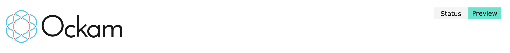

<div align="center">
:sparkles:
<a href="./documentation/guides/rust#readme">
Step-by-Step: Build end-to-end encrypted, mutually-authenticated, secure communication in Rust
</a>
:sparkles:
</div>

<hr>

<p>
<a href="./implementations#readme">

</a>
</p>

Rust and Elixir libraries for end-to-end encrypted, mutually authenticated, secure communication.

Data, within modern distributed applications, are rarely exchanged over a single point-to-point
transport connection. Application messages routinely flow over complex, multi-hop, multi-protocol
routes — _across data centers, through queues and caches, via gateways and brokers_ — before reaching
their end destination.

Transport layer security protocols are unable to protect application messages because their protection
is limited by the length and duration of the underlying transport connection.

Ockam is a suite of programming libraries and infrastructure that makes it simple for your applications
to guarantee end-to-end integrity, authenticity, and confidentiality of data.

You no longer have to implicitly depend on the defences of every machine or application within the same,
usually porous, network boundary. Your application's messages don't have to be vulnerable at every point,
along their journey, where a transport connection terminates.

Instead, your application can have a strikingly smaller vulnerability surface and easily make
_granular authorization decisions about all incoming information and commands._

<hr>

## Features

* End-to-end encrypted, mutually authenticated _secure channels_.
* Key establishment, rotation, and revocation - _for fleets, at scale_.
* Identity profiles isolated by _privacy contexts_.
* Attribute-based Access Control - credentials with _selective disclosure_.
* Add-ons for a variety of operating environments, transport protocols, and _cryptographic hardware_.
* Libraries for multiple languages - _Rust, Elixir_ (more on the roadmap).

<hr>

## Hello Ockam

Let's write a simple example to create an encrypted secure channel between Alice and Bob. When a
message is sent through this channel it will be encrypted when it enters the channel and decrypted
just before it exits the channel.

For the purpose of our first example, we'll create a local channel within one program. In
[later examples](./documentation/guides/rust#readme), you'll see that it's just as easy to create
end-to-end protected channels over multi-hop, multi-protocol transport routes:

1. Install Rust

    ```
    curl --proto '=https' --tlsv1.2 -sSf https://sh.rustup.rs | sh
    ```

2. Setup a new cargo project to get started.

    ```
    cargo new --lib hello_ockam && cd hello_ockam && mkdir examples \
      && echo 'ockam = "*"' >> Cargo.toml && cargo build
    ```

    If the above instructions don't work on your machine, please
    [post a question](https://github.com/ockam-network/ockam/discussions/1642),
    we would love to help.

3. Create a file at `examples/hello.rs` and copy the below code snippet to it.

    ```rust
    use ockam::{route, Context, Entity, Result, SecureChannels, TrustEveryonePolicy, Vault};

    #[ockam::node]
    async fn main(mut ctx: Context) -> Result<()> {
        // Create a Vault to safely store secret keys for Alice and Bob.
        let vault = Vault::create(&ctx)?;

        // Create an Entity to represent Bob.
        let mut bob = Entity::create(&ctx, &vault)?;

        // Create a secure channel listener for Bob that will wait for requests to
        // initiate an Authenticated Key Exchange.
        bob.create_secure_channel_listener("bob", TrustEveryonePolicy)?;

        // Create an entity to represent Alice.
        let mut alice = Entity::create(&ctx, &vault)?;

        // As Alice, connect to Bob's secure channel listener and perform an
        // Authenticated Key Exchange to establish an encrypted secure channel with Bob.
        let channel = alice.create_secure_channel("bob", TrustEveryonePolicy)?;

        // Send a message, ** THROUGH ** the secure channel,
        // to the "app" worker on the other side.
        //
        // This message will automatically get encrypted when it enters the channel
        // and decrypted just before it exits the channel.
        ctx.send(route![channel, "app"], "Hello Ockam!".to_string()).await?;

        // Wait to receive a message for the "app" worker and print it.
        let message = ctx.receive::<String>().await?;
        println!("App Received: {}", message); // should print "Hello Ockam!"

        // Stop all workers, stop the node, cleanup and return.
        ctx.stop().await
    }

    ```

4. Run the example

    ```
    cargo run --example hello
    ```

Congratulations on running your first Ockam program 🥳.

A lot happened when you ran this small example. It created a secure vault, spawned workers to represent
entities, established a mutually authenticated channel and then routed a message through the channel.
This involved running cryptographic protocols for generating keys, authenticating as an entity, performing
an authenticated key exchange, exchanging messages with authenticated encryption etc.

To learn more, about how we make these powerful cryptographic protocols simple to use, please have a look
at our [step-by-step guide](./documentation/guides/rust#readme) where we introduce the building blocks in Ockam.

<hr>

## Concepts

Here's a high-level view of the core ideas in Ockam.

<p>
<a href="./documentation/concepts#readme">

</a>
</p>

To learn more please see the [concepts](./documentation/concepts#readme) page and our
[step-by-step guide](./documentation/guides/rust#readme).

## License

The code in this repository is licensed under the terms of the [Apache License 2.0](LICENSE).

<hr>

<p>
<a href="https://github.com/ockam-network/ockam/actions?query=workflow%3A%22Continuous+Integration%22">

</a>

<a href="https://www.ockam.io/learn/how-to-guides/high-performance-team/conduct/">

</a>
