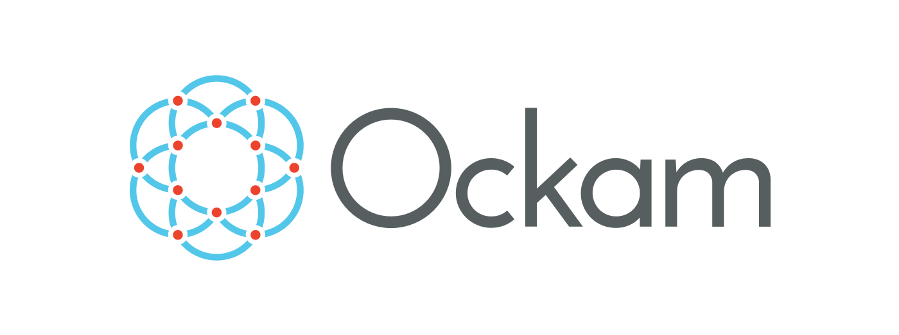
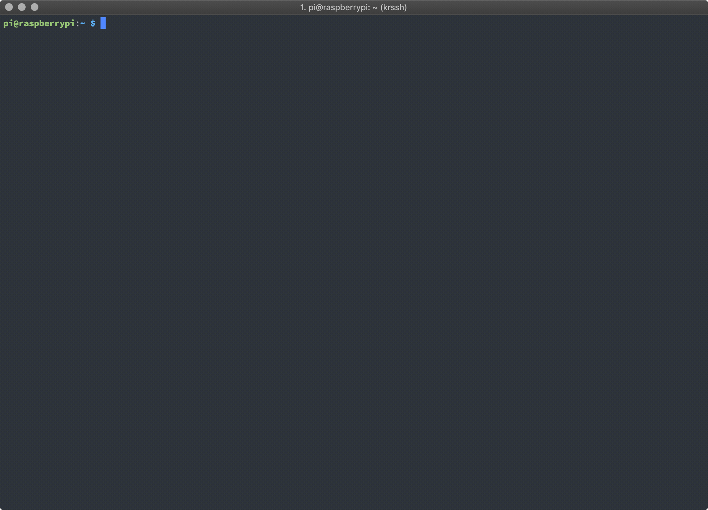

<h1 align="center">
	
</h1>

<p align="center">
<a href="https://dev.azure.com/ockam-network/ockam/_build/latest?definitionId=10?branchName=master"></a>
<a href="LICENSE"></a>
<a href="https://godoc.org/github.com/ockam-network/ockam"></a>
<a href="https://join.slack.com/t/ockam-community/shared_invite/enQtNDk5Nzk2NDA2NDcxLWMzMzJlZjQzOTZjYWY0YmNkNWE1NmI1M2YyYzlkNjk4NDYyYzU0OWE0YTI4ZjcwNDBjNmQ4NzZjZTMzYmY3NDA"></a>
</p>

<h1 align="center">
	
</h1>

## Overview

[Ockam](ockam.io) is a decentralized and open platform for easily adding identity, trust and interoperability
to connected devices.

This repository contains:
1. The `ockam` command line program for simple interactions with the Ockam Network.
2. The `github.com/ockam-network/ockam` Golang package to develop Go applications that programmatically interact with
the Ockam Network.  In the near future, we will be adding `ockam` packages for other programming languages as well.

## Contents

- [Get the Golang package](#go-package)
- [Write your first Hello Ockam program](#hello-ockam)
- [Register an Entity](#register-an-entity)
- [Submit a Claim](#submit-a-claim)
- [Use the Ockam Command](#commmand-line)
- [Build the source code](#build)
- [Contribute to Ockam](#contributing-to-ockam)
- [Contributors](#contributors)
- [License and attributions](#license-and-attributions)

## Go Package

With Go version `1.11+` installed, add the ockam Golang package to your project using `go get`:
```
go get github.com/ockam-network/ockam
```

## Hello Ockam

Here is some simple Go code to connect with the Ockam TestNet:

```go
// create a lightweight local ockam node and give it a way to find peers on the ockam test network
ockamNode, err := node.New(node.PeerDiscoverer(http.Discoverer("test.ockam.network", 26657)))
if err != nil {
	log.Fatal(err)
}

// ask the local node to find peers and sync with network state
err = ockamNode.Sync()
if err != nil {
	log.Fatal(err)
}

// print the id of the chain that the network is maintaining.
ockamChain := ockamNode.Chain()
fmt.Printf("Chain ID: %s\n", ockamChain.ID())
```

The above code is in the [example directory](example/01_hello_ockam.go); you may run it by calling:
```
go run -mod=vendor example/01_hello_ockam.go
```

### The Ockam TestNet

The Ockam TestNet is provided and maintained by the Ockam team to help you build and experiment with
applications that interact with Ockam. The TestNet has no service level guarantees, may have intermittent availability,
may be down for maintenance, and may be restarted at anytime. If your application needs a production-ready network,
please email the Ockam team at hello@ockam.io

## Register an Entity

In Ockam, things are modeled as entities. Each `Entity` has a [DID](https://w3c-ccg.github.io/did-primer/) that
begins with `did:ockam:` and uses the `ockam` DID method.

An example Ockam DID looks like this: `did:ockam:2QyqWz4xWB5o4Pr9G9fcZjXTE2ej5`

```go
// create a new ed25519 signer
signer, err := ed25519.New()
if err != nil {
	log.Fatal(err)
}

// create a new ockam entity to represent a temperature sensor
temperatureSensor, err := entity.New(
	entity.Attributes{
		"name":         "Temperature Sensor",
		"manufacturer": "Element 14",
		"model":        "Raspberry Pi 3 Model B+",
	},
	entity.Signer(signer),
)
if err != nil {
	log.Fatal(err)
}

// register the entity by creating a signed registration claim
registrationClaim, err := ockamChain.Register(temperatureSensor)
if err != nil {
	log.Fatal(err)
}

fmt.Printf("registrationClaim - %s\n", registrationClaim.ID())
```

The above code is in the [example directory](example/02_register_entity.go); you may run it by calling:
```
go run -mod=vendor example/02_register_entity.go
```

This generates a new `ed25519` signer, then creates a new entity and assigns it that signer. It also adds some
attributes to the entity (e.g., its manufacturer's name).

The code above, as part of the `Register` method, lastly generates an `EntityRegistrationClaim`.  This
[verifiable](https://www.w3.org/TR/verifiable-claims-data-model/) registration claim embeds the
[DID Document](https://w3c-ccg.github.io/did-spec/#dfn-did-document) that represents this newly-created entity.

The claim is cryptographically signed using the entity's signer and then submitted to the network.

An example `EntityRegistrationClaim` claim looks like this:

```
{
	"@context": [
		"https://w3id.org/identity/v1",
		"https://w3id.org/security/v1"
	],
	"id": "did:ockam:2QyqWz4xWB5o4Pr9G9fcZjXTE2ej5/claim/1brpf2pkh6",
	"type": [
		"EntityRegistrationClaim"
	],
	"issuer": "did:ockam:2QyqWz4xWB5o4Pr9G9fcZjXTE2ej5",
	"issued": "2019-01-10",
	"claim": {
		"authentication": [
			{
				"publicKey": "did:ockam:2QyqWz4xWB5o4Pr9G9fcZjXTE2ej5#key-1",
				"type": "Ed25519SignatureAuthentication2018"
			}
		],
		"id": "did:ockam:2QyqWz4xWB5o4Pr9G9fcZjXTE2ej5",
		"manufacturer": "Element 14",
		"model": "Raspberry Pi 3 Model B+",
		"name": "Temperature Sensor",
		"publicKey": [
			{
				"id": "did:ockam:2QyqWz4xWB5o4Pr9G9fcZjXTE2ej5#key-1",
				"publicKeyHex": "3c93f446990ecd3ce64bcf9a5f949423d2e348948ee3aeb1c78924490f6b50f9",
				"type": "Ed25519VerificationKey2018"
			}
		],
		"registrationClaim": "did:ockam:2QyqWz4xWB5o4Pr9G9fcZjXTE2ej5/claim/1brpf2pkh6"
	},
	"signatures": [
		{
			"created": "2019-01-10T07:53:25Z",
			"creator": "did:ockam:2QyqWz4xWB5o4Pr9G9fcZjXTE2ej5#key-1",
			"domain": "ockam",
			"nonce": "1brpf2pkh6",
			"signatureValue": "4v3cTB5u0/nA/xxrGU3gQ38IaP1MJJ7tQyPQtBtZmVLE36M96d2XRo0ArFyxQV2CsDMtP57n/vnvZWN88Du+Bg==",
			"type": "Ed25519Signature2018"
		}
	]
}
```

## Submit a Claim

Once an entity is registered, it can make signed, verifiable claims about itself or other entities.

This will create and submit a new signed claim that includes a temperature reading:
```go
// create a temperature claim with this new sensor entity as both the issuer and the subject of the claim
temperatureClaim, err := claim.New(
	claim.Data{"temperature": 100},
	claim.Issuer(temperatureSensor),
	claim.Subject(temperatureSensor),
)
if err != nil {
	log.Fatal(err)
}

// submit the claim to be
err = ockamChain.Submit(temperatureClaim)
if err != nil {
	log.Fatal(err)
}

fmt.Printf("Submitted - " + temperatureClaim.ID())
```

The above code is in the [example directory](example/03_submit_claim.go); you may run it by calling:
```
go run -mod=vendor example/03_submit_claim.go
```

This generates a signed claim of the following form:

```
{
	"@context": [
		"https://w3id.org/identity/v1",
		"https://w3id.org/security/v1"
	],
	"id": "did:ockam:2PdDcphFfkW5eU1C1mFB1i9H8ZsgC/claim/iu5aczbwnt",
	"type": [
		""
	],
	"issuer": "did:ockam:2PdDcphFfkW5eU1C1mFB1i9H8ZsgC",
	"issued": "2019-01-10",
	"claim": {
		"id": "did:ockam:2PdDcphFfkW5eU1C1mFB1i9H8ZsgC",
		"temperature": 100
	},
	"signatures": [
		{
			"created": "2019-01-10T08:00:31Z",
			"creator": "did:ockam:2PdDcphFfkW5eU1C1mFB1i9H8ZsgC#key-1",
			"domain": "ockam",
			"nonce": "iu5aczbwnt",
			"signatureValue": "UpCPc/Z6bGwUXfgNgRFxpQU2kSt8HBoe8E94JyvlAKG1yBNBfqb4oUKdPZPHOQH37JtiIFap9eGS4qMBP35DDA==",
			"type": "Ed25519Signature2018"
		}
	]
}
```

## Command Line

The `ockam` command is a useful tool to interact with the Ockam Network. You can install it for your
operating system from our [release bundles](https://github.com/ockam-network/ockam/releases).

If you are on Mac or Linux, you can also use this simple
[downloader script](godownloader-ockam.sh):

```
curl -L https://git.io/fhZgf | sh
```
This will download the binary to `./bin/ockam` in your current directory. It is self-contained, so you can copy it to
somewhere more convenient in your system path, for example:

```
cp ./bin/ockam /usr/local/bin/
```

Once the command is in your path, you can run:

```
ockam --version
```

Next you can run:
```
ockam register
```
which will generate a unique Ockam [decentralized identity](https://github.com/w3c-ccg/did-primer) for
your computer and register that identity on the Ockam TestNet.

## Building

If you have recent versions of Bash and Docker installed on your machine, you can build and run the Ockam binary from
source via:

```
./build && ./build install && ockam --version
```

A `Vagrantfile` is also provided if you wish to work within a Vagrant and Virtualbox environment.

For more details on how to build and contribute to Ockam, see our
[Contributing Guide](CONTRIBUTING.md#contribute-code).

## Contributing to Ockam

- [Ask a question](CONTRIBUTING.md#ask-a-question)
- [Report an issue or a bug](CONTRIBUTING.md#report-an-issue-or-a-bug)
- [Share an idea for a new feature](CONTRIBUTING.md#share-an-idea-for-a-new-feature)
- [Contribute Code](CONTRIBUTING.md#contribute-code)
	- [Development Environment](CONTRIBUTING.md#development-environment)
	- [Build](CONTRIBUTING.md#build)
	- [Lint](CONTRIBUTING.md#lint)
	- [Test](CONTRIBUTING.md#test)
	- [Project Conventions](CONTRIBUTING.md#project-conventions)
		- [Spacing and Indentation](CONTRIBUTING.md#spacing-and-indentation)
		- [Code Format](CONTRIBUTING.md#code-format)
		- [Commit Messages](CONTRIBUTING.md#commit-messages)
		- [Git Workflow](CONTRIBUTING.md#git-workflow)
		- [Signed Commits](CONTRIBUTING.md#signed-commits)
	- [Error Handling](CONTRIBUTING.md#error-handling)
	- [Effective Go](CONTRIBUTING.md#effective-go)
	- [Send a Pull Request](CONTRIBUTING.md#send-a-pull-request)
- [Code of Conduct](CONTRIBUTING.md#code-of-conduct)

## Contributors

* [Brian Schroeder](https://github.com/bts)
* [Brett Nitschke](https://github.com/BrettNitschke)
* [Logan Jager](https://github.com/jagtek)
* [Matthew Gregory](https://github.com/mattgreg)
* [Mrinal Wadhwa](https://github.com/mrinalwadhwa)
* [Rolf Kaiser](https://github.com/rkaiser0324)
* [Jeff Malnick](https://github.com/malnick)

## License and attributions

This code is licensed under the terms of the [Apache License 2.0](LICENSE)

This code depends on other open source packages, attributions for those packages are in the [NOTICE](NOTICE) file.
