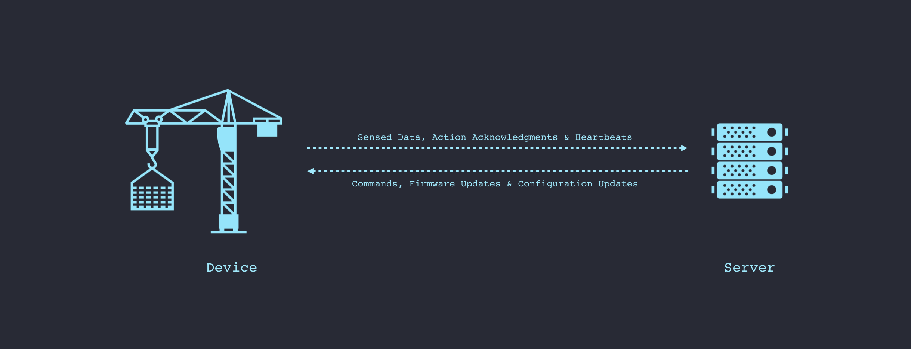

# Secure Connectivity & Messaging

IoT systems are, at their core, messaging systems. Connected devices, around us, exchange billions of messages everyday. Applications send commands to remote devices as messages. Sensors collect data about the physical world and share them with servers as messages. Devices, in proximity of each other, use messages to communicate wirelessly. Firmware and configuration updates are also delivered as a series of messages.

The transport protocols used to carry these messages vary across systems – TCP, TLS, HTTP, MQTT, CoAP, Bluetooth, NFC, LoRaWAN, NB-IoT, and many more. The schema, structure, and serialization format of messages also differ heavily across applications – Custom Binary, JSON, XML, Protocol Buffers, and many more.

This high degree of variation, in communication protocols, is why reasoning about security, trustworthiness and privacy has proven to be daunting for the larger IoT community. However, by focusing our efforts on the message layer and [how trust is established in each type of message](../0002-trust-architecture) flowing within a system, Ockam enables us to build a robust, transport agnostic, end-to-end architecture for trust within our IoT solutions.
