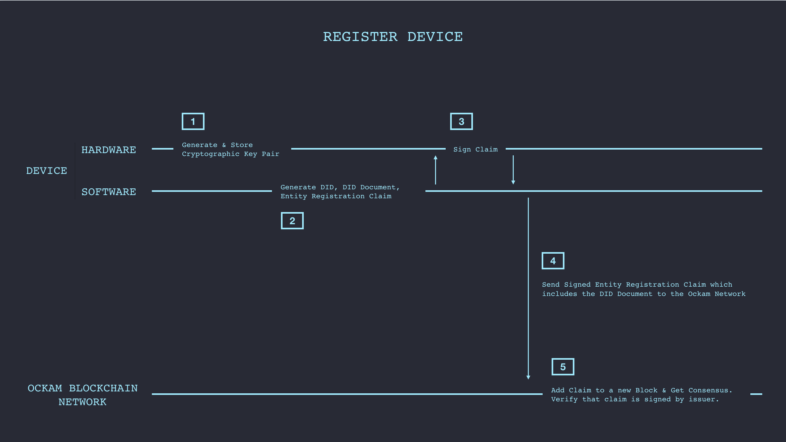

# Entity Registry

If an Entity (device or service) wishes to make its public keys and other metadata discoverable, it may register itself with an [Ockam Network Zone](../0011-blockchain-network). Registration stores the corresponding DID document in the blockchain based Entity Registry and ensures that the only the subject entity can edit the document. This way DIDs and their corresponding keys are not controlled by any central party like a certificate authority and are fully under the control of DID subject.



Here is some sample code to register an Entity:

```go
// create a new ed25519 signer
signer, err := ed25519.New()
if err != nil {
	log.Fatal(err)
}

// create a new ockam entity to represent a temperature sensor
temperatureSensor, err := entity.New(
	entity.Attributes{
		"name":         "Temperature Sensor",
		"manufacturer": "Element 14",
		"model":        "Raspberry Pi 3 Model B+",
	},
	entity.Signer(signer),
)
if err != nil {
	log.Fatal(err)
}

// register the entity by creating a signed registration claim
registrationClaim, err := ockamChain.Register(temperatureSensor)
if err != nil {
	log.Fatal(err)
}

fmt.Printf("registrationClaim - %s\n", registrationClaim.ID())
```

This generates a new `ed25519` [signer](../0006-hardware-vault-and-cryptography), then creates a new entity and assigns it that signer. It also adds other attributes to the entity (e.g., its manufacturer's name).

The code above, as part of the `Register` method, generates an `EntityRegistrationClaim`. This
[verifiable](../0008-trustful-communication) registration claim embeds the
DID Document that represents this newly-created entity.

The claim is cryptographically signed using the entity's signer and then submitted to the network.

An example `EntityRegistrationClaim` claim looks like this:

```
{
	"@context": [
		"https://w3id.org/identity/v1",
		"https://w3id.org/security/v1"
	],
	"id": "did:ockam:2QyqWz4xWB5o4Pr9G9fcZjXTE2ej5/claim/1brpf2pkh6",
	"type": [
		"EntityRegistrationClaim"
	],
	"issuer": "did:ockam:2QyqWz4xWB5o4Pr9G9fcZjXTE2ej5",
	"issued": "2019-01-10",
	"claim": {
		"authentication": [
			{
				"publicKey": "did:ockam:2QyqWz4xWB5o4Pr9G9fcZjXTE2ej5#key-1",
				"type": "Ed25519SignatureAuthentication2018"
			}
		],
		"id": "did:ockam:2QyqWz4xWB5o4Pr9G9fcZjXTE2ej5",
		"manufacturer": "Element 14",
		"model": "Raspberry Pi 3 Model B+",
		"name": "Temperature Sensor",
		"publicKey": [
			{
				"id": "did:ockam:2QyqWz4xWB5o4Pr9G9fcZjXTE2ej5#key-1",
				"publicKeyHex": "3c93f446990ecd3ce64bcf9a5f949423d2e348948ee3aeb1c78924490f6b50f9",
				"type": "Ed25519VerificationKey2018"
			}
		],
		"registrationClaim": "did:ockam:2QyqWz4xWB5o4Pr9G9fcZjXTE2ej5/claim/1brpf2pkh6"
	},
	"signatures": [
		{
			"created": "2019-01-10T07:53:25Z",
			"creator": "did:ockam:2QyqWz4xWB5o4Pr9G9fcZjXTE2ej5#key-1",
			"domain": "ockam",
			"nonce": "1brpf2pkh6",
			"signatureValue": "4v3cTB5u0/nA/xxrGU3gQ38IaP1MJJ7tQyPQtBtZmVLE36M96d2XRo0ArFyxQV2CsDMtP57n/vnvZWN88Du+Bg==",
			"type": "Ed25519Signature2018"
		}
	]
}
```

The Entity Registry makes device and service public keys and endpoints discoverable which can greatly simplify on boarding workflows. It also enables us to establish a [Web of Trust](../0008-trustful-communication) around an entity.
