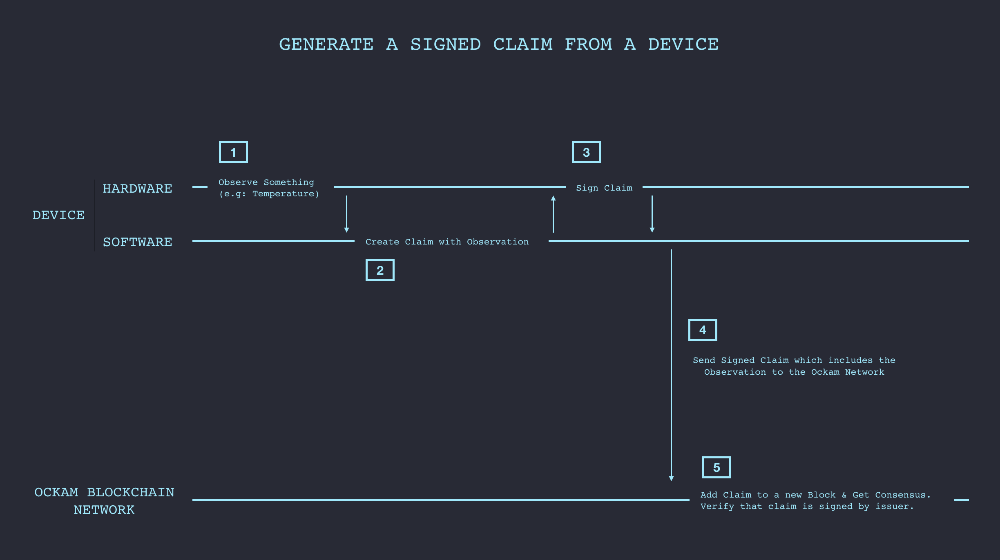
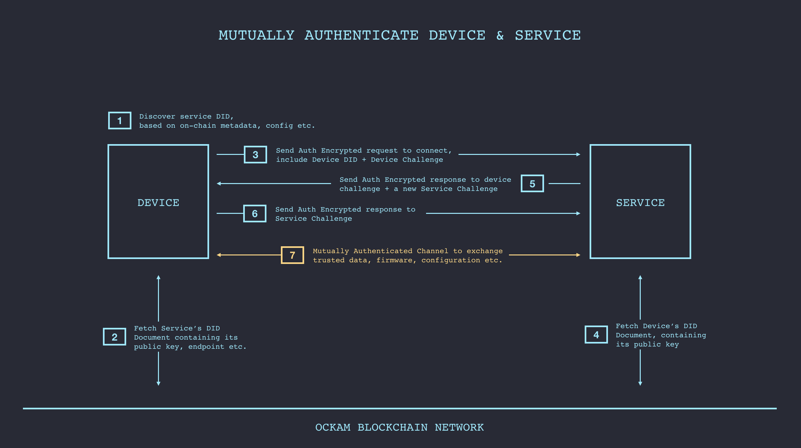

# Trustful Communication
Establishing trust over and above the [minimum criteria](../0003-minimum-criteria-for-trust) requires attestations. We use Verifiable Credentials (standard under development at W3C) to enable one entity to make signed claims and issue credentials to other entities.

For instance, multiple parties responsible for manufacturing and operating a device may write claims about that device to Ockam Network to create a Web of Trust around that device. Other entities may then require additional rules to be satisfied (over and above the [minimum criteria](../0003-minimum-criteria-for-trust)) before they trust a message for this device - I will only trust messages from devices that have been attested by ACME corp.



Here's an example that creates a new signed claim that includes a temperature reading:
```go
// create a temperature claim with this new sensor entity as both the issuer and the subject of the claim
temperatureClaim, err := claim.New(
	claim.Data{"temperature": 100},
	claim.Issuer(temperatureSensor),
	claim.Subject(temperatureSensor),
)
if err != nil {
	log.Fatal(err)
}

// submit the claim
err = ockamChain.Submit(temperatureClaim)
if err != nil {
	log.Fatal(err)
}

fmt.Printf("Submitted - " + temperatureClaim.ID())
```

This generates a signed claim of the following form:

```
{
	"@context": [
		"https://w3id.org/identity/v1",
		"https://w3id.org/security/v1"
	],
	"id": "did:ockam:2PdDcphFfkW5eU1C1mFB1i9H8ZsgC/claim/iu5aczbwnt",
	"type": [
		""
	],
	"issuer": "did:ockam:2PdDcphFfkW5eU1C1mFB1i9H8ZsgC",
	"issued": "2019-01-10",
	"claim": {
		"id": "did:ockam:2PdDcphFfkW5eU1C1mFB1i9H8ZsgC",
		"temperature": 100
	},
	"signatures": [
		{
			"created": "2019-01-10T08:00:31Z",
			"creator": "did:ockam:2PdDcphFfkW5eU1C1mFB1i9H8ZsgC#key-1",
			"domain": "ockam",
			"nonce": "iu5aczbwnt",
			"signatureValue": "UpCPc/Z6bGwUXfgNgRFxpQU2kSt8HBoe8E94JyvlAKG1yBNBfqb4oUKdPZPHOQH37JtiIFap9eGS4qMBP35DDA==",
			"type": "Ed25519Signature2018"
		}
	]
}
```

We also provide a Peer-to-peer Mutual Authentication protocol that leverages DIDs and does not involve a centralized identity provider (IDP). DID based authentication enables a device to establish a mutually authenticated channel of communication with a service. This channel can be used to reliably deliver signed data, firmware and new configuration.



DID based authentication also enables a device to establish a mutually authenticated channel with another device.


