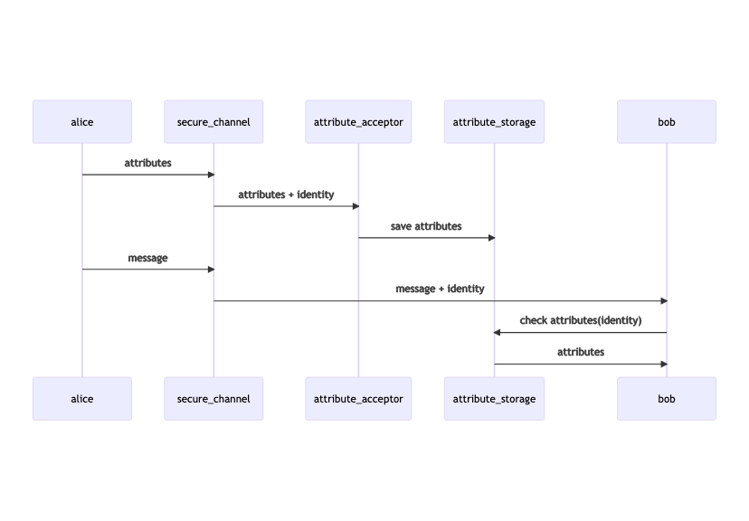
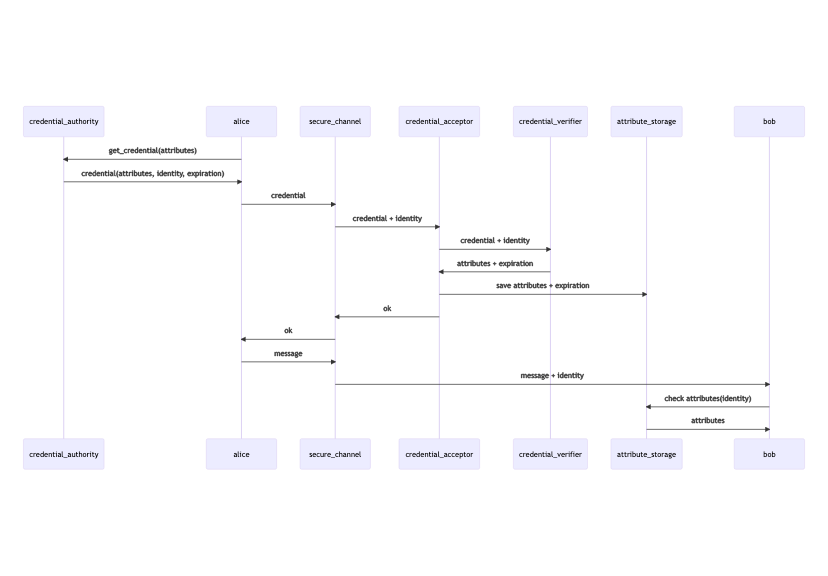
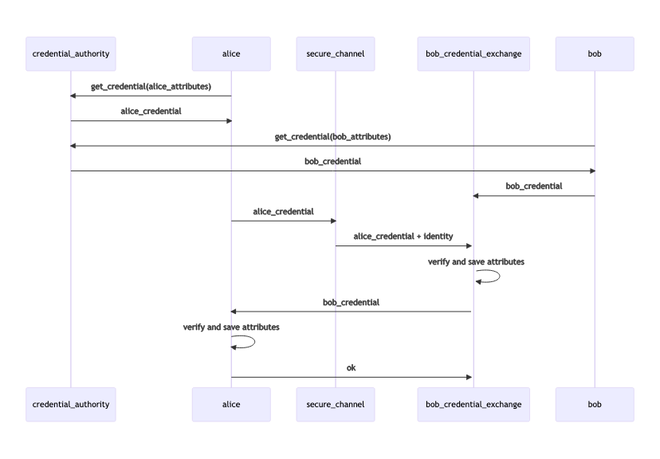

## Credential authorization.

### Background

Currently secure channel exchange identities as a part of the handshake.

Identities can be used to authorize messages, but authorizing worker will have to
know which identity has access to which actions.

In order to configure identity access to actions, we can use attribute base authorization,
when identity can present a set of attributes and authorizing worker can match them.

Given that attributes are stored on the authorizing node side, authorized worker can retrieve them using identity from the message metadata.

### Accepting attributes

In order to accept attributes from the identity, authorizing endpoint will need to trust this identity, which requires either the knowledge about identity or credential signed by some trusted authority.

**Currently we implement credential based authorization for accepting attributes.**

Credential contains identity of the sender, a set of attributes this sender is authorized to present and a signature which can be checked by the endpoint accepting the attributes.

### Credential based attribute acceptance implementation

To accept attributes from a credential, the accepting endpoint will need to trust a credential authority and be able to verify credential signature.
This is implemented by possessing the credential authority identity, which contains the public key used to sign credentials.

The attribute acceptance works as following:

- Receive a credential from an identity
- Verify credential signature and identity using credential verifier service
- Receive attribute set from the verifier service
- Save attribute set to local cache associated with the sender identity

### Attribute sets and expiration

Possession of attributes by certain identity may change over time, this means we need to remove attributes from the attribute storage for this identity at some point.
This can be done by having attribute expiration time and removing the attributes once they expired.

Expiration time is controlled by the credential authority and communicated in a credential.

A group of attributes presented in a credential with their expiry is called attribute set.

**Current implementation of attribute storage allows to store one attribute set per identity.**

**If the same identity presents a new credential - old attribute set is overridden by a new one.**

### Credential exchange

To present a credential and update the attributes on the receiving end we use credential exchange protocol.

Credential exchange may be:

- asymmetrical: one endpoint presenting credential to another

- or symmetrical: both endpoints present credentials to each other

### Credential retrieval and management

**TODO: update me**
