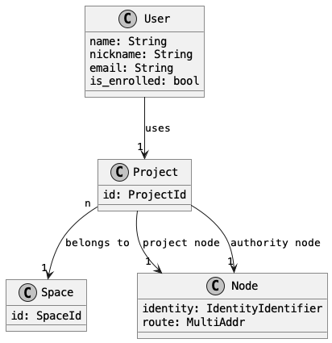
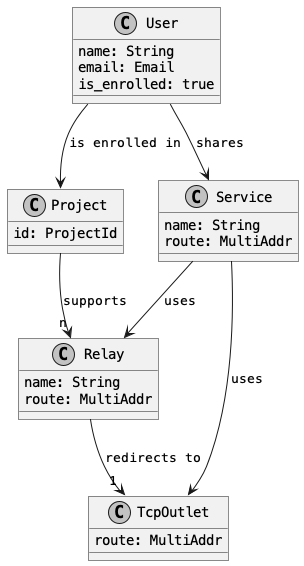
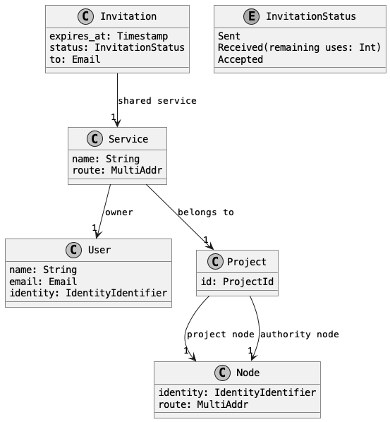

# Desktop application

This document presents the data model used in the desktop application.

There are 3 main activities available to a user when using the application:

1. Enroll / Reset / Quit
2. Share a local service / Invite a user to a shared service
3. Accept an invitation / Connect to a remote service

The following sections show the main data types supporting the scenarios above

# Enrollment

When a user enrolls with the application:

1. a space is either created or retrieved for them if they previously enrolled with the same email address
2. a project is either created or retrieved for them if they previously enrolled with the same email address
3. a [relay](https://docs.ockam.io/reference/command/advanced-routing) is created in the default project in order to
   support the routing of all the shared services

The project node information is used to establish
a [secure channel](https://docs.ockam.io/reference/command/secure-channels) with the user project node in the
Orchestrator and create the relay.

The authority node information is used to retrieve credentials for the user.

The user information (name, email address, ...) is retrieved during the enrollment process and
displayed in the application.

## Reset

On reset, we remove all local state: user information, shared services, connected services, etc.

We also remove the following remote state: invitations and relays. The default space and project are however not
deleted and will be accessible if the user enrolls again.

## Quit

On quit, the application's node is killed but the local state is kept. When the application is restarted,
a new in-memory node is created restoring its previous state using the local and remote state.

# Sharing / Inviting

## Sharing

In order to share a service a user must:

- be enrolled, so that a project and a relay exists for that user identity
- create a TCP outlet, given a name and local address

Once a TCP outlet is created, the route of the service is the concatenation of the route of the relay + the TCP outlet
route

## Inviting

In order to create an invitation to a service we need to:

1. select a shared service
2. choose an expiration date (default: 14 days)
3. select an email address for the invitee
4. create a token containing all the above information

*TODO*: specify the content and properties of the token (is it signed, encrypted, how can it be decoded, etc...)

All invitations must be persisted on the Orchestrator so that, for each service owner,
it is possible to tell which invitations have been accepted (expired invitations must be removed).

The invitations are also persisted in the desktop app. A refresh action can be added to query the
current state of invitations.

# Accepting / Connecting

*TODO*
