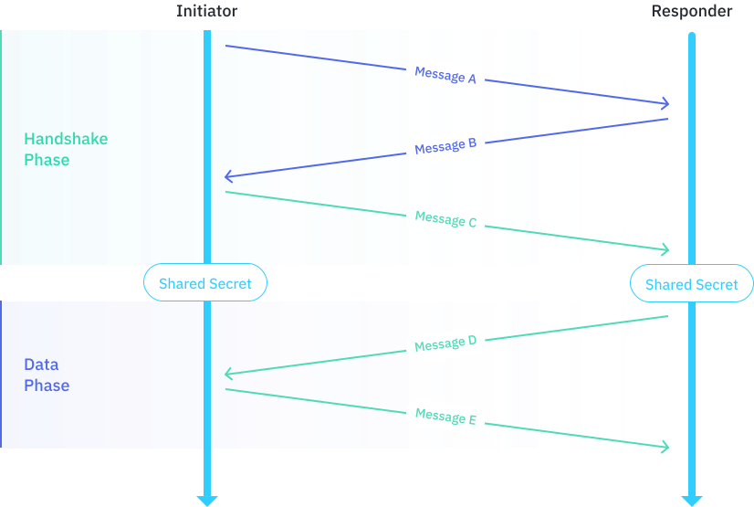

# Key Agreement - XX

This document specifies a __key agreement protocol__ for two entities to agree
on a shared secret without ever transporting that secret over the network. This
protocol design is based on the `XX` design pattern that is defined in the
[Noise Protocol Framework](#reference-1).

As part of the protocol both entities share their long term static public keys
and prove to each other that they possess the corresponding private keys. This
type of key agreement is most useful in scenarios where the two entities have
never encountered each other before and neither has pre-existing knowledge of
the other entities static public key.

## Description

The Key Agreement protocol begins with two entities exchanging handshake messages.

During this __handshake phase__ the entities exchange Diffie-Hellman public keys
and perform a sequence of Diffie-Hellman operations, hashing the results of those
operations into a shared secret.

After the handshake phase each party can use this shared secret to send encrypted
__data messages__.

The two participating entities are called __Initiator__ and __Responder__:

- __Initiator__: The entity that initiates the key agreement protocol by
sending the first message (Message A).\
- __Responder__: The entity that responds to the initiator's message with
the second message (Message B).




```
Initiator                                 |   Responder
------------------------------------------|----------------------------------------


Message A (Send)
-> e

1. Pick a static 25519 keypair for
this handshake and set it to s

2. Generate an ephemeral 25519
keypair for this handshake and set
it to e

3. Set k to empty, Set n to 0

4. Set h and ck to
'Noise_XX_25519_AESGCM_SHA256'

5. h = SHA256(h || prologue),
prologue is empty

6. h = SHA256(h || e.PublicKey),
Write e.PublicKey to outgoing message
buffer, BigEndian

7. h = SHA256(h || payload),
payload is empty


------------------------------------------|----------------------------------------


                                                Message A (Receive)
                                                -> e

                                                1. Pick a static 25519 keypair for
                                                this handshake and set it to s

                                                2. Generate an ephemeral 25519
                                                keypair for this handshake and set
                                                it to e

                                                3. Set k to empty, Set n to 0

                                                4. Set h and ck to
                                                'Noise_XX_25519_AESGCM_SHA256'

                                                5. h = SHA256(h || prologue),
                                                prologue is empty

                                                6. Read 32 bytes from the incoming
                                                message buffer, parse it as a public
                                                key, set it to re
                                                h = SHA256(h || re)

                                                7. read remaining message as payload
                                                h = SHA256(h || payload),
                                                payload should be empty


------------------------------------------|----------------------------------------


                                                Message B (Send)
                                                <- e, ee, s, es

                                                1. h = SHA256(h || e.PublicKey),
                                                Write e.PublicKey to outgoing message
                                                buffer, BigEndian

                                                2. ck, k = HKDF(ck, DH(e, re), 2)
                                                n = 0

                                                3. c = ENCRYPT(k, n++, h, s.PublicKey)
                                                h =  SHA256(h || c),
                                                Write c to outgoing message
                                                buffer, BigEndian

                                                4. ck, k = HKDF(ck, DH(s, re), 2)
                                                n = 0

                                                5. c = ENCRYPT(k, n++, h, payload)
                                                h = SHA256(h || c),
                                                payload is empty

------------------------------------------|----------------------------------------


Message B (Receive)
<- e, ee, s, es

1. Read 32 bytes from the incoming
message buffer, parse it as a public
key, set it to re
h = SHA256(h || re)

2. ck, k = HKDF(ck, DH(e, re), 2)
n = 0

3. Read 48 bytes the incoming
message buffer as c
p = DECRYPT(k, n++, h, c)
h = SHA256(h || c),
parse p as a public key,
set it to rs

4. ck, k = HKDF(ck, DH(e, rs), 2)
n = 0

5. Read remaining bytes of incoming
message buffer as c
p = DECRYPT(k, n++, h, c)
h = SHA256(h || c),
parse p as a payload,
payload should be empty


------------------------------------------|----------------------------------------


Message C (Send)
-> s, se

1. c = ENCRYPT(k, n++, h, s.PublicKey)
h =  SHA256(h || c),
Write c to outgoing message
buffer, BigEndian

2. ck, k = HKDF(ck, DH(s, re), 2)
n = 0

3. c = ENCRYPT(k, n++, h, payload)
h = SHA256(h || c),
payload is empty


------------------------------------------|----------------------------------------


                                                Message C (Receive)
                                                -> s, se

                                                1. Read 48 bytes the incoming
                                                message buffer as c
                                                p = DECRYPT(k, n++, h, c)
                                                h = SHA256(h || c),
                                                parse p as a public key,
                                                set it to rs

                                                2.ck, k = HKDF(ck, DH(e, rs), 2)
                                                n = 0

                                                3. Read remaining bytes of incoming
                                                message buffer as c
                                                p = DECRYPT(k, n++, h, c)
                                                h = SHA256(h || c),
                                                parse p as a payload,
                                                payload should be empty


------------------------------------------|----------------------------------------


                                                1. k1, k2 = HKDF(ck, zerolen, 2)
                                                n1 = 0, n2 = 0
                                                Use (k1, n1) to encrypt outgoing
                                                Use (k2, n2) to decrypt incoming

1. k1, k2 = HKDF(ck, zerolen, 2)
n1 = 0, n2 = 0
Use (k1, n1) to decrypt incoming
Use (k2, n2) to encrypt outgoing

```


### Message A

Message A, sent by the initiator, does not benefit from sender authentication
and does not provide message integrity. It could have been sent by any party,
including an active attacker. Message contents do not benefit from message secrecy
even against a purely passive attacker and any forward secrecy is out of the question.

### Message B

Message B, sent by the responder, benefits from sender authentication and is
resistant to Key Compromise Impersonation. Assuming the corresponding private keys
are secure, this authentication cannot be forged. However, if the responder carries
out a separate session with a separate, compromised initiator, this other session
can be used to forge the authentication of this message with this session's initiator.
Message contents benefit from some message secrecy and some forward secrecy, but not
sufficiently to resist any active attacker.

### Message C

Message C, sent by the initiator, benefits from sender and receiver authentication
and is resistant to Key Compromise Impersonation. Assuming the corresponding private
keys are secure, this authentication cannot be forged. Message contents benefit from
message secrecy and strong forward secrecy: if the ephemeral private keys are secure
and the responder is not being actively impersonated by an active attacker, message
contents cannot be decrypted.

### Message D

Message D, sent by the responder, benefits from sender and receiver authentication
and is resistant to Key Compromise Impersonation. Assuming the corresponding private
keys are secure, this authentication cannot be forged. Message contents benefit from
message secrecy and strong forward secrecy: if the ephemeral private keys are secure
and the initiator is not being actively impersonated by an active attacker, message
contents cannot be decrypted.

### Message E

Message E, sent by the initiator, benefits from sender and receiver authentication
and is resistant to Key Compromise Impersonation. Assuming the corresponding private
keys are secure, this authentication cannot be forged. Message contents benefit from
message secrecy and strong forward secrecy: if the ephemeral private keys are secure
and the responder is not being actively impersonated by an active attacker, message
contents cannot be decrypted.


## References

1. <span id="reference-1"></span>Perrin, T., The Noise Protocol Framework. <br/>
https://github.com/noiseprotocol/noise_spec/blob/v34/output/noise.pdf

2. <span id="reference-2"></span>Krawczyk, H., SIGMA: The ‘SIGn-and-MAc’ approach
to authenticated Diffie-Hellman and its use in the IKE protocols. <br/>
https://link.springer.com/content/pdf/10.1007/978-3-540-45146-4_24.pdf

3. <span id="reference-3"></span>Marlinspike, M. and Perrin, T.,
The X3DH Key Agreement Protocol. <br/>
https://signal.org/docs/specifications/x3dh/x3dh.pdf

4. <span id="reference-4"></span>Kobeissi, N., Nicolas, G. and Bhargavan, K.,
Noise Explorer: Fully Automated Modeling and Verification for Arbitrary Noise Protocols. <br/>
https://ia.cr/2018/766

5. <span id="reference-5"></span>Girol, G., Formalizing and verifying the security
protocols from the Noise framework. <br/>
https://ethz.ch/content/dam/ethz/special-interest/infk/inst-infsec/information-security-group-dam/research/software/noise_suter-doerig.pdf

6. <span id="reference-6"></span>IETF, The Transport Layer Security (TLS) Protocol Version 1.3 <br/>
https://tools.ietf.org/html/rfc8446
