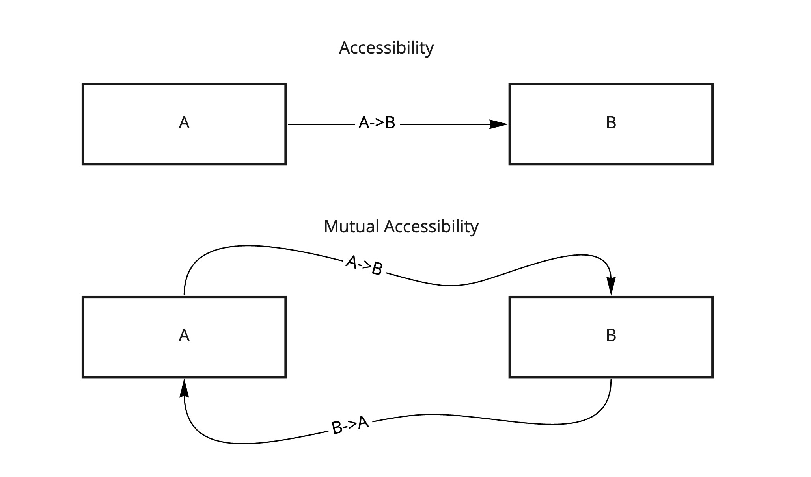
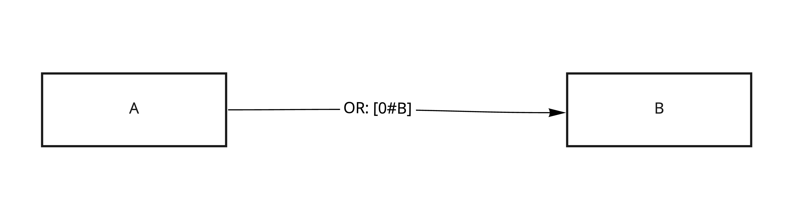
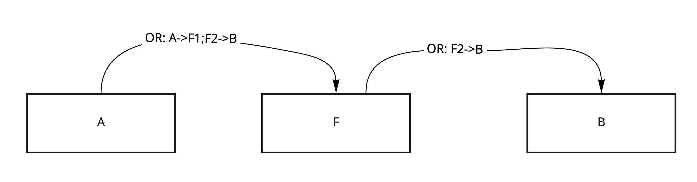
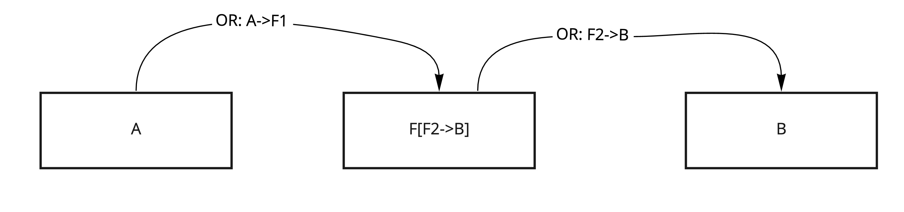
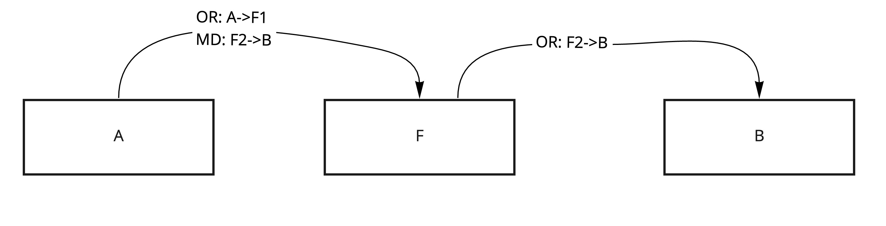
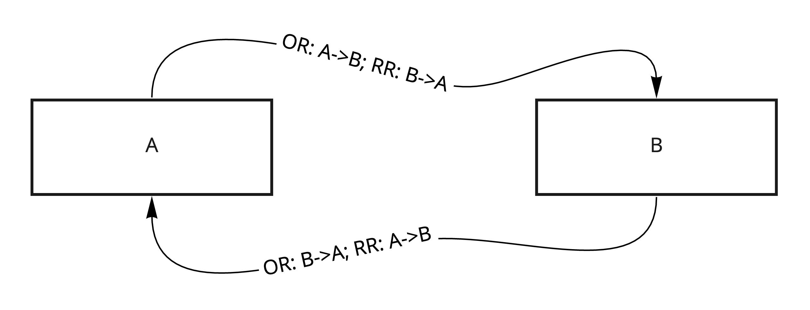
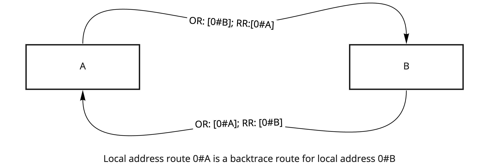
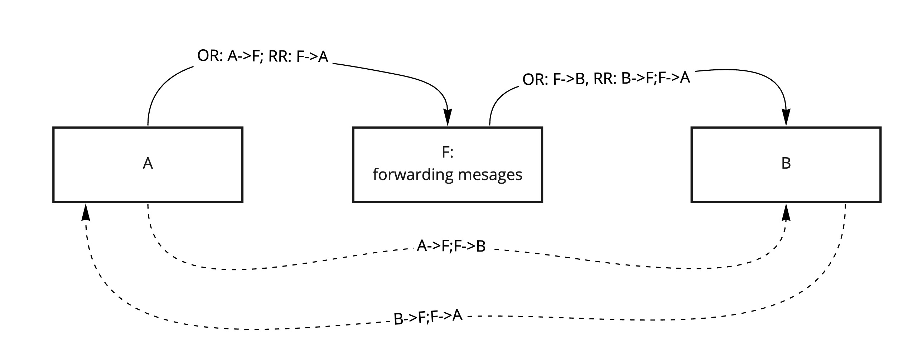

# Accessibility

Accessibility describes an ability of the route (and workers in this route) to successfully deliver messages to the destination.

Worker `B` is **accessible from** worker `A` **via** route `A->B` when:

- a message sent by `A` to `A->B` can be received by `B`

Route `A->B` **leads from** `A` **to** `B` if:

- `B` is accessible from `A` via `A->B`

Workers `A` and `B` are **mutually accessible** if there are routes:

- `A->B` **via** which `B` is **accessible from** `A`
- `B->A` **via** which `A` is **accessible from** `B`

**Notation `A->B` in future mentions implies that `B` is accessible by `A` (route leads from `A` to `B`)**

## Local routes

Local route is a route with a *single* local address, e.g. `[0#A]`.

Because all workers define how messages are handled and whether they are forwarded or not,
**routes with multiple local addresses are not local routes**.

For example, one local worker can send message to a remote node, hence all the following addresses in the onward route after it will be in
the context of this remote node.

If there is a worker with address `A`, it's **always accessible** via local route `[0#A]` by **all local workers**
as long as there are no [additional access control limitations](./Trust.md#access-control)

**All node implementations should implement this behaviour.**

## Forwarder workers

In order to make workers accessible, delivery can be routed through additional workers. Such workers route all received messages based on
some criteria.

**Forwarding is the main instrument for workers accessibility**.

Let's say we want `B` to be accessible by `A`:

- there is a route `A->F` to a forwarding worker `F`
- there is a route `F->B`

Then `B` can be accessible by `A` via route `A->F` if:

- Worker `F` upon receiving a message sends a message to onward route `F->B`

There are many ways to decide the route `F->B` here:

1. It can be part of the onward route, then `B` is accessible by `A` via `A->F ; F->B`. Such routing worker is called **route based
   forwarder**:

   **If:**
    - `F` is a route-based forwarder
    - and there is a route `A->F`
    - and there is a route `F->B`

   **Then:**
    - `B` is accessible by `A` via route `A->F ; F->B`

2. It can be part of the router worker state. Such worker is called **static forwarder**:

   **If:**
    - `Fst` is a static forwarder routing to `Fst->B`
    - and there is a route `A->Fst`

   **Then:**
    - `B` is accessible by `A` via route `A->Fst`

3. It can be calculated from the message metadata. Such worker is called **metadata forwarder**:

### Pipelining forwarding

Forwarder workers can be used to create pipeline routes.

For example

**If:**

- `F1` is a static forwarder routing to `F1->F2`
- and `F2` is a route-based forwarder

**Then:**

- worker `B` is accessible by `A` via `A->F1 ; F2->B`

This combination of workers is called a [routing pipe](./Pipes_Channels.md#pipe).

From the perspective of `A`, routing pipe works the same as a single route-based forwarding worker, which allows an abstraction to
hide `F1->F2` communication.

Pipes are widely used in Ockam messaging, more on pipes in [Pipes and Channels](./Pipes_Channels.md).

## Mutual accessibility with return routes

Ockam Routing protocol allows workers to trace return route of a message.

Each time a message is sent by a worker, it may add a return route information. If the worker is forwarding the message, it may use the
return route of the received message and append some additional information to that.

Messages sent through a route `A->B` will have some return route when received by `B`, call it `trace(A->B)`.

If return route `trace(A->B)` leads to `A`, then delivery on route `A->B` is **backtraceable**. Such route `trace(A->B) = B->A` is called
a **backtrace** of `A->B`.

If delivery on a route `A->B` is backtraceable, then there is a route `B->A`, which is a backtrace of `A->B`, hence  `A` and `B` are
mutually accessible.

**NOTE**:

Route tracing and routes being backtraceable is **sufficient** to achieve mutual accessibility of workers, but **not necessary**.

If there is a way to discover return route other than route tracing, a delivery which is backtraceable may be extended or wrapped to inject
this route. This extended delivery is now backtraceable.

### Local route backtracing

Since a local route `[0#A]` leads to `A` from any local worker, then this route is a backtrace for **any local route** used to send messages
from `A`.

**Local delivery is backtraceable as long as sending worker adds its local address to the return route.**

### Forwarding and backtracing

Backtracing is different for route-based, static and metadata based forwarders.

#### For route-based forwarders.

Let's say we want to send a message from `A` to `B` through forwarding worker `F`:

- `F` is accessible to `A` via a local route `[0#F]`
- `F` is accessible to `B` via a local route `[0#F']` (`F` may be different from `F'`)

We have a backtraceable delivery `A->F` and backtraceable delivery `F'->B` with respective backtrace routes `F->A` and `B->F'`.

Then:

- if the forwarder `F` receives the message from `A` with return route `F->A`, it should forward the message with return
  route `[0#F'] ; F->A`
- if the forwarder `F` receives the message from `B` with return route `F->B`, it should forward the message with return
  route `[0#F] ; F->B`

This makes worker `A` and `B` mutually accessible via routes `A->F ; F'->B` and backtrace `B->F' ; F->A`

Such forwarding worker is called **proxy worker**.

Delivery through a proxy worker is backtraceable. By induction, delivery through multiple
proxy workers is also backtraceable. A distributed proxy worker (two workers working together as proxy) is called
a [Channel](./Pipes_Channels.md#channel):

#### Backtracing with other types of forwarders

Static forwarders forward to a specific route and usually cannot trace return routes to themselves.

As a general rule, **delivery through static forwarders and pipes is not backtraceable**, but additional forwarding workers can be used to
manipulate routes and build backtraceable delivery over multiple static forwarders.

Metadata forwarders may trace routes, but it depends on the specific implementation.

**More on pipes and channels:** [Pipes and Channels](./Pipes_Channels.md)

**Routing techniques to implement accessibility:** [Routing](./Routing.md)

**Back to:** [Delivery properties](Delivery.md)

**Up next:** [Reliability](Reliability.md)
