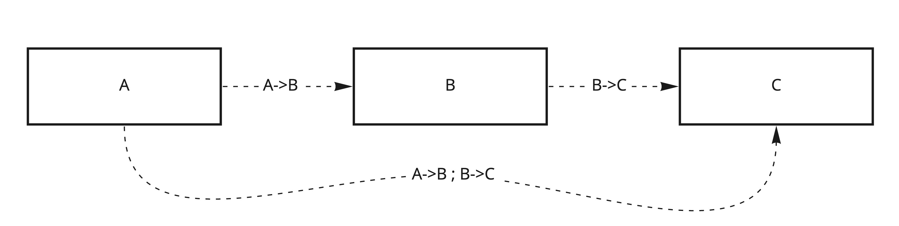
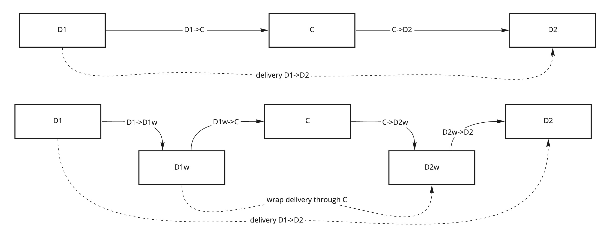

# Delivery properties

Delivery through routes of multiple workers and transports depends on those workers' behaviour. Received sequences may be different from
sent, messages may be missing, reordered or compromised.

The longer the pipeline of workers and transports between sender and receiver, the harder it becomes to reason about delivery.

To simplify that, we are going to formalize a set of properties, and describe how they can be combined.

## End-to-end

Delivery properties exist between two workers (sender and receiver) on a route.

For example when worker `A` send messages to worker `D` via route `A->B;B->C;C->D`, we describe delivery on route `A->D = A->B;B->C;C->D`.

Delivery properties on routes `B->C` and `C->D` may be different, but as long as we can validate properties of `A->D`, we can ignore that.

This approach is called **end-to-end**.

End-to-end approach allows us to abstract away complex parts of the message delivery.

## Core combination techniques

In order to combine delivery over multiple steps, we use the following techniques:

### Pipelining:

If we have a delivery `A->B` and delivery `B->C`, and we know the properties of those deliveries (i.e. we know how each worker forwards
messages), then we can tell how a pipelined delivery `A->B;B->C` would behave.

### End-to-end wrapping:

If we know that a delivery from `A->C` has certain properties, we can extend logic of A and C to improve those properties.

For example if we want to facilitate delivery between devices over cloud services, we would create a pipeline from one device through the
cloud service and to the other device `D1->C;C->D2`.

Then we would set up end-to-end coordination between devices by adding some messaging logic **on the devices** to make sure delivery
properties are respected end-to-end.

Special workers can be used to "wrap" unreliable delivery and provide reliable delivery over unreliable message pipelines,
e.g. `D1->D1w ; D1w->C;C->D2w ; D2w->D2` where `D1w` and `D2w` are wrapper workers.

Main tool to implement end-to-end wrapping is called [Pipe](./Pipes_Channels.md).

**When defining Delivery Properties we will highlight how they can be combined using those two techniques**.

## Properties

1. [Accessibility](./Accessibility.md)

   Accessibility describes an ability to deliver messages to the destination. If messages sent from the sender worker to some route will be
   received by the receiver worker. Accessibility is required property in messaging, since there is no delivery without it.

1. [Reliability and uniqueness](./Reliability.md)

   Reliability describes how many sent messages were received and whether some messages were lost. Uniqueness describes whether messages
   received correspond to unique sent messages or are duplicates of the same sent message.

1. [Ordering](./Ordering.md)

   Ordering describes whether messages are received in the same order as they were sent. Uniqueness is related to Ordering in the sense that
   absolute ordering requires no duplicates, hence similar techniques are used to achieve those properties.

1. [Data Integrity](./Data_Integrity.md)

   Data Integrity describes whether received messages carry the same data as sent messages, that they are not corrupted. Delivery Integrity
   of multiple messages is related to ordering and reliability and often requires those properties.

1. [Confidentiality](./Confidentiality.md)

   Confidentiality of messages describes which messaging participants have access to the messages data

1. [Authenticity and authorization](./Trust.md)

   Authenticity describes whether messages received originated at the specific sender. Authorization describes messages can be received by
   a certain receiver if they were sent by a certain sender or went through a certain route.

**Up next**: [Accessibility](./Accessibility.md)
