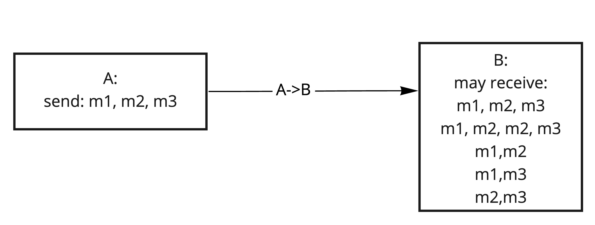
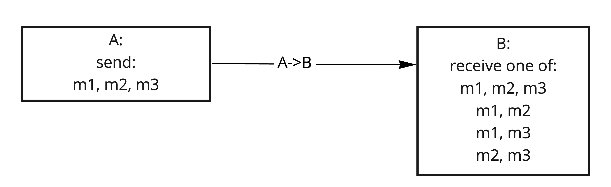
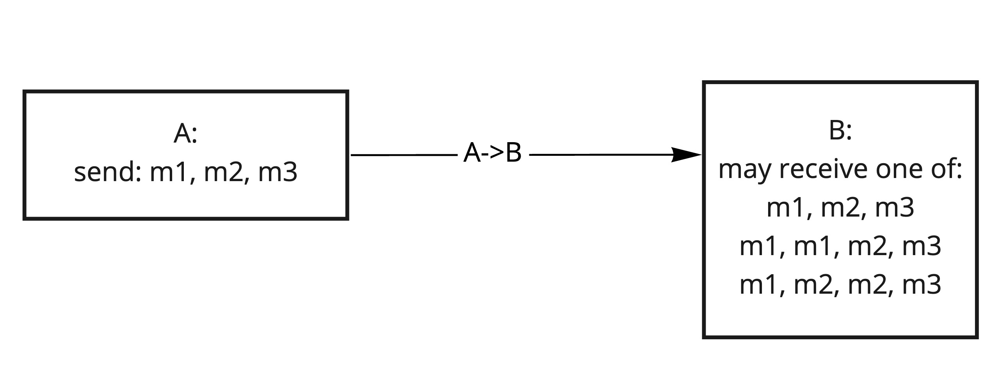
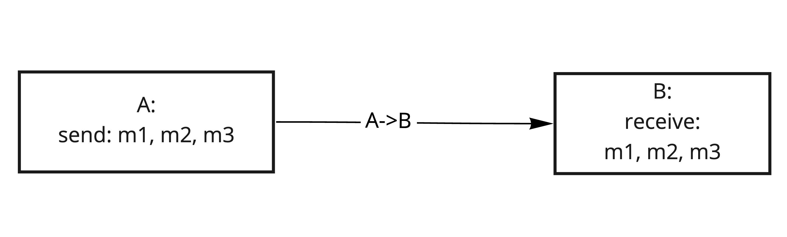
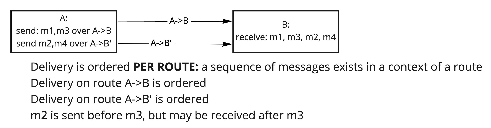
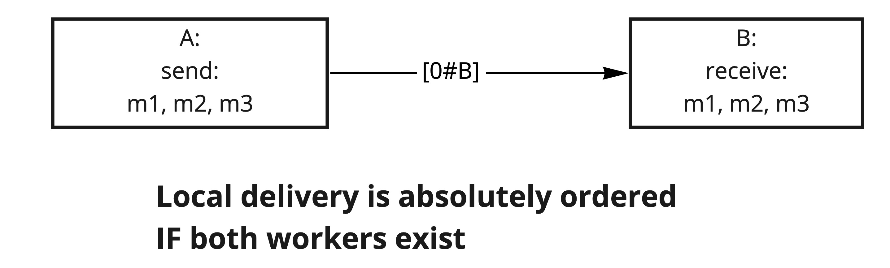
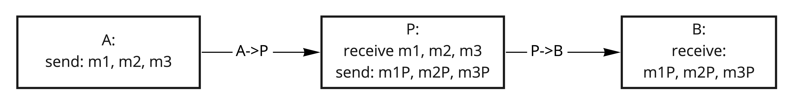
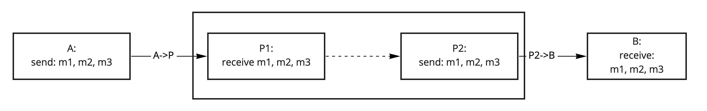
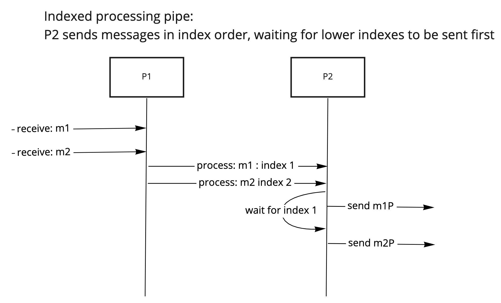

# Ordering

Ordering of a delivery describes order in which messages are received in relation to the order in which messages were sent.

### Types of ordering

#### Monotonic ordering

Delivery is monotonically ordered when:

- In a sequence containing messages `m1, m2 ...`
- A message `m1` which was sent before message `m2`, cannot be received after `m2`

#### Strict monotonic ordering

Delivery is strictly ordered when:

- In a sequence `m1, m2, ...`
- A message `m1` which was sent before message `m2`, cannot be received after `m2` or after `m1`

The difference between monotonic and strict ordering is that
**strict ordering doesn't allow duplicates**.

#### Continuous ordering

Delivery is continuously monotonic ordered when:

- In a sequence `m1, m2, ...`
- A message `m2` which was sent after `m1`, cannot be received before `m1`

The difference between monotonic and continuous ordering is that
**continuous ordering doesn't allow message loss**.

#### Continuous strict ordering (Absolute ordering)

Delivery is absolute ordered when:

- In a sequence `m1, m2, ...`
- A message `m2` which was sent after `m1` can only be received after `m1`

**Absolute ordering doesn't allow either message loss or duplicates**.

**NOTE:**

All ordering properties exist per delivery, which only applies for messages sent via same route.

## Local delivery

Local delivery (delivery to local routes `[0#A]`) has an **absolute** ordering. **This is a requirement for node implementations**.

However, workers **may process** messages in different order.

## Ordering in complex routes

When forwarding messages through an intermediate worker, it can process messages in different order, which might reorder messages in
delivery.

### Ordered processors

**Ordered processor** is a worker which upon receiving a sequence of messages, sends a sequence of processed results in the same order.

Processors ordering has the same [ordering types](./Ordering.md#types-of-ordering) as delivery.

Delivery via local routes through an ordered processor has the same properties as the processor.

### Pipelining ordering

Similar to reliability, ordering guarantees are weakening when pipelining.

Pipelining monotonic and continuous delivery results in monotonic delivery.

Pipelining strict and non-strict delivery results in non-strict delivery.

### Ordered pipes

A [pipe](./Pipes_Channels.md) in which receiver sends messages in the same order as sender receives them, can be viewed as an ordered
processor.

Ordered pipes can be injected to turn unordered delivery on a route (or multiple routes)
into an ordered delivery.

## Implementing ordered pipes

### Sequential processing pipe:

Also known as **receive queue approach**:

- `P2` sends confirms for every sent message to `P1`
- `P1` does not process a message before `P2` sends a previous message

To enforce **continuity**, sender may re-send messages which were not confirmed.

To enforce **strictness**, receiver may confirm duplicate messages without sending them.

### Indexed processing pipe:

Also known as **send queue approach**:

- `P1` assigns each message a monotonic continuous index
- `P2` sends messages in index order

To enforce **continuity**, receiver may request missing lower index messages when receiving non-consecutive index

To enforce **strictness**, receiver sends the same message once

**More on pipes and channels:** [Pipes and Channels](./Pipes_Channels.md)

**Ordered pipes implementations:** [Ordered Pipes](./Pipes_Directory.md#ordering)

**Back to:** [Delivery properties](Delivery.md)

**Up next:** [Data Integrity](./Data_Integrity.md)

