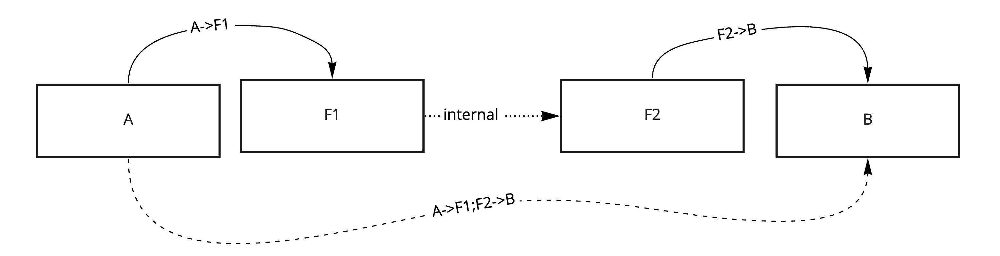
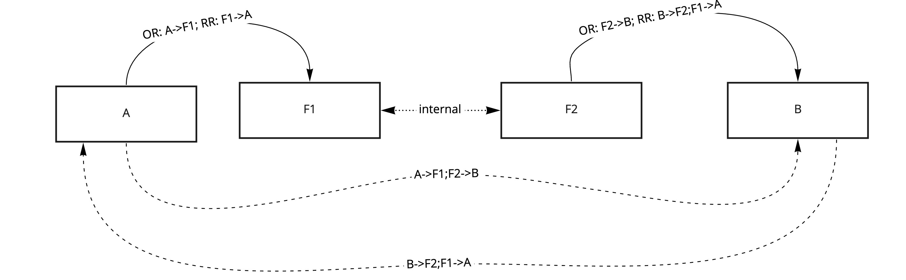
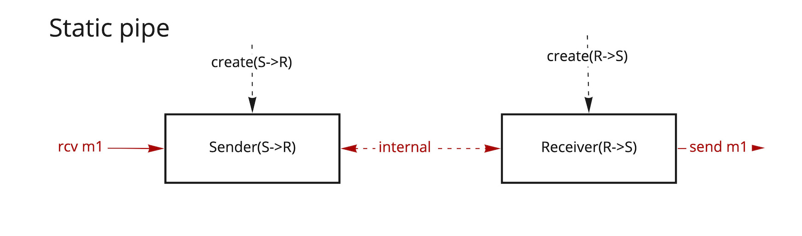
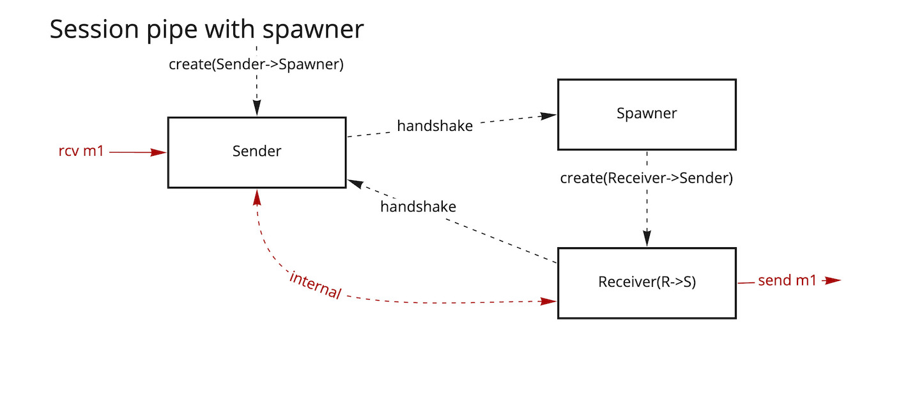
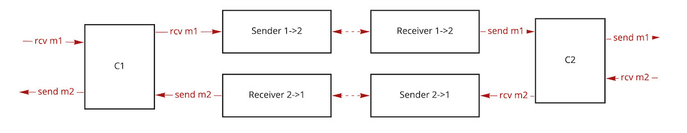

# Pipes and channels

**NOTE: this document contains information from the [pipes and channels proposal](https://github.com/build-trust/proposals/tree/main/design/0011-pipes-and-channels)**

## Purpose

Pipes and channels are main building blocks for end-to-end messaging.

In order to provide end-to-end properties of message delivery, the "ends" need to be defined and have coordinated logic and state.
This means we need groups of coordinated workers to achieve that.


## Definitions

## Pipe

Pipe is a pair of coordinated workers, Sender and Receiver, such as:
  - When sender receives a message with:
  ```
    OR: [sender] ; onward_route
    RR: return_route
  ```
  - Sender forwards the message to receiver
  - Receiver sends a message with:
  ```
    OR: onward_route
    RR: return_route
  ```

Pipes facilitate unidirectional message delivery.
Pipes preserve the return route of the original message BUT do not trace a return route

Pipes may use a coordinated state and send more messages between sender and receiver to provide
additional message delivery properties.



## Channel

Channel is a pair of coordinated workers, C1 and C2, such as:
  - When C1 receives a message with:
  ```
    OR: [C1] ; onward_route
    RR: return_route
  ```
  - C1 forwards the message to C2
  - C2 sends a message with:
  ```
    OR: onward_route
    RR: [C2] ; return_route
  ```

  - When C2 receives a message with:
  ```
    OR: [C2] ; onward_route
    RR: return_route
  ```
  - C2 forwards the message to C1
  - C1 sends a message with:
  ```
    OR: onward_route
    RR: [C1] ; return_route
  ```

Channels facilitate bidirectional message exchange.
Channels preserver the return route AND trace the return route with the channel address

Same as pipes, channels may provide additional messaging delivery properties and have more messages
exchanged between C1 and C2.



## Implementations

### Accessibility and session setup

Pipes:

In order to have coordinated state, sender and receiver must be accessible by each other. At least receiver should be accessible by the sender.

Since messages are flowing from the sender, receiver does not initiate the communication and rarely needs to store a route to the sender in its state.

1. Static pipe - a pipe in which sender is created with a known route to the receiver
2. Session pipe - a pipe in which sender is created with a session init route and receiver may be created during the session establishment





Channels:

1. Static channel - a channel where both ends are created with routes to each other
2. Session channel - a channel where one side is created with a session init route and another may be created during the session establishment

### Channels using pipes

A channel may use two pipes to deliver messages between channel workers




A channel using pipes as means to deliver messages should take into account that pipes do not trace return routes and just pass the incoming message route as a return route.

This means that the route scope inside and outside of the pipe is different and to route messages through the channel workers either:
- receiver needs to be configured to route messages through the channel
OR
- channel ends should be aware of each other and send messages to each other through the pipes

Using the latter approach message route tracing looks like this:

Given

Channel ends `C1` and `C2`
Pipe workers `S1->2`, `R1->2`, `S2->1` and `R2->1`


Message sent to `C1` with the routes:
```
OR: [C1] ; onward_route
RR: return_route
```

Will be forwarded to the pipe sender `S1->2` with:
```
OR: [S1->2] ; [C2'] ; onward_route
RR: return_route
```

When `C2` receives the message from the pipe
```
OR: [C2'] ; onward_route
RR: return_route
```

It sends the message with:
```
OR: onward_route
RR: [C2] ; return_route
```

`C2'` is an address of worker C2 which is used for internal channel communication, it may be different from the address used for external communication.

What happens here is the channel end which receives a message forwards it through the pipe and the channel end which is supposed to send that message.

Pipe channels can be dynamically established using [pipe channel session process](https://github.com/build-trust/proposals/blob/main/design/0011-pipes-and-channels/pipe_channel_session.md)


**Back to:** [Delivery properties](Delivery.md)

**Implementing specific property pipes:** [Pipes Directory](./Pipes_Directory.md)

**Routing techniques to implement pipes:** [Routing](./Routing.md)
