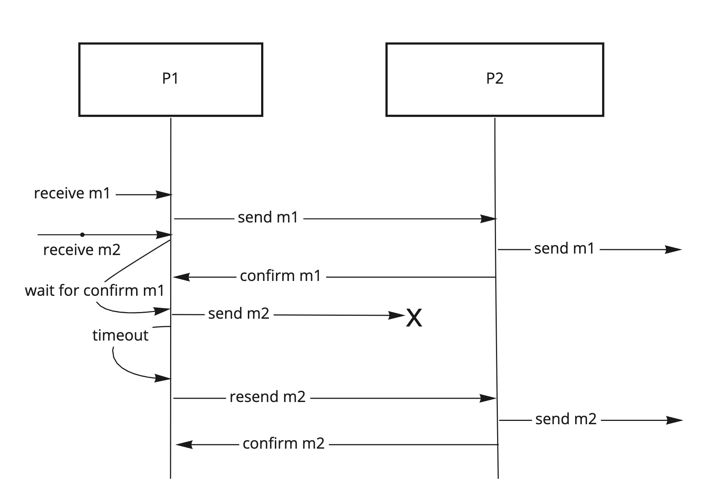
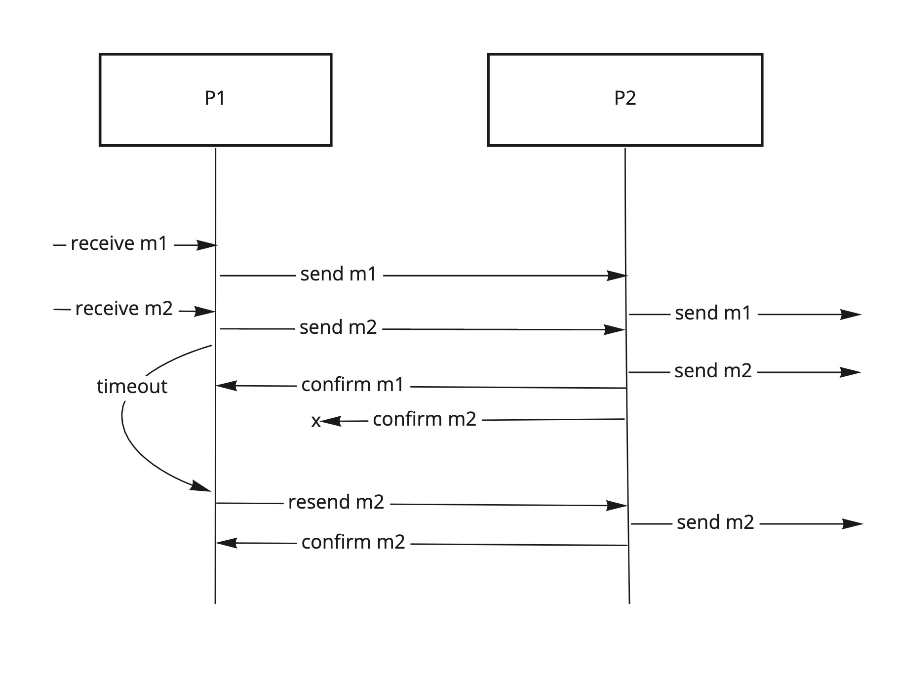
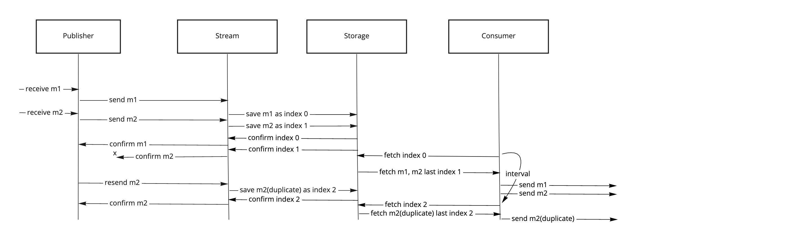
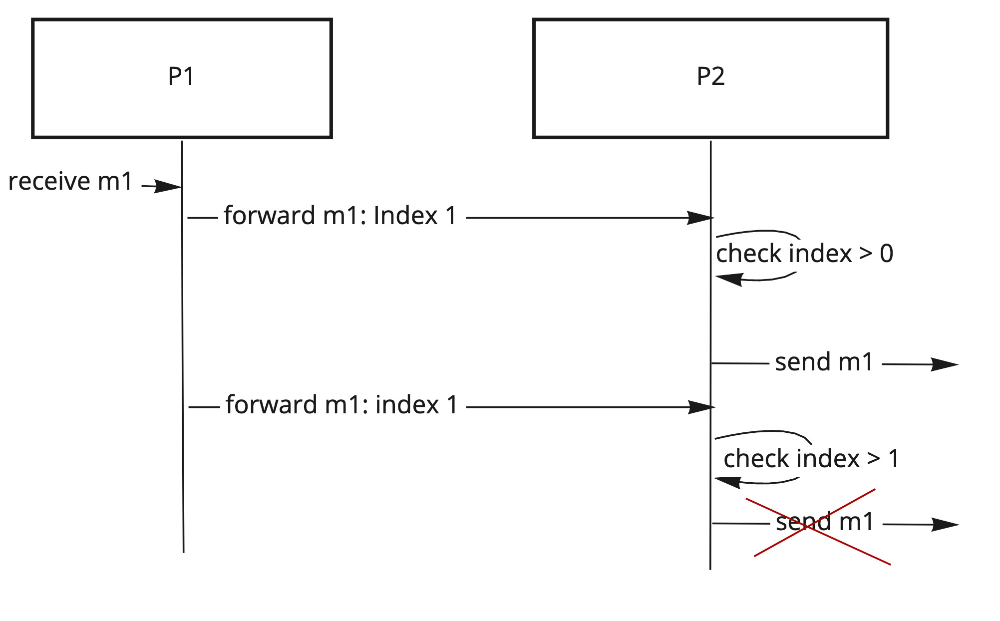

# Pipes directory

## Reliable delivery

### Re-send pipe

- Sender attaches a unique ID to every message forwarded
- Receiver after sending a message confirms send to Sender with the message ID
- If Sender does not receive a confirmation in some time - it sends the message again
- If there are unconfirmed messages - Sender buffers them until it gets confirm

#### Requirements:

State:

- Sender must have a route Receiver
- Sender must keep current unconfirmed message and it's id
- Sender must keep a buffer of messages to be sent while waiting for confirm

Internal Routes:

- A route from Sender to Receiver should be backtraceable

Delivery properties:

- Delivery is at-least-once with possible duplicates

Error tolerance:

- Delivery tolerates failures in the route from Sender to Receiver as long as Receiver is accessible via Receiver route
- Delivery does not tolerate failures in the Sender worker
- Delivery tolerates failures in the Receiver worker

### Re-send pipe with multiple unconfirmed messages

Same behaviour as for [resend pipe](Pipes_Directory.md#re-send-pipe), but instead of buffering unsent messages and waiting for confirm,
Sender sends all messages and tracks multiple unconfirmed messages.

#### Requirements:

State:

- Sender must have a route to Receiver
- Sender must keep current unconfirmed messages and their IDs

Internal Routes:

- A route from Sender to Receiver should be backtraceable

Delivery properties and error tolerance are the same as in [resend pipe](Pipes_Directory.md#re-send-pipe).

### Stream pipe - pipe with persistent storage

- Sender puts message in a stream and gets a confirmation from the stream storage
- Sender re-sends the message if confirmation was not received in some time
- Stream saves messages to persistent storage using monotonic index
- (optional) Receiver reads index from the index storage
- Receiver fetches messages from the stream with current index
- (optional) After sending messages receiver commits index of latest sent message to the index storage

#### Requirements:

State:

- Sender must have a route to stream
- Receiver must have a route to stream
- (optional) Receiver must have a route to index storage

Internal Routes:

- A route from sender to stream should be backtraceable
- A route from receiver to stream should be backtraceable
- (optional) A route from receiver to index storage should be backtraceable

Delivery properties:

- Delivery is at-least-once with possible duplicates

Error tolerance:

- Delivery tolerates errors in the routes from sender and receiver to stream
- Delivery tolerates errors in the routes from receiver to index storage
- Delivery tolerates errors in the receiver
- Delivery does not tolerate errors in the sender (because messages are buffered until confirmed)
- Delivery tolerates errors in the stream engine, **but not data loss in the storage**

## Ordering

### Sequential confirm pipe (send queue)

- Sender forwards message to receiver
- Receiver sends confirms after sending a message
- Sender waits for confirm from each message before sending the next one
- Sender buffers messages to send while it's waiting for confirms

#### Requirements:

State:

- Sender must have a route to receiver
- Sender keeps a buffer of unsent messages

Internal Routes:

- Route from sender to receiver must be backtraceable
- Delivery from sender to receiver must be at-least-once (to not lose confirms)

Delivery properties:

- Delivery is continuously ordered

Error tolerance:

- Delivery does not tolerate errors in Sender or Receiver

**Due to low error tolerance, low throughput and high inner route requirements, this implementation is not very useful**

### Strict monotonic index pipe

- Sender assigns a consecutive index to each message
- Receiver keeps track of messages indexes and only sends message if its index is higher than the current
- Receiver sets the current index to the last sent message index

#### Requirements:

State:

- Sender keeps track of the last assigned index
- Receiver keeps track of the last sent index

Internal Routes:

- Route from sender and receiver should be accessible

Delivery properties:

- Delivery is strictly monotonically ordered (may have message loss, cannot have duplicates)
- This can be relaxed to monotonic with the check in Receiver changed from `<` to `=<`

Error tolerance:

- Delivery tolerates errors in the route from sender to receiver as long as it's eventually accessible
- Delivery does not tolerate errors in the sender or receiver

### Continuous index pipe (send queue)

- Sender assigns a consecutive index to each message
- Receiver keeps track of messages indexes and if the message index is not consecutive to the current index, the message is put in the send
  queue
- If message is the right index, it's sent and current index is set to the message index
- After sending a message with the right index, send queue is checked for the next index, which may be sent

#### Requirements:

State:

- Sender keeps track of the last assigned index
- Receiver keeps track of the current index
- Receiver keeps the send queue

Internal Routes:

- Delivery from sender to receiver should be at-least-once

Delivery properties:

- Delivery is absolutely ordered (may not have message loss or duplicates)
- This can be relaxed to just continuous ordering with the check in Receiver changed from `<` to `=<`

Error tolerance:

- Delivery does not tolerate errors in sender or receiver

