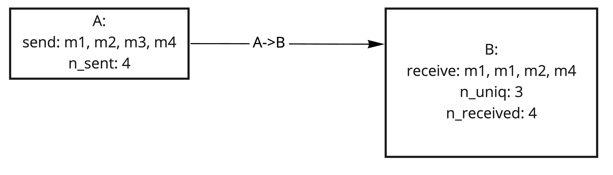
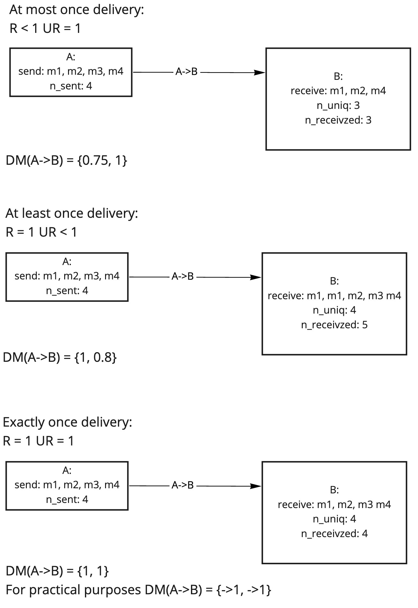
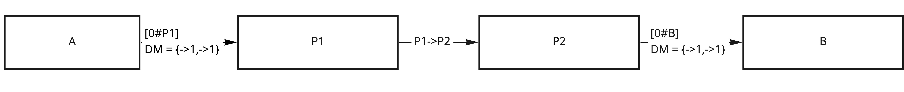
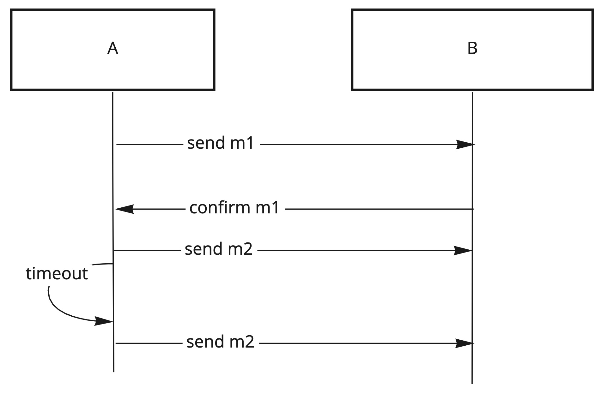
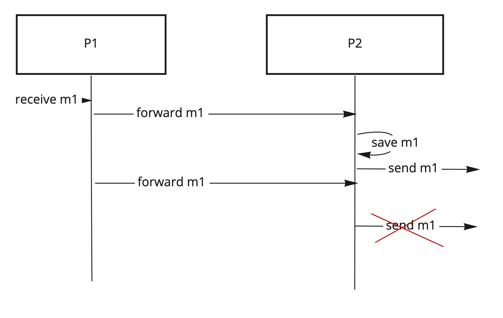
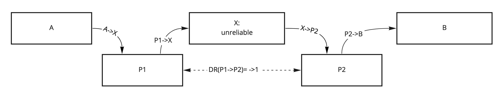
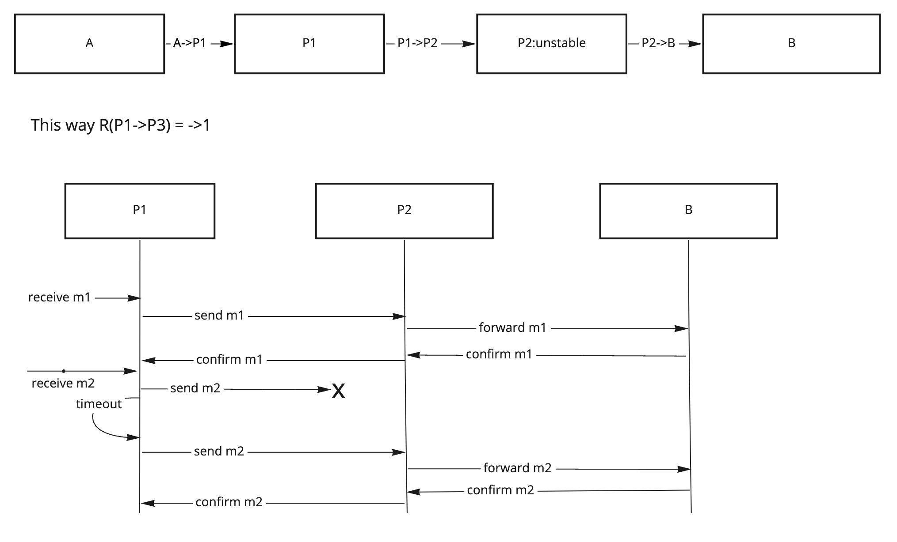
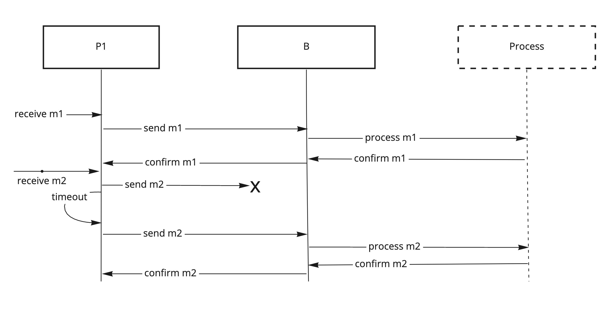
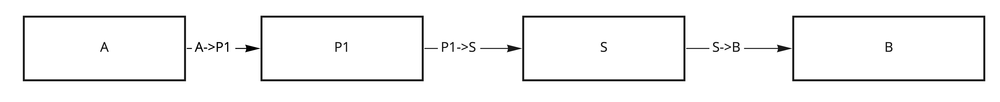
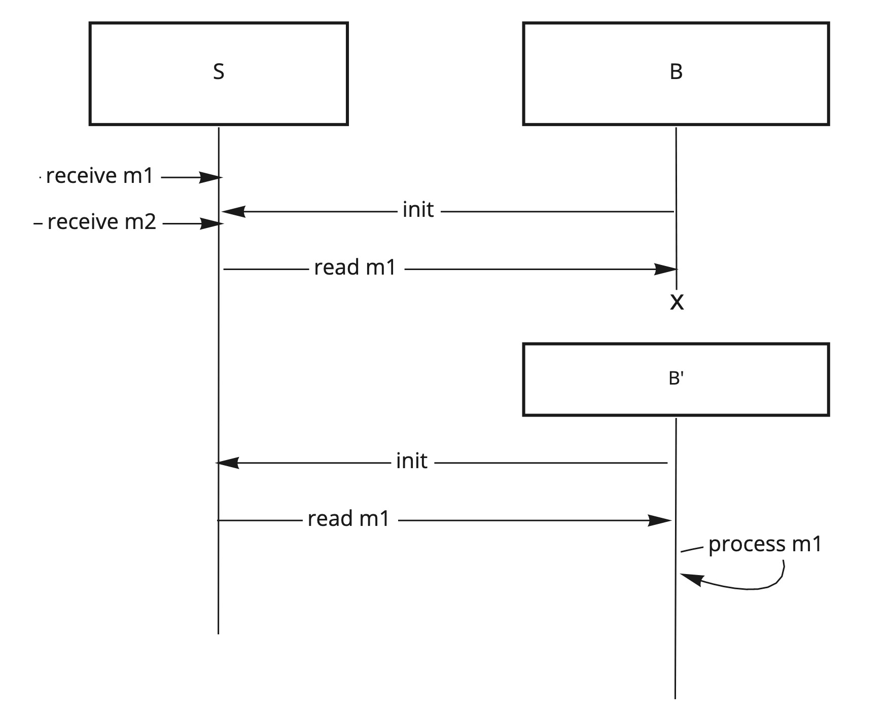

# Reliability and uniqueness

**Reliability** describes how many sent messages were received and whether some messages were lost.

Reliability can be described as the proportion between the number of unique messages received `Ru` and the total number of messages sent `S`
. When sending messages on `A->B`, `A` sends `SA` messages and `B` receives `RuB` unique messages, reliability of such delivery
is `R(A->B) = RuB/SA =< 1`. Given that `Ru` cannot be higher than `S`, reliability is always `=< 1`.

**Uniqueness** describes whether a received message is unique or is a duplicate of a message that was already received.

We can measure the duplication rate in a delivery by calculating a fraction of total messages received `R` to unique messages received `Ru`
. `DR = R/Ru`. Duplication rate of `1` means each received message was received only once, rate of `2` means that messages were received two
times on average, not necessary each message was duplicated though.

For consistency with reliability, we can use inverted duplication rate, call it **uniqueness rate** as `UR = 1/DR = Ru/R`. If `UR = 1` when
each message was received only one time, `UR = 0.5` when messages are received twice on average.

From the image above:

* Reliability `R(A->B) = 3/4`: 1 message out of 4 was lost

* Uniqueness rate `UR(A->B) = 3/4`: 1 message out of 4 was duplicated

## Delivery modes

Reliability is often described together with uniqueness as "delivery modes".

If we have a delivery mode as a tuple of reliability and uniqueness rate: `DM(A->B) = {R(A->B), UR(A->B)}`
then we can describe the following modes:

1. Unreliable: when messages may be lost or duplicated, `DM = {R < 1, UR < 1}`
1. At-most-once: when all messages are unique, but may be missing, `DM = {R < 1, UR = 1}`
1. At-least-once: when all messages are received, but may have duplicates, `DM = {R = 1, UR < 1}`
1. Exactly-once: when all messages are received and only once, `DM = {R = 1, UR = 1}`

Exactly-once delivery is controversial and hard to achieve in presence of errors. For practical purposes we're going to use a more relaxed
version of this definition where both values **approach one** `-> 1` instead of **equal one** `= 1`.

Then for relaxed exactly-once we have `DM = {R -> 1, UR -> 1}`.

## Pipeline reliability

When pipelining deliveries, e.g. `A->B ; B->C`, reliability and uniqueness rates are multiplying, because they are probabilities of
dependent events.

Which means that:

- `R(A->B ; B->C) = R(A->B) * R(B->C)`
- and `UR(A->B ; B->C) = UR(A->B) * UR(B->C)`

If we pipeline deliveries, the most relaxed delivery mode will dominate:

- at-most-once with at-least-once: the pipeline will be unreliable
- exactly-once with at-least-once: the pipeline will be at-least-once
- exactly-once with at-most-once: the pipeline will be at-most-once
- unreliable to anything: the pipeline will be unreliable

As you can see preserving high reliability in pipelined delivery is problematic and, therefore, reliability should be ensured
by [end-to-end wrapping](./Delivery.md#end-to-end-wrapping).

## Local delivery

**Local delivery is supposed to be implemented as highly reliable**.

Workers are supposed to have delivery mode close to exactly-once **as long as both workers are alive and don't have errors**. For practical
purposes delivery mode over a route with single local address `DM([0#B])` is assumed `{R->1, UR->1}`.

## Pipe reliability

If we have a pipe `P1->P2`, which connects to endpoints `A` and `B` on local routes `A->0#P1 ; P1->P2 ; P2->0#B`.

Since we assume delivery on `[0#P1]` and `[0#B]` to be exactly-once, we can assume that delivery between `A` sending and `B` receiving
messages has the same mode as delivery between `P1` receiving messages and `P2` sending messages.

We call that **pipe reliability**. Same for uniqueness rate we can define **pipe uniqueness rate**.

This allows us to design the pipes as building blocks to achieve reliable delivery, **with the caveat of having actual endpoints and pipe
workers always running and not having errors*.

**A difference between pipe reliability and delivery reliability is that pipe does not take into account delivery between pipe workers and
application workers**.

## Improving reliability

**Retries** can be used to improve delivery reliability.

- Given a chance to deliver message from `A` to `B`: `R(A->B) = 0.5`.
- If we retry delivery on missing message,
- Then it becomes `R1 = R + (1- R) * R = 0.75` on first retry, `R2 = 0.875` on second, etc.
- If retries `-> ∞`,
- Then `R∞->1`.

Retries **decrease the uniqueness rate**.

- Given `DM(A->B) = {0.5, 1}`.
- If we enable retries for this delivery,
- Then `DMr∞(A->B) = {->1, ->0.5}`, where reliability increased at the expense of reducing the uniqueness rate.

To control retries, confirmation messages and timeouts are used:

To provide at-least-once delivery between workers which don't have additional logic, at-least-once pipe can be used:

## Improving uniqueness rate

Improving delivery uniqueness rate is not possible, because we measure already received messages, and we can't un-receive them.

However, for **pipe uniqueness rates**, we can use some techniques to make sure that the pipe sender does not send the duplicates for
messages already sent.

This is called **deduplication**, which consists of ignoring some received messages based on some knowledge of which messages we already
sent.

#### ID Deduplication:

- Sender assigns a unique ID to each message
- Receiver discard messages with IDs already processed

#### Index deduplication:

- Sender assigns each message next monotonic index
- Receiver discards messages with lower index than already processed
- **Optionally receiver only processes next consecutive index**

## Reliable message delivery in presence of errors in the pipeline

Previously we assumed that workers are always alive and have no errors. In that case, given that a worker forwards all messages
exactly-once, its internal delivery mode will be also exactly-once.

Otherwise, we should consider reliability of delivery from worker receiving a message to it sending this message.

- If we have a pipeline of routes `A->X; X->B`, in which `R(A->X) -> 1`
- and `R(X->B) -> 1`,
- Then `R(A->B) = R(A->X)xR(X)xR(X->B)`. If X has errors, then `R(X) < 1`.

### Pipe injection

In order to achieve reliable delivery, we can inject a reliable delivery pipe between `A->B`, such that the messages will go
via `A->P1 ; P1->X ; X->P2 ; P2->B`.

Then if `P1` and `P2` can achieve `R(P1->P2) = 1`, `R(A->B)` will also be `1`.

### Cascade confirmation

In case we don't have a reliable delivery to the last step, or if we can have errors processing the message, then the pipe receiver may be
configured to send confirms to the pipe sender only after it gets a confirmation from the next worker in the pipeline.

For example, if we have a pipeline `A->P1; P1->P2; P2->B` and delivery `P2->B` is not reliable, then `P2` should only send confirmations
to `P1` when it receives a confirmation from `B`.

There can be multiple confirming workers in this pipeline, e.g. `A->P1; P1->P2; P2->P3; P3->B`.

Cascade confirmations can be used to implement **reliable processing**, which happens when the processing worker `B` sends confirmation
right after the message was processed and not when it was received.

### Persistent storage

Cascade confirmation may require long chains and lots of messages exchanged. To optimize that, **persistent storage** can be used. This
technique is also time dependent, but as long as message delay tolerance is lower than data storage time, it's practical.

Persistent storage `S` has `R(S) = ->1` as long as it does not delete data.

- Because `R(S) = ->1`,
- Given `R(A->S) = ->1` (with confirmations),
- And `R(S->B) = ->1` (reading from the start in case of errors),
- Then `R(A->B) = ->1`

Persistent storage is also useful in case of errors on `B`, as long as `B` can recover and retry reading from the storage:

**More on pipes and channels:** [Pipes and Channels](./Pipes_Channels.md)

**Reliable pipes implementation:** [Reliable pipes](Pipes_Directory.md#reliable-delivery)

**Back to:** [Delivery properties](Delivery.md)

**Up next:** [Ordering](Ordering.md)
