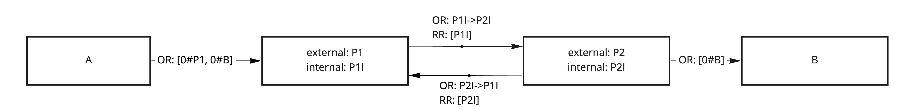

# Routing tools to connect pipes and channels

## Workers with multiple addresses

Pipes and channels rely on internal routing to deliver messages.

Internal message exchange between pipe workers for each pipe has a certain API, different from an external exchange with other workers. In
order for pipe workers to distinguish between external and internal API messages, they can use different addresses.

Each pipe worker would have `internal` address to talk to another pipe end, and an
`external` address to communicate to other workers.

All messages received on the `internal` address are handled as pipe internal API messages.

For example, for the confirm pipe:

- Sender receives messages on the external address `P1`
- It forwards messages to receiver using internal address `P2I`
- Confirms from receiver are sent using sender internal address traced in the return route `P1I`

## Session routes

Pipes (and especially channels) often use bidirectional communication and rely on coordinated state.

Simplest approach to get it is to provide this state on worker start. However, sometimes it's not possible because routes between workers
can be dynamic (contain workers with random addresses) or state needs to be dynamically generated.

In order to coordinate this state workers can exchange some handshake messages before starting to run the main pipe or channel logic.

We call this approach Sessions and such pipes and channels **session pipes** and **session channels**

**More info on using sessions:** [Sessions](./Sessions.md)

**Back to:** [Pipes and Channels](./Pipes_Channels.md)
