# Sessions

Sessions is a technique to have coordinated state across multiple workers.

Sessions are useful when working with distributed forwarding like Pipes and Channels.

Basic session concepts are described here: [Sessions discussion thread](https://github.com/build-trust/ockam/discussions/1486)

## Terminology

- Session: coordinated state between two or more workers
- Initiator: worker starting the session
- Responder: worker participating in the session, which is not an initiator
- Handshake stage: a stage in a session state machine during which handshake messages are sent
- Data stage: a stage in a session state machine when session is established
- Handshake message: message sent in handshake stage
- Data message: message sent in data stage
- Init route: a route used to send a first handshake to
- Data route or Session route: a route used to send data messages
- Session state: coordinated state of workers

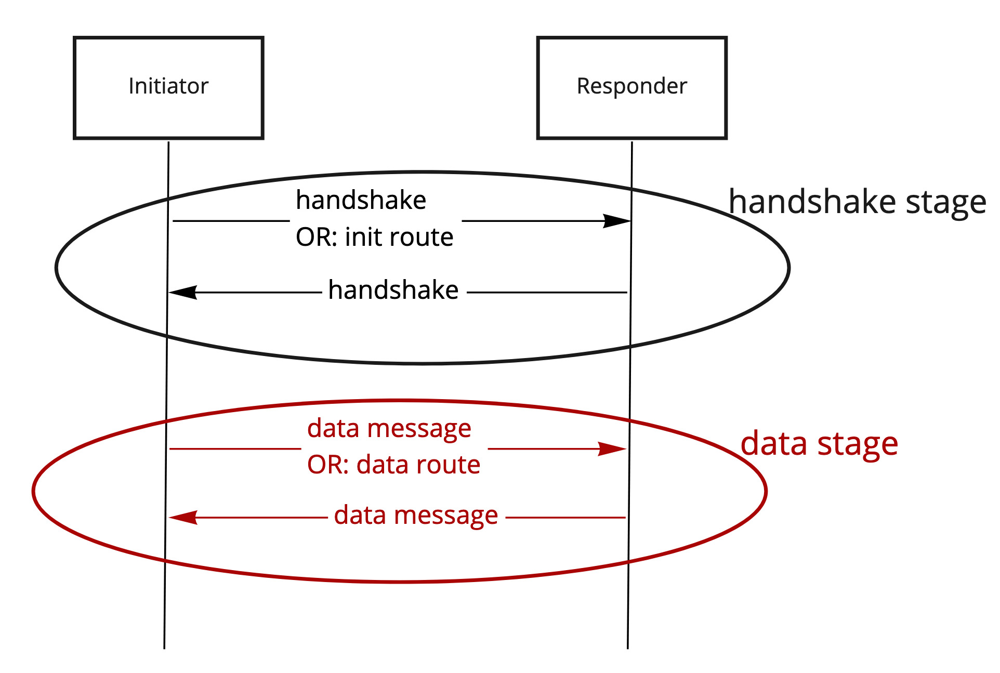

## Session routes and discovery

Basic component of coordinated workers is routing. Each worker in the session [should know a route to other workers](./Accessibility.md).

### Static routes

Session routes may be static when all workers know a route to each other in advance.

In static sessions, init route and data route are usually the same.

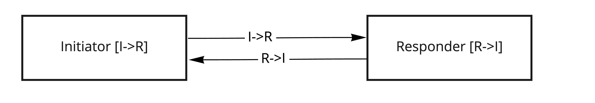

### Dynamic routes

But, usually, session handshake can be used to discover the routes. Sessions are often used just to discover the routes between workers.

To discover a responder, initiator uses discovery worker route that is known in advance to initiator. Discovery worker then forwards the
handshake to responder, which can send a handshake back to initiator.

Such discovery often relies on routes being **backtraceable**.

In this case init route is a route to discovery worker and data route is created dynamically using backtracing of the handshake messages.

Discovery workers may either serve as proxies for the handshake messages or hand over routing by tracing or not tracing its return address
in the handshake messages.

Hand-over workers require `A` to be mutually accessible from `B` via `rrA` and `rrB`.

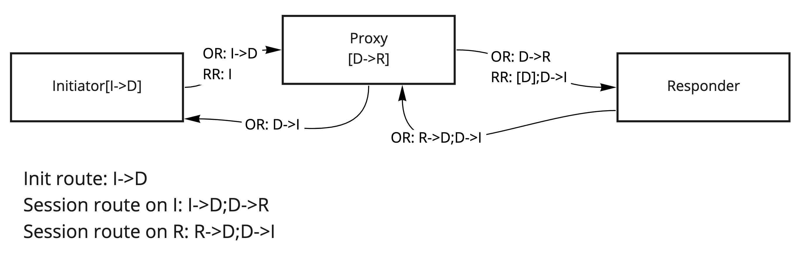

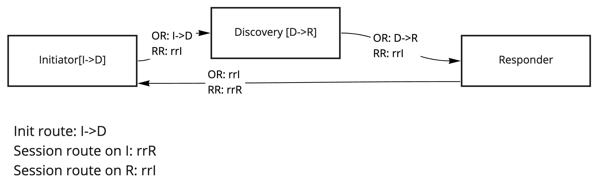

## Spawners

Spawner is a type of worker which creates new workers on demand.

Spawners create new workers when receiving a "create" message. Newly spawned workers send the "create_ok" message when initialized to "reply
route" to populate the address of a new worker.

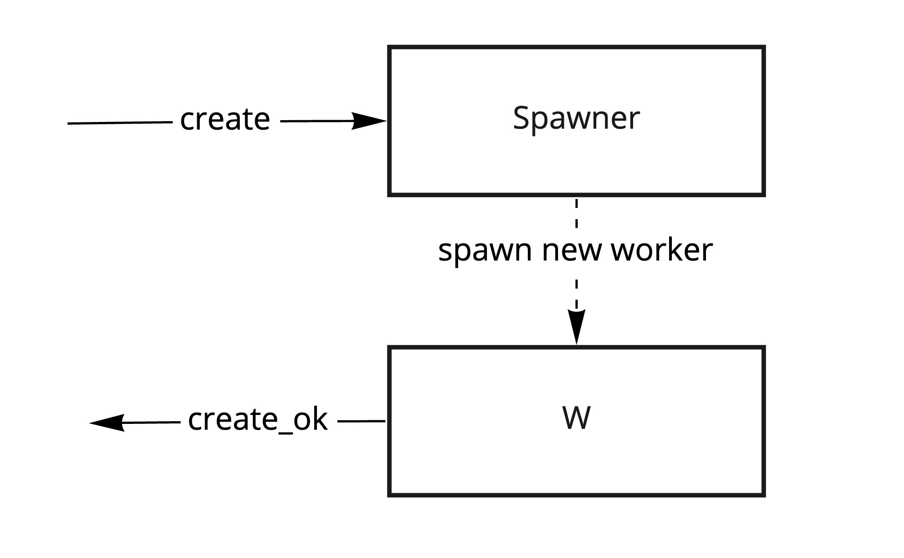

Reply route may lead to some discovery worker, which will save the spawned worker route and make it available to other workers.

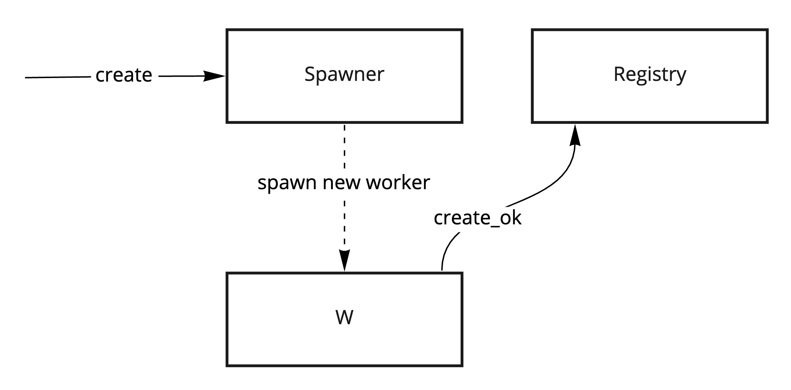

Spawner worker may serve as a discovery worker if reply route leads back to the spawner.

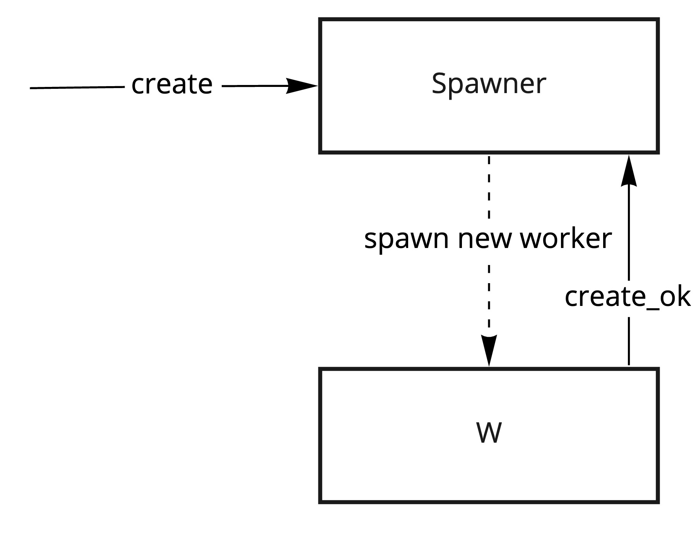

If "create" message route is backtraced, reply route can be a backtrace to the original message.

In this case the worker which sent "create" message will receive "create_ok" message. This type of spawning can be used to spawn Responders
using session handshake.

Session init route leads to the spawner.

Session data route will be traced with "create_ok" message
"create_ok" message would carry a handshake response from newly spawned Responder.

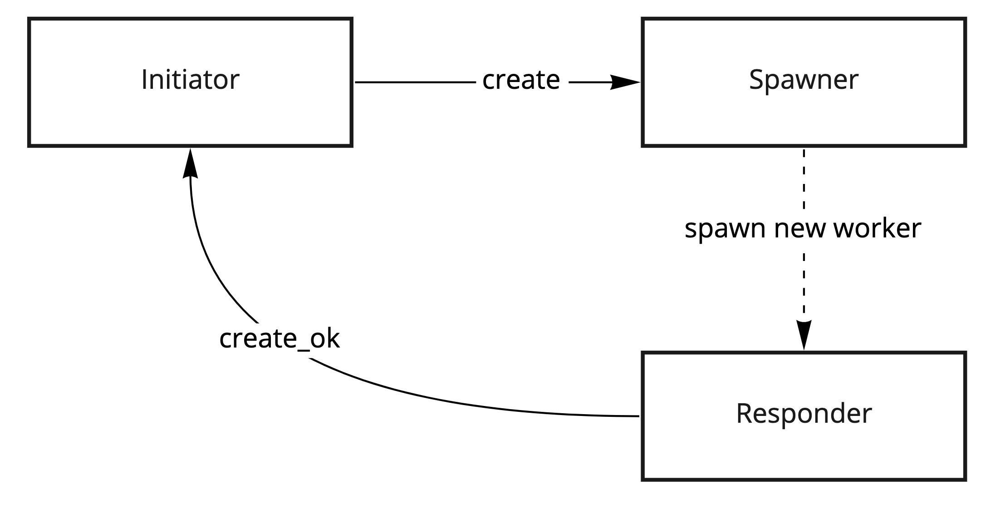

Pipe and channel sessions can be established using discovery and spawners.

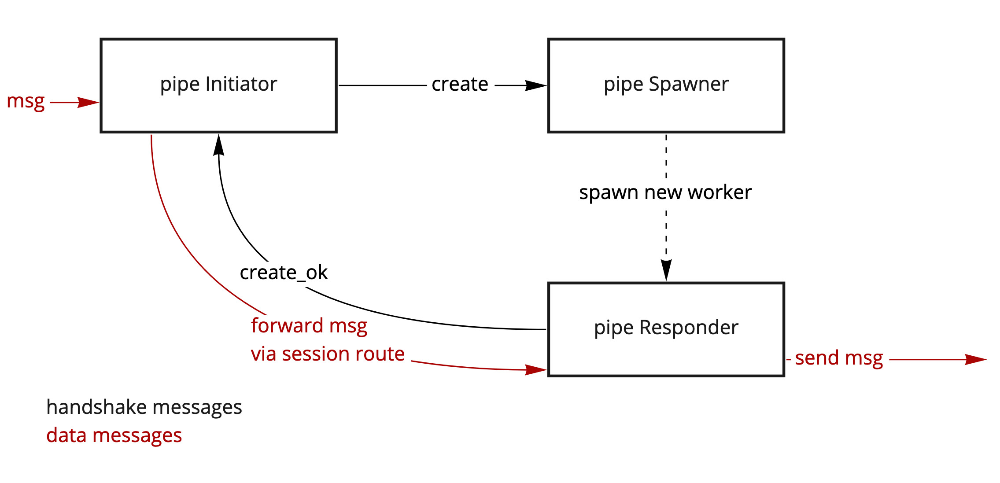

## Routing session handshakes

Ping handshake:

- Given routes between `I` and `R` are backtraceable and workers can use return routes.
- Initiator sends a traceable ping to responder with backtraceable message.
- Responder makes a return route from the ping message and sends pong to it.

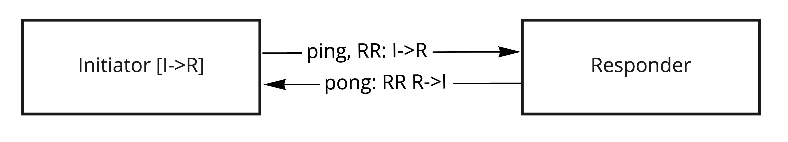

Ping handshake with discovery worker or spawner:

- Initiator sends the ping message to discovery.
- Discovery worker forwards the ping message to responder (or creates a new responder): responder knows the route to initiator.
- Responder sends the pong message: initiator knows the route to responder.

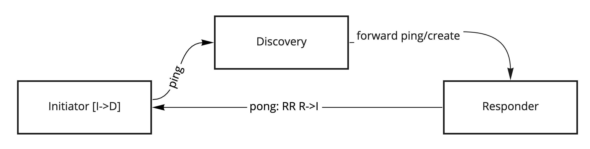

Multi-stage handshake with discovery, which can be used if init route is not backtraceable:

- Initiator sends an init to responder
- Responder gets a backtraceable route to initiator from somewhere (e.g. additional metadata)
- Responder sends a ping to initiator on this route
- Initiator replies with pong on the return route
- (Optionally) initiator and responder may continue sending handshakes

Example: responder is listening to stream events and establishes a TCP connection on init message.

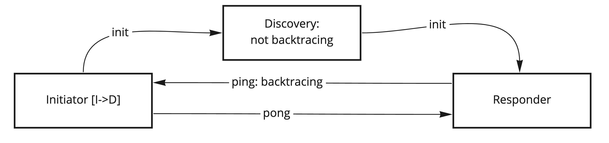

## Session state machines

Here are some state machine diagrams for different kinds of sessions:

### Simple session

In this session Initiator and Responder establish a session state and move to the data stage. Session state is final and not re-negotiated
after establishment.

Initiator:

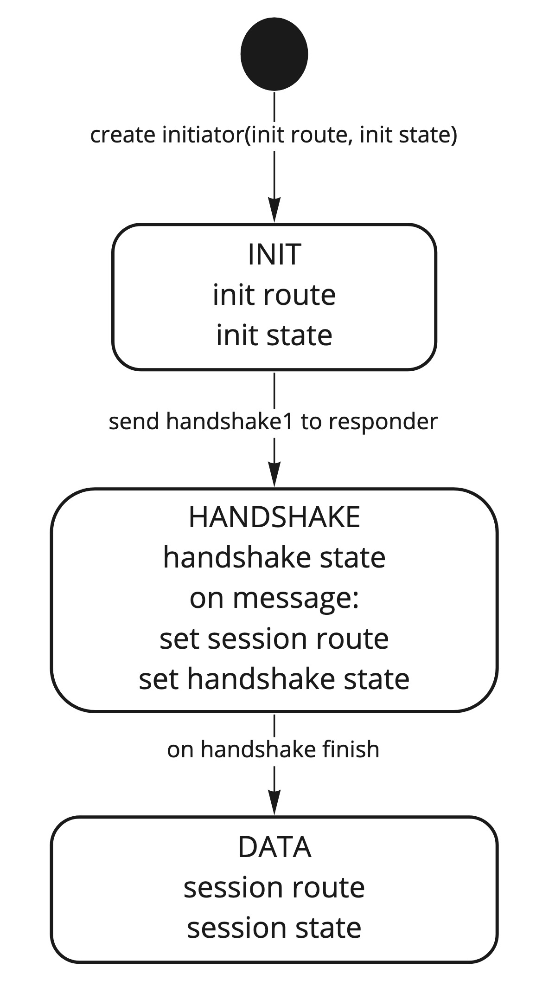

Static responder (waiting for handshake from initiator):

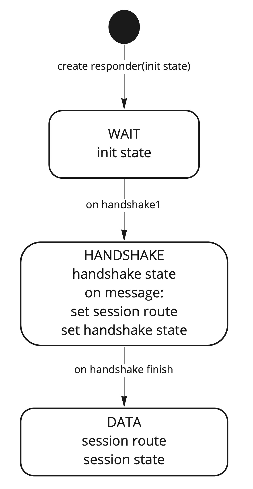

Spawned responder (created by spawner with handshake as create message):

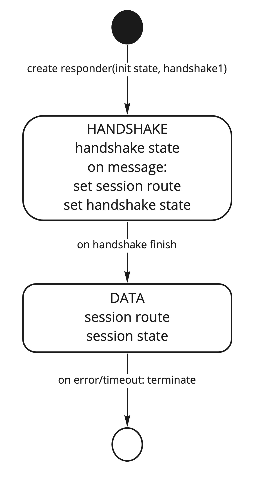

### Recoverable session

This behaviour can re-negotiate the session after data stage error.

Initiator:

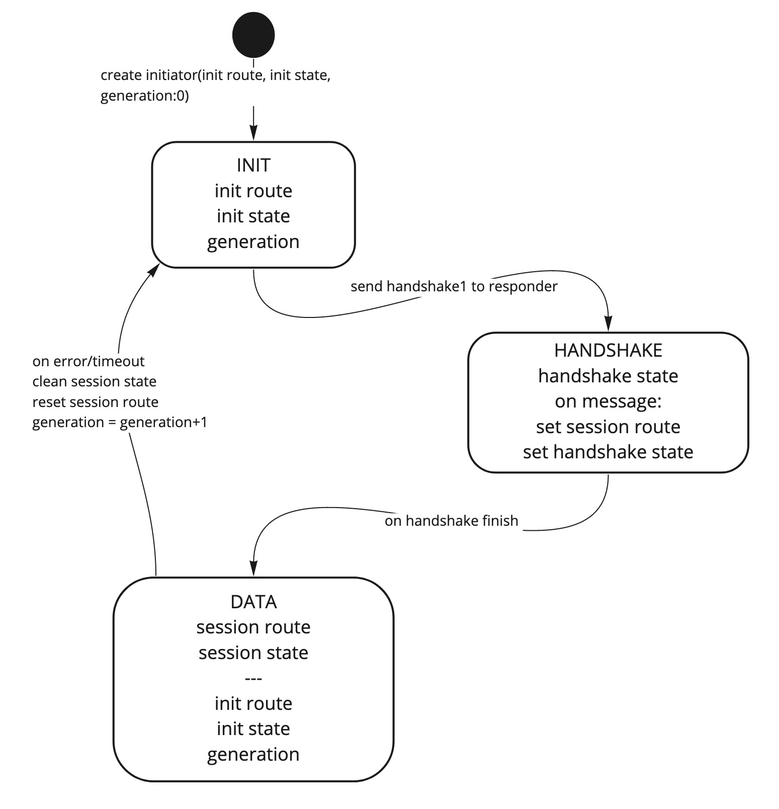

Static Responder:

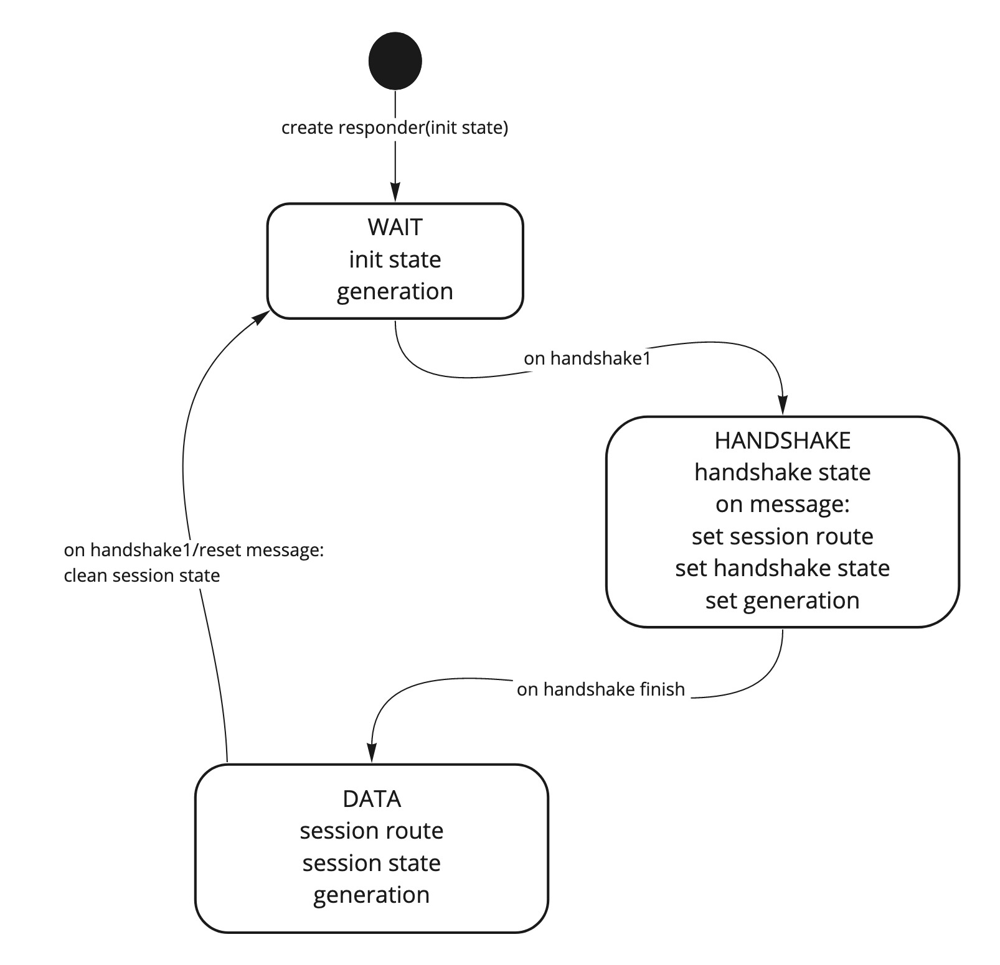

Spawned recoverable responder would look the same as simple responder because it's created anew on session establishment.

## Resettable session

This behaviour allows re-negotiation on-demand.

Initiator:

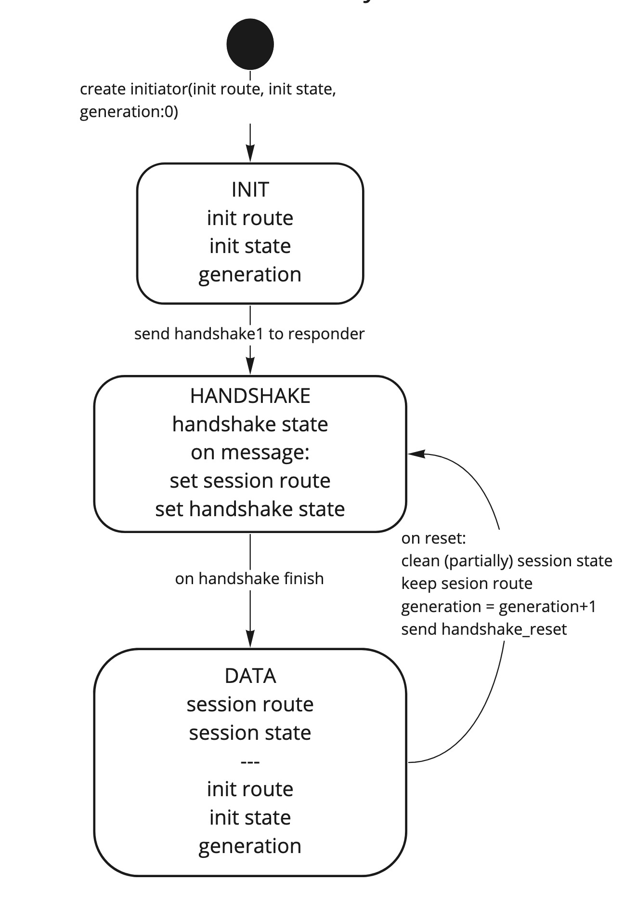

Spawned Responder:

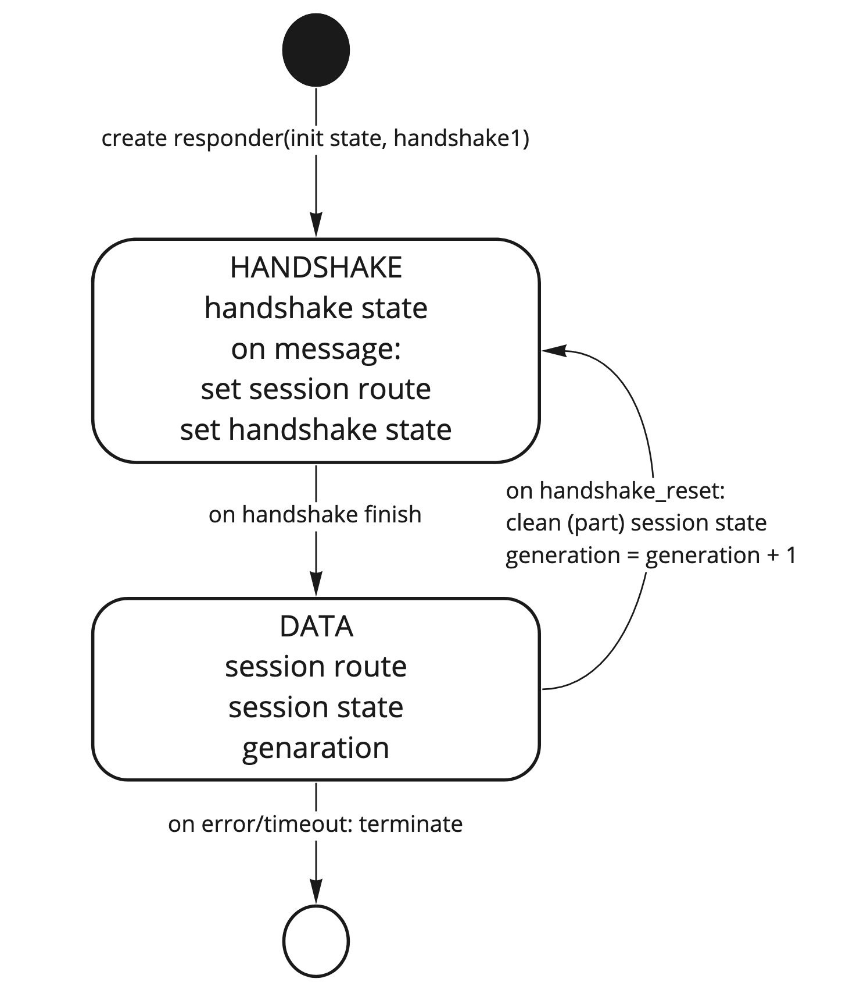
