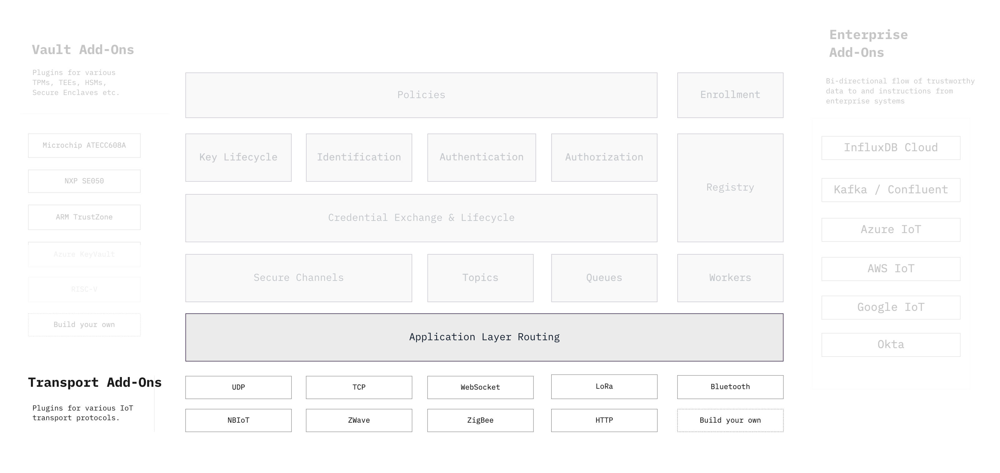

```yaml
title: Application Layer Routing
order: 2
```

# Application Layer Routing



To enable end-to-end encrypted [secure channels](./secure_channels) that don't
expose application data on network intermediaries, Ockam includes a
lightweight, binary, application layer routing protocol.

This protocol enables secure channels that can span across the length of
multiple network connections. Ockam Routing Protocol messages encode
their onward and return routes in the message and can carry arbitrary payload
data. This is how we achieve end-to-end encryption.

This design decouples Ockam's suite of cryptographic protocols, like secure
channels and credential exchange, from the underlying means of transporting
messages.
