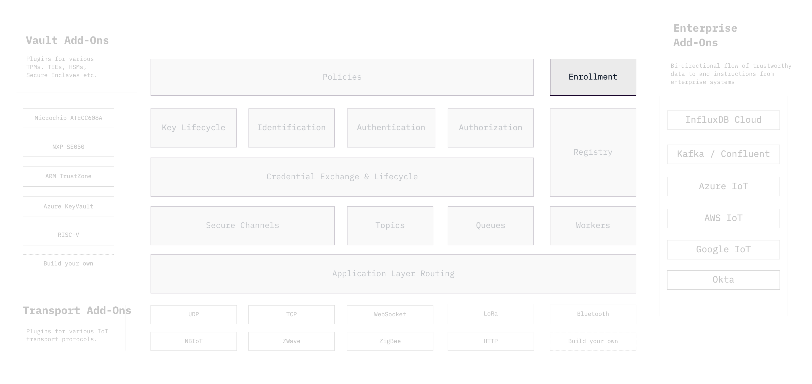

```yaml
title: Device Enrollment
order: 5
```

# Secure Enrollment in Connected Fleets



Bootstrapping trust between enterprise systems and devices can be very
challenging at scale. We must, somehow, provision unique cryptographic keys
and credentials in large fleets of remote devices.

We encounter a chicken and egg like trust situation that often leads to
manual enrollment of devices which is very slow, costly and error prone when
dealing with thousands of devices. This challenge is also usually why
manufacturers end up hardcoding credentials into devices which is a major
source of IoT security breakdowns (see: Mirai and its derivative botnets).

The Ockam Enrollment protocol facilitates secure enrollment of devices to
an enterprise service. We enable this using an enroller device which may be
a fixture at the end of an assembly line or an app in a handheld
at the install location.

The enroller facilitates a three way handshake using well established
cryptographic primitives to bootstrap a secure channel between the enrolee
and an enterprise service without exposing a device's unique private keys
and credentials to the enroller.

Further, this bootstrapping can happen in partially connected, asynchronous
environments where the enroller may connect with an not-yet-connected enrollee
over protocols that require a wired connection (Ethernet, Serial etc.) or
those that only work over short distances (Bluetooth, NFC etc.) to provide
it with cryptographic material needed to enroll along with credentials and
other information needed to connect the local network and to the end service.
