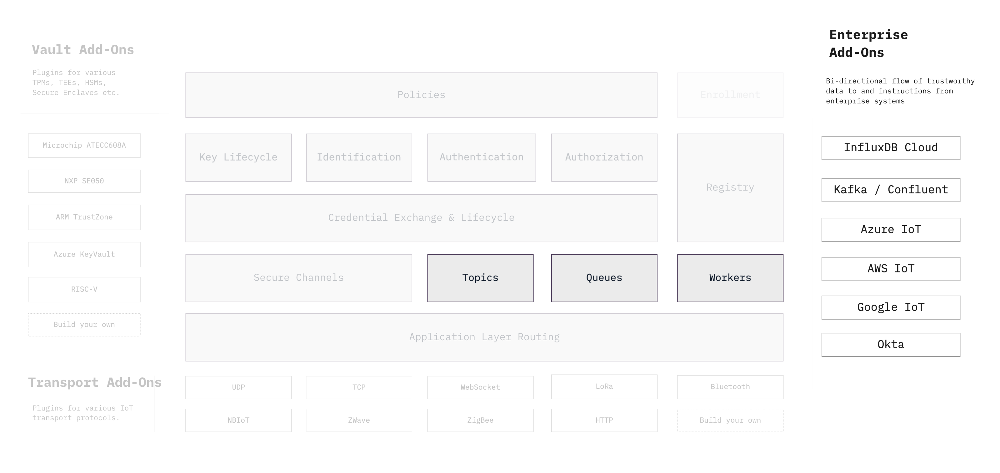

```yaml
title: Enterprise Add-Ons
order: 7
```

# Enterprise Add-Ons: For Cloud Services and Enterprise Architectures



Ockam is focused on helping application developers build __dependable__
IoT and edge systems. Systems that are secure, respect user privacy and can
be relied on for business critical applications.

Our protocols and libraries are designed to become a part of larger enterprise
systems and applications.

Ockam enables bi-direction flow of trustworthy messages between edge devices
and cloud services. To make integration easy with existing enterprise
applications, we are building add-ons that tightly integrate Ockam with other
systems like Kafka, InfluxDB and Okta that are commonly leveraged within
modern enterprise architectures.
