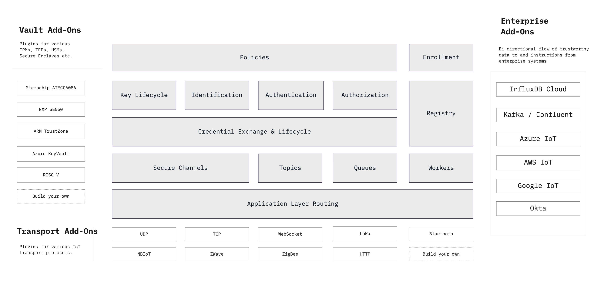

```yaml
title: Concepts
order: 2
```

# Overview



Ockam is a suite of tools, programming libraries and infrastructure that make
it easy to build devices that communicate securely, privately and trustfully
with cloud services and other devices.

We believe that Security, Privacy and Trust are application layer concerns and
IoT developers should have simple tools to granularly control these aspects
of their applications.

Cryptographic protocols can be a powerful tool to solve many complex, real world
challenges in deploying dependable IoT at scale. Such protocols, however, must
be designed and implemented with extreme care.

In Ockam, we're taking proven cryptographic building blocks and applying them
to build solutions for common IoT and edge computing problems like:

* Secure, easy and rapid __enrollment of large fleets__ of devices.
* Scalable provisioning, proof of possession, rotation, and revocation
  of __identity keys and credentials__.
* __End-to-end encrypted communication__ over low-bandwidth, intermittently
  connected, multi-protocol IoT and edge network topologies.

Our goal is to provide this functionality in multiple programming languages with
secure, high level application interfaces that are easy to use correctly and
hard to misuse.
