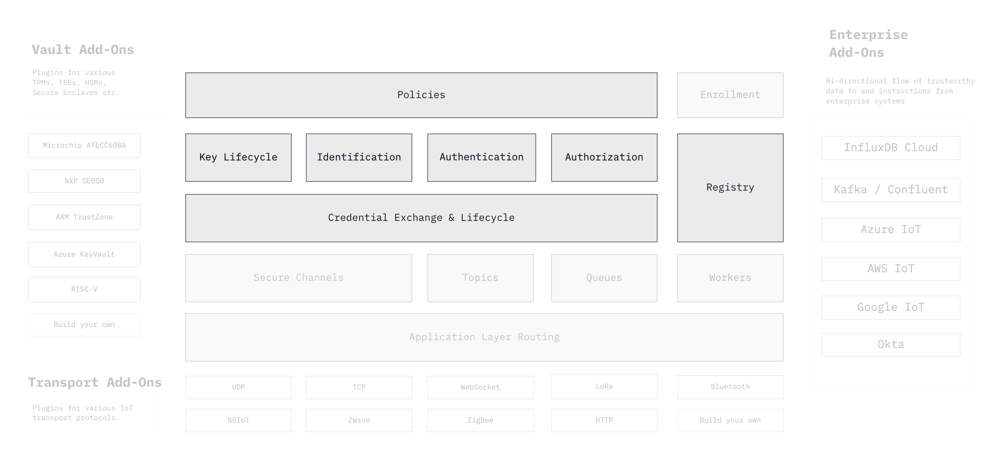

```yaml
title: Machine Identities and Credentials
order: 4
```

# Machine Identity and Access Management



In modern secure systems, since there should be [no implicit trust in network
boundaries](https://www.nist.gov/publications/zero-trust-architecture),
trust must be based on the identification, authentication and
authorization of the sender of each message.

An application's access decisions must be rooted in unique cryptographic
identities and credentials. This can be very challenging to implement
correctly and scale to large fleet of devices.

Ockam includes a suite of robust cryptographic protocols, accessible through
simple to use programming libraries, that enable application developers to
focus on the trust rules and policies of their IoT systems.

The Ockam programming libraries help easily encode, business specific,
granular access control logic into applications without having to deal with
the complexities of cryptographic protocols or falling back to weak, coarse
grained security based on network boundaries.
