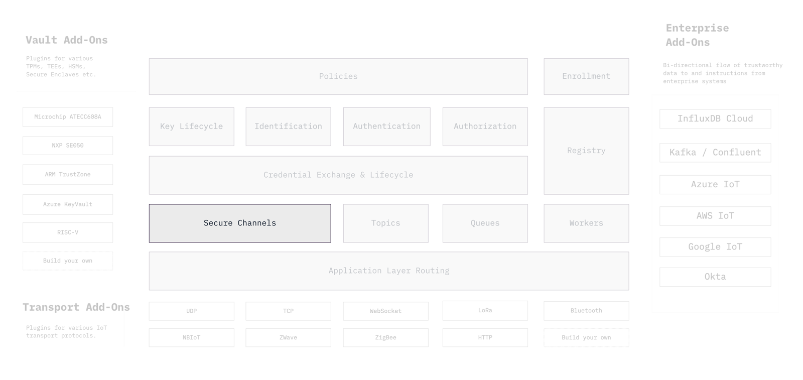

```yaml
title: End-to-end encrypted secure channels
order: 1
```

# End-to-end encrypted secure channels



Secure Channels provide end-to-end encrypted and mutually authenticated
communication that is safe against eavesdropping, tampering, and forgery
of messages en-route.

Machines, within IoT systems, communicate amongst each other by exchanging
messages over a variety of transport protocols like TCP, UDP, Bluetooth,
ZigBee, LoRaWAN etc. Many of these protocols also come with some means of
establishing secure communication, however, the security properties of these
mechanisms can vary in many subtle but significant ways.

In typical IoT scenarios, a message travels over multiple transport
protocol connections before reaching its destination and this communication
is often asynchronous. En-route, the message passes through several protocol
gateways, edge gateways, vendor specific servers, load balancers,
network proxies etc.

This means that even though, in well configured systems, each connection may
be secure, the end-to-end application layer communication is insecure
because the application's data is fully observable and manipulatable at these
intermediaries.

Furthermore, experienced system architects know that network boundaries are
not enforceable in modern real world environments. This is why we've embraced
the mantra of [Zero Trust in network perimeters](https://www.nist.gov/publications/zero-trust-architecture).

The zero trust principles teach us that the best security design strategy is
to assume that internal and partner networks are just as fraught with danger
as the public internet. There should be no implicit trust in network location
and infrastructure, instead applications must be able to make granular access
decisions based on cryptographic identities and credentials.

Ockam includes simple library functions to bootstrap and create lightweight,
end-to-end secure channels that enable application developers to easily
encode these precise, granular, least privilege access decisions within their
IoT systems.
