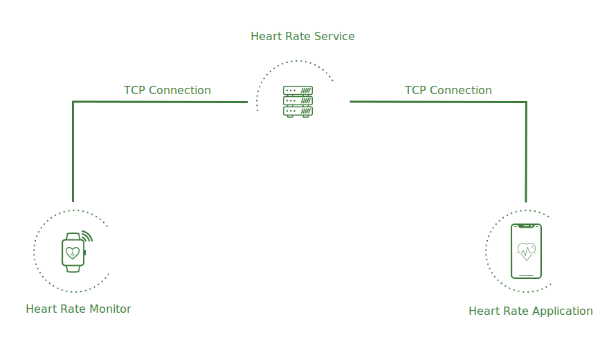
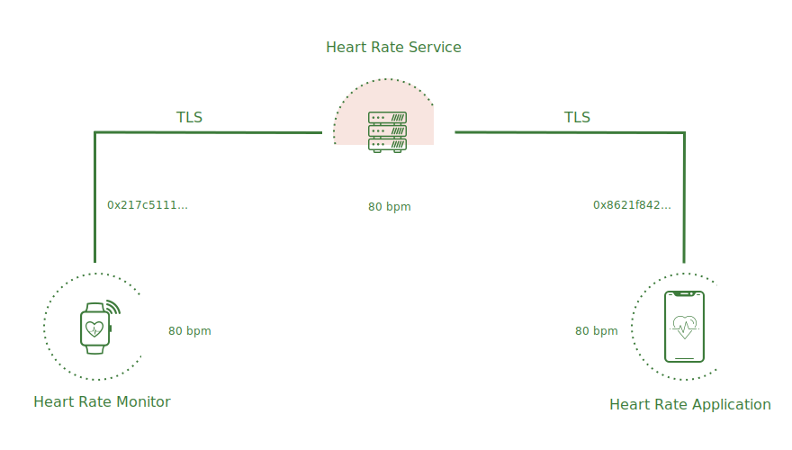
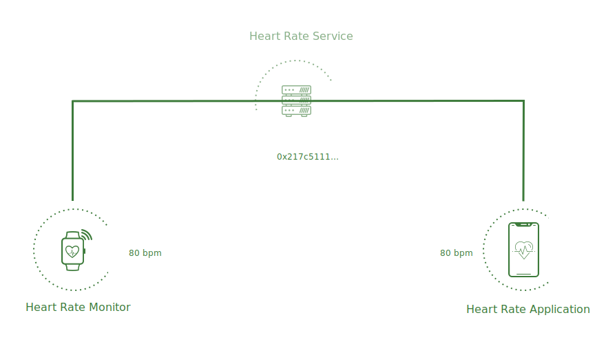
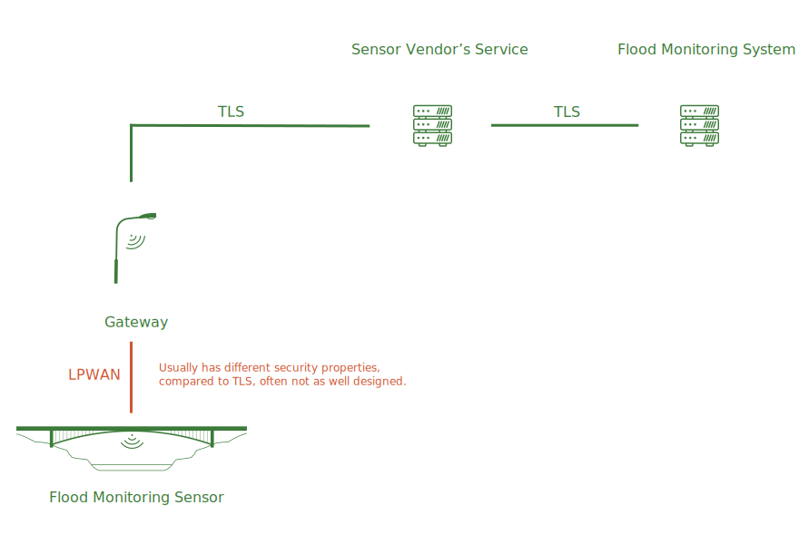
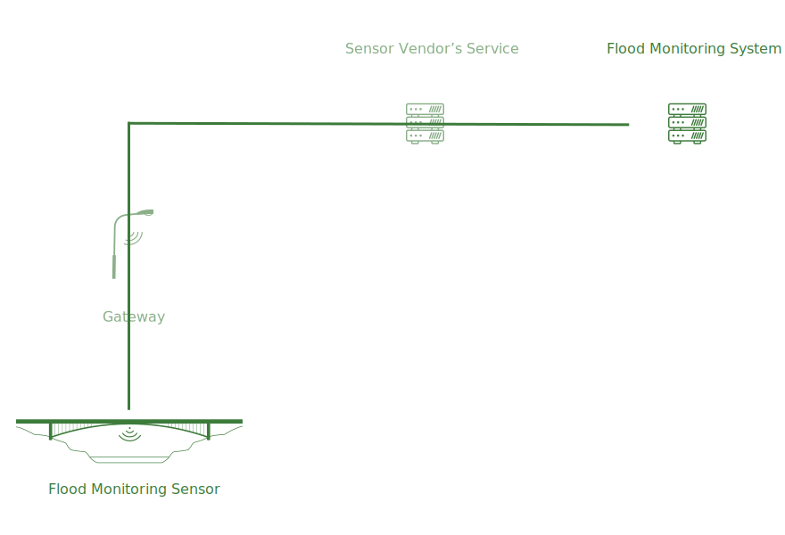

```yaml
title: Secure Channels
```

# Secure Channels

Secure Channels provide end-to-end secure and private communication that is
safe against eavesdropping, tampering, and forgery of messages en-route.

Machines, within IoT systems, communicate amongst each other by exchanging
messages over a variety of transport protocols like TCP, Bluetooth,
ZigBee, LoRaWAN etc. Many of these protocols also come with some means of
establishing secure communication, however, the security properties of these
mechanisms can vary in many subtle but significant ways.

In case of TCP, communication is secured using TLS which is the most mature
amongst the various secure transport protocols that are commonly used within
IoT systems. While the latest version, TLS 1.3, is notably simpler than
previous versions, TLS remains intrinsically complex in order to support the
needs of legacy web browsers and web servers.

These legacy requirements don't usually apply to IoT systems and TLS' complex
negotiation logic is an overhead. A variety of configuration options and more
[cryptographic agility](https://www.imperialviolet.org/2016/05/16/agility.html),
than what is required, also make TLS challenging to configure correctly in
large scale IoT deployments.

Furthermore, in many IoT scenarios, __a message travels over multiple transport
protocol connections before reaching its destination__. For instance, a
message from a heart rate monitor to a phone application would typically require
at least two transport connections. The monitor makes a TCP connection to a
server on the Internet, the phone also makes a different TCP connection to the
same server.



This is typical because usually neither device is listening, as a TCP server,
at a fixed public address. Instead, both devices connect, as TCP clients, to a
well know server address and that server then routes messages from the monitor
to the phone and vice versa. This topology can handle various routing related
complexities like when either device is roaming and their IP address is
continuously changing or when either device is offline or if either is behind
a NAT.

Since TLS is usually tied to a TCP connection, this means that even in cases
where TLS is configured correctly our data is entirely exposed to the server
whose primary task, in our topology, was supposed to be routing and caching
of messages. All protections provided by TLS against eavesdropping, tampering,
and forgery of messages are lost at the server even though routing and caching
don't even require it to know the entire contents of a message.

This violates the security design principle of
[least privilege](https://en.wikipedia.org/wiki/Principle_of_least_privilege)



Ockam includes an end-to-end secure channel protocol that can span across
multiple transport connections.



This secure channel protocol can be layered on top of most common IoT transport
protocols to provide a consistent, simple to configure end-to-end secure channel
even in scenarios where multiple transport protocols are in the path of one
message.



Many secure communication protocols, other than TLS, that are commonly used within
IoT systems tend to be lacking in their design and security properties. Usually
there is no forward secrecy, no protection against key compromise impersonation
attacks and generally poor hiding of identities.



Decoupling the secure channel protocol from the transport protocols removes
the complexity of dealing with multiple disparate secure protocols, enables us to
have end-to-end secure channels, minimizes the attack surface and helps us to build
better end-to-end secure and private systems.

The precise design of the secure channel protocol is being discussed as part of
Ockam Proposal [OP-0002](https://github.com/ockam-network/proposals/tree/master/design/0002-secure-channels).
