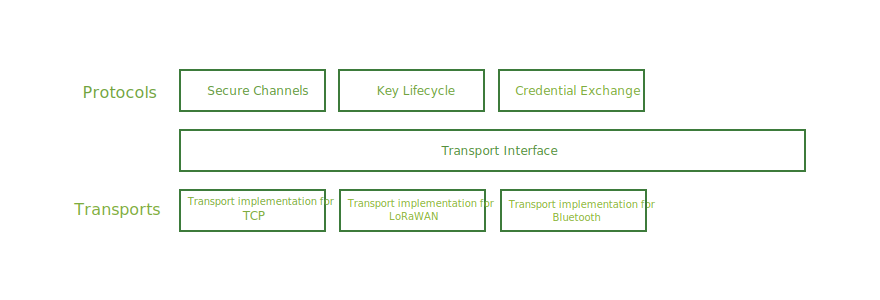

```yaml
title: Transports
```
# Vaults

Connected machines and devices communicate amongst each other by exchanging
messages over a variety of transport protocols like TCP, UDP, Bluetooth,
ZigBee, LoRaWAN etc.

Ockam includes a set of secure communication protocols, like
[secure channels](./secure_channels) that provide their functionality in a
way that is agnostic to the underlying means of transporting messages.
Such higher level protocols need a simple consistent mechanism, to send
and receive messages, that only loosely couples them with the underlying
transport protocol. This loose coupling is achieved using an abstract
`Transport` interface.

A concrete implementation of the `Transport` interface is called an Ockam
Transport. Over time there will be many such implementations.



This loose coupling between Ockam's higher level protocols and how a specific
transport sends or receives messages allows us to design secure protocols
that can provide consistent guarantees in complex IoT topologies.

The precise design of the `Transport` interface is being discussed as part of
Ockam Proposal [OP-0005](https://git.io/JvOLf).
