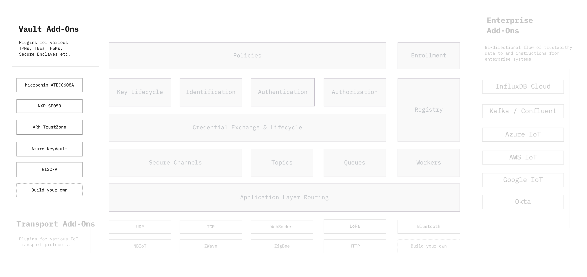

```yaml
title: Vault Add-Ons
order: 6
```

# Vault Add-ons: For Cryptographic Hardware



Various Ockam protocols, like secure channels, key lifecycle, credential
exchange, device enrollment etc. depend on a variety of standard
cryptographic primitives or building blocks. Depending on the environment,
these building blocks may be provided by a software implementation or a
cryptographically capable hardware component.

In order to support a variety of cryptographically capable hardware we
maintain loose coupling between our protocols and how a specific
building block is invoked in a specific hardware. This is achieved using
an abstract `Vault` interface.

A concrete implementation of the `Vault` interface is called an Ockam
Vault. Over time, and with help from the Ockam open source community, we
plan to add vaults for several TEEs, TPMs, HSMs, and Secure Enclaves.
