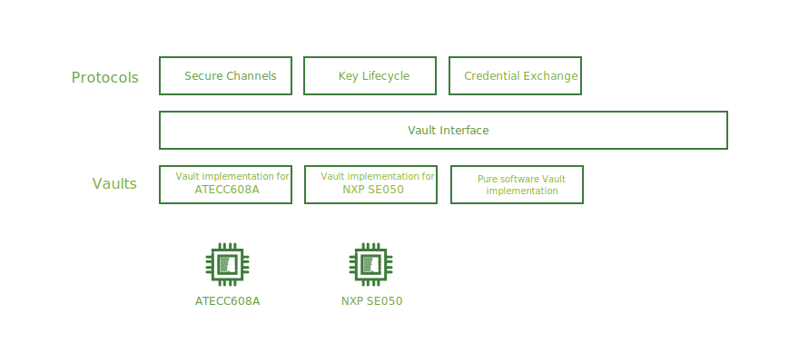

```yaml
title: Vaults
```

# Vaults

Various Ockam protocols depend on a variety of standard cryptographic
primitives or building blocks. Depending on the environment, these
building blocks may be provided by a software implementation or a
cryptographically capable hardware component.

In order to support a variety of cryptographically capable hardware we
maintain loose coupling between a protocol and how a specific
building block is invoked in a specific hardware. This is achieved using
an abstract `Vault` interface.

A concrete implementation of the `Vault` interface is called an Ockam
Vault. Over time there will be many such implementations.



The `Vault` interface exposes functions for generating and using
cryptographic keys, secure random numbers, key derivation, hashing,
message authentication, digital signatures, Diffie-Hellman key exchange,
authenticated encryption etc.

The precise design of the `Vault` interface is being discussed as part of
a draft Ockam Proposal [OP-0005](https://github.com/ockam-network/proposals/tree/main/design/0005-vault-interface).
