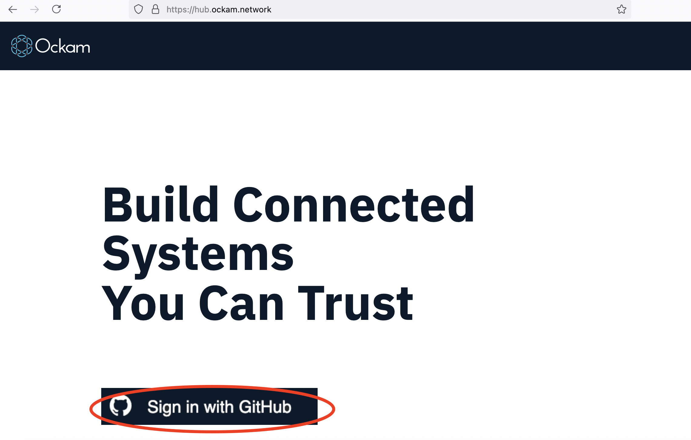
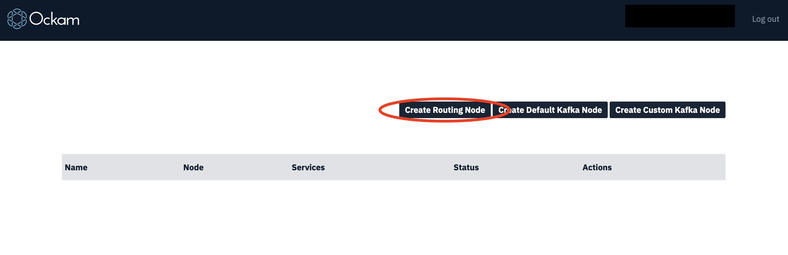
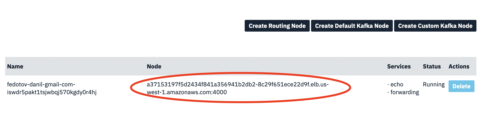

# Using Cloud nodes

## Ockam Hub

In previous examples we learned how to send messages between nodes using [transports](../07-routing-over-transport).

But to connect two nodes at least one of them must be exposed via hostname or a public IP, which makes connecting devices challenging. To address that we can use special kind of node running on the cloud with a fixed hostname and make it forward messages between devices. We call such nodes Ockam Hub Nodes.

You can host a Hub Node yourself, or use one provided by Ockam service at https://hub.ockam.network

Hub Nodes run persistent workers, which are called services. Services can be used for discovery, routing and
integration with various cloud services used by the application.

This guide shows how to start a new Hub Node, connect an application and use services in there.

## Creating Hub Nodes

1. Navigate to http://hub.ockam.network

1. In order to create a node, you need to log in using your GitHub account:

    

1. After that you can create a routing node:

    

1. When the node status changes to `Running`, the node is ready to use.

1. You can copy the node name from the nodes list and use in the following example.

    

## Example service usage

In this example we're going to use the `echo_service` on the Hub Node we created. This service behaviour is similar to the `echoer` workers we used before - it will reply for a message with the same payload.

### Application code

Create a new file at:

```
touch examples/10-routing-to-a-cloud-node.rs
```

Add the following code to this file:

```rust
// This node routes a message, to a worker on a cloud node, over the tcp transport.

use ockam::{route, Context, Result, TcpTransport, TCP};

use std::net::{SocketAddr, ToSocketAddrs};

#[ockam::node]
async fn main(mut ctx: Context) -> Result<()> {
    // Create a cloud node by going to https://hub.ockam.network

    let cloud_node_tcp_address = "<Your node host copied from hub.ockam.network>:4000";

    // Initialize the TCP Transport.
    let tcp = TcpTransport::create(&ctx).await?;

    // Create a TCP connection to your cloud node.
    tcp.connect(cloud_node_tcp_address).await?;

    // Send a message to the `echo_service` worker on your cloud node.
    ctx.send(
        // route to the echo_service worker on your cloud node
        route![(TCP, cloud_node_tcp_address), "echo_service"],
        // the message you want echo-ed back
        "Hello Ockam!".to_string(),
    )
    .await?;

    // Wait to receive the echo and print it.
    let msg = ctx.receive::<String>().await?;
    println!("App Received: '{}'", msg); // should print "Hello Ockam!"

    // Stop the node.
    ctx.stop().await
}

```

### Run

```
cargo run --example 10-routing-to-a-cloud-node
```

<div style="display: none; visibility: hidden;">
<hr><b>Next:</b> <a href="../xx-discovery-using-cloud-node">XX. Discovery using cloud node</a>
</div>

