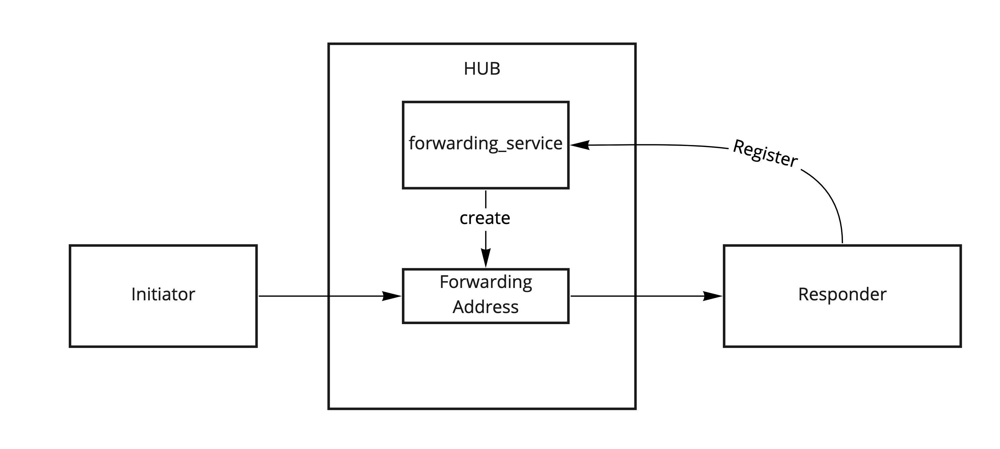

# Connecting devices using Hub Node

## Introduction

In the previous guide we learned how to [create a Hub Node](../xx-hub-node) and use services there using the TCP transport.

Hub Nodes can be used as proxies to connect devices not exposed by public hostnames or IPs. These nodes can forward the traffic from one device to another using the Ockam Transport connections established by device nodes.

## Connecting nodes using forwarding

To reach another worker in an Ockam Network, sender worker has to be aware of the route to the destination worker.
If we're connecting device nodes over a Hub Node using TCP connection, this route would lead through a TCP connections which are dynamic and not exposed to the device nodes.

Hub Node provides Forwarding Service which can be used to solve that. A device node worker can register with the Forwarding Service to create a Forwarding Address local to the Hub Node.
All messages sent to the Forwarding Address will be redirected to the registered worker.



Ockam Rust library provides an API to use Forwarding Service

```rust
RemoteForwarder::create(ctx: &Context, hub_route: Into<Route>, destination: into<Address>)
```

Where `hub_route` is a route to the Hub Node and `destination` is a local address to which messages will be forwarded.

For example `RemoteForwarder::create(&ctx, route![(TCP, "127.0.0.1:4000")], "echoer");` would register a Forwarding Address to the local "echoer" worker.

This function returns the Forwarding Address

## Application code

In this example we're going to connect two nodes using the Forwarding Service

One node we call "responder", it will run an "echoer" worker and will register a route with the Forwarding Service.
The Forwarding Address it registers will be shown to be used by another node.

Another node we call "initiator", it will use the Forwarding Address generated by responder to send a message.


### Responder

First create a responder at:

```
touch examples/xx-connecting-devices-using-hub-node-responder.rs
```

Add the following code to this file:

```rust
use ockam::{route, Context, RemoteForwarder, Result, TcpTransport, TCP};
use ockam_get_started::Echoer;

#[ockam::node]
async fn main(ctx: Context) -> Result<()> {
    // Create a hub node by going to https://hub.ockam.network
    let hub_node_tcp_address = "<Your node Address copied from hub.ockam.network>"; // e.g. "127.0.0.1:4000"

    // Initialize the TCP Transport.
    let _tcp = TcpTransport::create(&ctx).await?;

    // Create an echoer worker
    ctx.start_worker("echoer", Echoer).await?;

    // Ask the forwarding_service, in your node in Ockam Hub,
    // to create a forwarder that would forward all its messages
    // to the "echoer" worker we created above.
    let forwarder =
        RemoteForwarder::create(&ctx, route![(TCP, hub_node_tcp_address)], "echoer").await?;

    println!("Forwarding address: {}", forwarder.remote_address());

    Ok(())
}
```

This node will run an `echoer` worker to reply to the messages sent from the initiator node.

### Run responder

You need to get the Forwarding Address from the Hub Node first in order to configure the initiator properly.

To do that run:

```
cargo run --example xx-connecting-devices-using-hub-node-responder
```

You will see the log message `Forwarding Address: ...` - copy the address from here

### Initiator

```
touch examples/xx-connecting-devices-using-hub-node-initiator.rs
```

Add the following code to this file (replace fields in `<>` with values you copied):

```rust
// This node routes a message, to a different node, using a forwarding address on the hub node.
use ockam::{route, Context, Result, TcpTransport, TCP};

#[ockam::node]
async fn main(mut ctx: Context) -> Result<()> {
    // Create a hub node by going to https://hub.ockam.network
    let hub_node_tcp_address = "<Your node Address copied from hub.ockam.network>"; // e.g. "127.0.0.1:4000"

    // Run xx-connecting-devices-using-hub-node-responder,
    // it will print the forwarding address of echoer on your hub node
    let echoer_forwarding_address = "<Address copied from responder output>";

    // Initialize the TCP Transport.
    let _tcp = TcpTransport::create(&ctx).await?;

    // Send a message to the echoer worker, on a different node,
    // using a forwarding address on your hub node
    ctx.send(
        route![(TCP, hub_node_tcp_address), echoer_forwarding_address],
        "Hello Ockam!".to_string(),
    )
    .await?;

    // Wait to receive a reply and print it.
    let reply = ctx.receive::<String>().await?;
    println!("App Received: {}", reply); // should print "Hello Ockam!"

    // Stop all workers, stop the node, cleanup and return.
    ctx.stop().await
}
```

### Run initiator

```
cargo run --example xx-connecting-devices-using-hub-node-initiator
```

You should expect a log message `App Received: Hello Ockam!`


## Message flow


<div style="display: none; visibility: hidden;">
<hr><b>Next:</b> <a href="../xx-secude-channel-over-hub-node">XX. Secure channel via a node in Ockam Hub</a>
</div>

