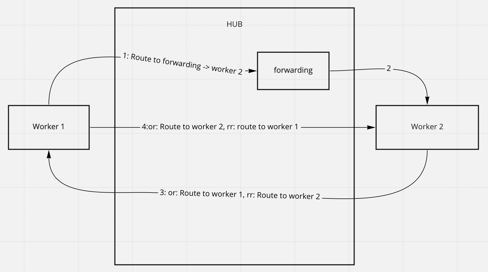

# Discovery using cloud node

## Introduction

In the previous guide we learned how to [create a cloud node](../xx-cloud-node) and connect to it using the TCP transport.

Cloud nodes can be used as proxies to connect devices not exposed by public hostnames or IPs. In this case the cloud node would redirect the traffic from one node to another using the transport connections established by devices.

## Discovery using forwarding

In this guide we're going to use the "forwarding_service" - a Hub Node service which allows a device to connect to another device using a temporary route alias.

In order to do that, a device we call "responder" is going to create an alias first, which can be used by another device we call "initiator" to send messages to responder.

After discovery step both devices would have a route to each other, which they can use to exchange messages.



## Application code

### Responder

First create a responder at:

```
touch examples/xx-discovery-using-cloud-node-responder.rs
```

Add the following code to this file:

```rust
use ockam::{Context, RemoteForwarder, Result, TcpTransport};
use ockam_get_started::Echoer;

#[ockam::node]
async fn main(ctx: Context) -> Result<()> {
    // Create a cloud node by going to https://hub.ockam.network
    let cloud_node_tcp_address = "<Your node host copied from hub.ockam.network>:4000";

    // Initialize the TCP Transport.
    let tcp = TcpTransport::create(&ctx).await?;

    // Create a TCP connection to your cloud node.
    tcp.connect(cloud_node_tcp_address).await?;

    // Create an echoer worker
    ctx.start_worker("echoer", Echoer).await?;

    let forwarder = RemoteForwarder::create(&ctx, cloud_node_tcp_address, "echoer").await?;
    println!(
        "Forwarding address of echoer: {}",
        forwarder.remote_address()
    );

    Ok(())
}
```

This node will run an `echoer` worker to reply to the messages sent from the initiator node.

### Run responder

You need to get the temporary forwarding address from the Hub Node in order to configure the initiator properly.

To do that run:

```
cargo run --example xx-discovery-using-cloud-node-responder
```

You will see the log message `Forwarding address of echoer: ...` - copy the address from here

### Initiator

```
touch examples/xx-discovery-using-cloud-node-initiator.rs
```

Add the following code to this file (replace fields in `<>` with values you copied):

```rust
// This node routes a message, to a different node, using a forwarding address on the cloud node.

use ockam::{route, Context, Result, TcpTransport, TCP};

#[ockam::node]
async fn main(mut ctx: Context) -> Result<()> {
    // Create a cloud node by going to https://hub.ockam.network
    let cloud_node_tcp_address = "<Your node host copied from hub.ockam.network>:4000";

    // Run 11-forwarding-via-a-cloud-node-responder,
    // it will print the forwarding address of echoer on your cloud node
    let echoer_forwarding_address = "<Address copied from responder output>";

    // Initialize the TCP Transport.
    let tcp = TcpTransport::create(&ctx).await?;

    // Create a TCP connection to your cloud node.
    tcp.connect(cloud_node_tcp_address).await?;

    // Send a message to the echoer worker, on a different node,
    // using a forwarding address on your cloud node
    ctx.send(
        route![(TCP, cloud_node_tcp_address), echoer_forwarding_address],
        "Hello Ockam!".to_string(),
    )
    .await?;

    // Wait to receive a reply and print it.
    let reply = ctx.receive::<String>().await?;
    println!("App Received: {}", reply); // should print "Hello Ockam!"

    // Stop all workers, stop the node, cleanup and return.
    ctx.stop().await
}

```

### Run initiator

```
cargo run --example xx-discovery-using-cloud-node-initiator
```

You should expect a log message `App Received: Hello Ockam!`


## Message flow


<div style="display: none; visibility: hidden;">
<hr><b>Next:</b> <a href="../xx-secude-channel-over-cloud-node">XX. Secure channel over cloud node</a>
</div>

