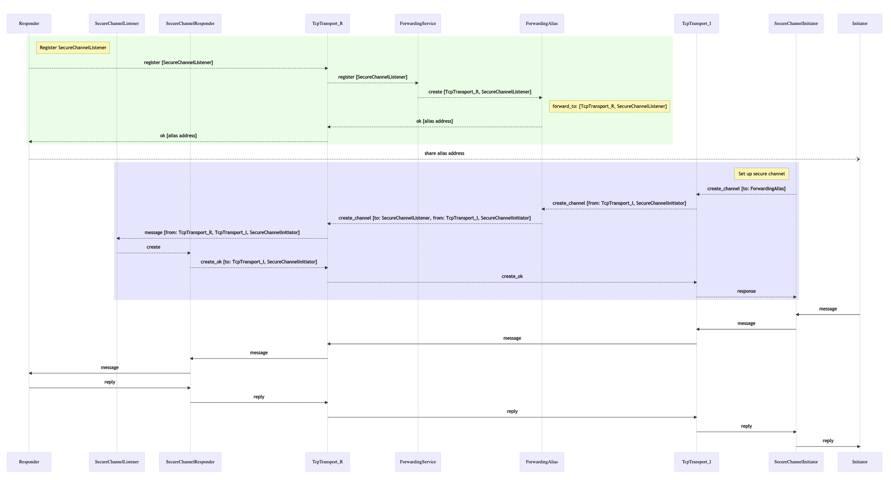

# Secure channel over Hub Node

## Introduction

In the previous guides we learned how to create [secure channels](../05-secure-channel) and connect nodes using [Hub Node forwarding](../xx-connecting-devices-using-hub-node).

Now we can conbine these and set up a Secure Channel over a Hub Nodes.

This way device nodes can communicate through the Hub Node, without exposing messages content to it.

## Application code

We are goig to create two nodes.

One we call "responder", it will start an "echoer" worker, secure channel listener and register a Forwarding Address on the Hub Node.

Another node we call "initiator", it will use the Forwarding Address to establish a Secure Channel to the responder and send a message to "echoer" using this secure channel.

You will need a Hub Node for this example. To create a new one, please follow the [Creating Hub Nodes](../xx-hub-node) guide.

### Responder

First create a responder at:

```
touch examples/xx-secure-channel-over-hub-node-responder.rs
```

Add the following code to this file:

```rust
use ockam::{
    Context, Entity, NoOpTrustPolicy, RemoteForwarder, Result, SecureChannels, TcpTransport,
};
use ockam_get_started::Echoer;

#[ockam::node]
async fn main(ctx: Context) -> Result<()> {
    // Create a hub node by going to https://hub.ockam.network
    let hub_node_tcp_address = "<Your node Address copied from hub.ockam.network>"; // e.g. "127.0.0.1:4000"

    // Initialize the TCP Transport.
    let tcp = TcpTransport::create(&ctx).await?;

    // Create a TCP connection to your hub node.
    tcp.connect(hub_node_tcp_address).await?;

    // Create an echoer worker
    ctx.start_worker("echoer", Echoer).await?;
    let mut bob = Entity::create(&ctx)?;

    // Create a secure channel listener at address "bob_secure_channel_listener"
    bob.create_secure_channel_listener("bob_secure_channel_listener", NoOpTrustPolicy)?;

    let forwarder =
        RemoteForwarder::create(&ctx, route![(TCP, cloud_node_tcp_address)], "bob_secure_channel_listener")
            .await?;

    println!("Forwarding address: {}", forwarder.remote_address());

    Ok(())
}
```

### Run responder

You need to get the Forwarding Address from the Hub Node in order to configure the initiator properly.

To do that run:

```
cargo run --example xx-xx-secure-channel-over-hub-node-responder
```

You will see the log message `Forwarding address: ...` - copy the address from here


### Initiator

```
touch examples/xx-secure-channel-over-hub-node-initiator.rs
```

Add the following code to this file (replace fields in `<>` with values you copied):

```rust
use ockam::{
    route, Address, Context, Entity, NoOpTrustPolicy, Result, SecureChannels, TcpTransport, TCP,
};

#[ockam::node]
async fn main(mut ctx: Context) -> Result<()> {
    // Create a hub node by going to https://hub.ockam.network
    let hub_node_tcp_address = "<Your node Address copied from hub.ockam.network>"; // e.g. "127.0.0.1:4000"

    let secure_channel_listener_forwarding_address =
        "<Address copied from responder output>";

    // Initialize the TCP Transport.
    let tcp = TcpTransport::create(&ctx).await?;

    // Create a TCP connection to your hub node.
    tcp.connect(hub_node_tcp_address).await?;

    let mut alice = Entity::create(&ctx)?;
    let hub_node_address: Address = (TCP, hub_node_tcp_address).into();
    let hub_node_route = route![
        hub_node_address,
        secure_channel_listener_forwarding_address
    ];

    let channel = alice.create_secure_channel(hub_node_route, NoOpTrustPolicy)?;

    let echoer_route = route![channel, "echoer"];

    ctx.send(echoer_route, "Hello world!".to_string()).await?;

    // Wait to receive a reply and print it.
    let reply = ctx.receive::<String>().await?;
    println!("App Received: {}", reply); // should print "Hello Ockam!"

    // Stop all workers, stop the node, cleanup and return.
    ctx.stop().await
}
```

### Run initiator

```
cargo run --example xx-xx-secure-channel-over-hub-node-initiator
```

You should expect a log message `App Received: Hello Ockam!`


## Message flow


