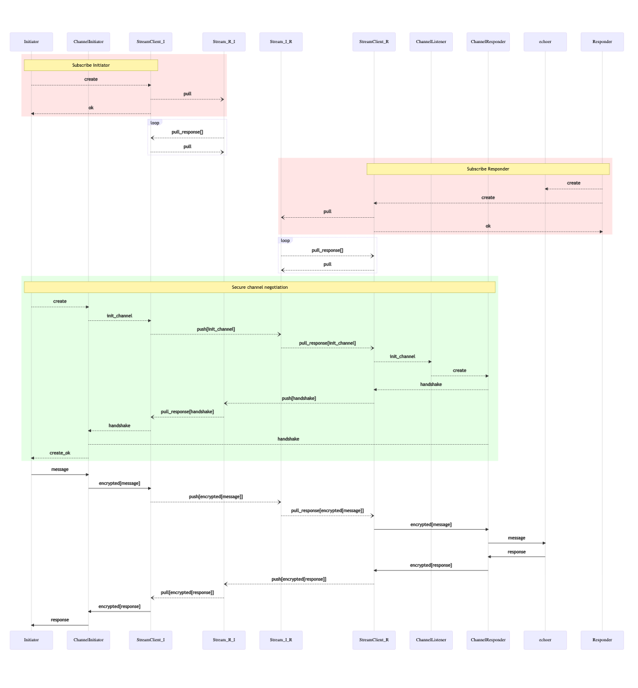

```
title: Secure channel over Streams
```

# Secure channel over Streams

## Introduction

In the previous examples we demonstrated how to establish secure channels and streams,
and how to send messages through them.

In this guide, we're going to combine that and send messages over streams using secure channels.
This way we'll achieve both end-to-end encryption and reliable message delivery.


## App worker

We're going to run two nodes communicating via Ockam Hub. One of them will run the secure channel listener and the echoer worker, another will run the secure channel initiator and send the message to echoer.


### Listener node

Create a new file at:

```
touch examples/14-secure-channel-over-stream-over-cloud-node-responder.rs
```

Add the following code to this file:

```rust
use ockam::{stream::Stream, Context, Result, Route, SecureChannel, TcpTransport, Vault, TCP};
use ockam_get_started::Echoer;
use std::time::Duration;

#[ockam::node]
async fn main(ctx: Context) -> Result<()> {
    let tcp = TcpTransport::create(&ctx).await?;
    tcp.connect("127.0.0.1:4000").await?;

    // Create a vault
    let vault = Vault::create(&ctx)?;

    // Create a secure channel listener at address "secure_channel_listener"
    SecureChannel::create_listener(&ctx, "secure_channel_listener", &vault).await?;

    // Create a bi-directional stream
    Stream::new(&ctx)?
        .stream_service("stream")
        .index_service("stream_index")
        .client_id("secure-channel-over-stream-over-cloud-node-responder")
        .with_interval(Duration::from_millis(100))
        .connect(
            route![(TCP, "127.0.0.1:4000")],
            // Stream name from THIS node to the OTHER node
            "sc-test-b-a",
            // Stream name from OTHER to THIS
            "sc-test-a-b",
        )
        .await?;

    // Create an echoer worker
    ctx.start_worker("echoer", Echoer).await?;

    // Don't call ctx.stop() here so this node runs forever.
    Ok(())
}
```

### Initiator node

Create a new file at:

```
touch examples/14-secure-channel-over-stream-over-cloud-node-initiator.rs
```

Add the following code to this file:

```rust
use ockam::{stream::Stream, Context, Result, Route, SecureChannel, TcpTransport, Vault, TCP};
use std::time::Duration;

#[ockam::node]
async fn main(mut ctx: Context) -> Result<()> {
    let tcp = TcpTransport::create(&ctx).await?;
    tcp.connect("127.0.0.1:4000").await?;

    // Create a vault
    let vault = Vault::create(&ctx)?;

    // Create a bi-directional stream
    let (tx, _) = Stream::new(&ctx)?
        .stream_service("stream")
        .index_service("stream_index")
        .client_id("secure-channel-over-stream-over-cloud-node-initiator")
        .with_interval(Duration::from_millis(100))
        .connect(
            route![(TCP, "127.0.0.1:4000")],
            // Stream name from THIS node to the OTHER node
            "sc-test-a-b",
            // Stream name from OTHER to THIS
            "sc-test-b-a",
        )
        .await?;

    // Create a secure channel via the stream
    let channel = SecureChannel::create(
        &ctx,
        Route::new()
            // Send via the stream
            .append(tx.clone())
            // And then to the secure_channel_listener
            .append("secure_channel_listener"),
        &vault,
    )
    .await?;

    // Send a message via the channel to the "printer"
    ctx.send(
        Route::new().append(channel.address()).append("echoer"),
        "Hello World!".to_string(),
    )
    .await?;

    // Wait for the reply
    let reply = ctx.receive_block::<String>().await?;
    println!("Reply via secure channel via stream: {}", reply);

    ctx.stop().await
}

```

This code starts a stream client and initializes a secure channel using the stream address, setting up the secure channel 
communication to use th stream forwarding.

Then it sends the message through the secure channel normally.


### Run

```
cargo run --example 14-secure-channel-over-stream-over-cloud-node-responder
```

```
cargo run --example 14-secure-channel-over-stream-over-cloud-node-initiator
```

You now should see the log message from the initiaror: `Reply via secure channel via stream: ...`

## Message flow



<div style="display: none; visibility: hidden;">
</div>
