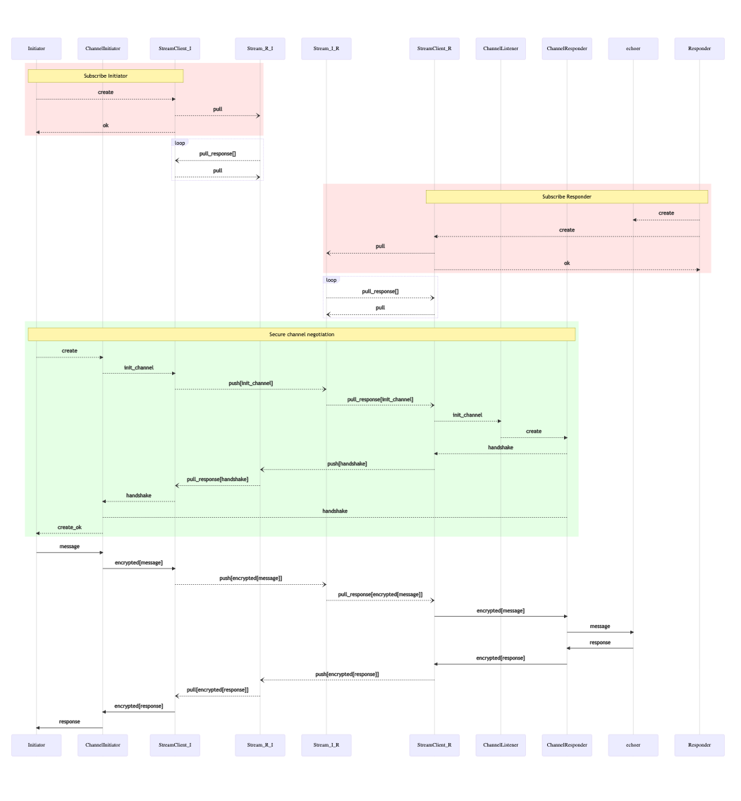

```
title: Secure channel via Streams
```

# Secure channel via Streams

## Introduction

In previous examples we demonstrated sending messages through secure channels as well as sending messages via streams.

Let's now combine these two examples and send messages via streams using secure channels.

This gives us both end-to-end encryption and reliable message delivery with only minimal changes to our code.

## Service set-up


## App worker

For this example we'll create two nodes that communicate with each other via the Ockam Hub stream service.

The first node, which we will refer to as the "responder", will be responsible for running the echoer worker and the secure channel listener.

The other node, called the "initiator", will initiate the secure channel protocol and send a message to the echoer worker.

Connecting these two nodes will be the bi-directional stream managed by Ockam Hub.

Encryption is managed by the nodes and ensures that Ockam Hub is unable to inspect the content of any messages.

**NOTE:** You will need a Hub Node with Kafka integration for this example. To create a new one, please follow the [Creating Hub Nodes](../07-hub) guide.

### Responder node

Create a new file at:

```
touch examples/15-secure-channel-via-streams-responder.rs
```

Add the following code to this file:

```rust
use ockam::{route, stream::Stream, Context, Result, SecureChannel, TcpTransport, Vault, TCP};
use ockam_get_started::Echoer;

#[ockam::node]
async fn main(ctx: Context) -> Result<()> {
    let _tcp = TcpTransport::create(&ctx).await?;

    let hub_node_tcp_address = "<Your node Address copied from hub.ockam.network>"; // e.g. "127.0.0.1:4000"

    // Create a vault
    let vault = Vault::create(&ctx)?;

    // Create a secure channel listener at address "secure_channel_listener"
    SecureChannel::create_listener(&ctx, "secure_channel_listener", &vault).await?;

    // Create a bi-directional stream
    Stream::new(&ctx)?
        .stream_service("stream")
        .index_service("stream_index")
        .client_id("secure-channel-over-stream-over-cloud-node-responder")
        .with_interval(Duration::from_millis(100))
        .connect(
            route![(TCP, hub_node_tcp_address)],
            "sc-responder-to-initiator",
            "sc-initiator-to-responder",
        )
        .await?;

    // Start an echoer worker
    ctx.start_worker("echoer", Echoer).await?;

    // Don't call ctx.stop() here so this node runs forever.
    Ok(())
}
```

### Initiator node

Create a new file at:

```
touch examples/15-secure-channel-via-streams-initiator.rs
```

Add the following code to this file:

```rust
use ockam::{route, stream::Stream, Context, Result, SecureChannel, TcpTransport, Vault, TCP};
use std::time::Duration;

#[ockam::node]
async fn main(mut ctx: Context) -> Result<()> {
    let _tcp = TcpTransport::create(&ctx).await?;

    let hub_node_tcp_address = "<Your node Address copied from hub.ockam.network>"; // e.g. "127.0.0.1:4000"

    // Create a vault
    let vault = Vault::create(&ctx)?;

    // Create a bi-directional stream
    let (sender, _receiver) = Stream::new(&ctx)?
        .stream_service("stream")
        .index_service("stream_index")
        .client_id("secure-channel-over-stream-over-cloud-node-initiator")
        .connect(
            route![(TCP, hub_node_tcp_address)],
            // Stream name from THIS node to the OTHER node
            "sc-initiator-to-responder",
            // Stream name from the OTHER node to THIS node
            "sc-responder-to-initiator",
        )
        .await?;

    // Create a secure channel via the stream
    let channel = SecureChannel::create(
        &ctx,
        route![
            // Send via the stream
            sender.clone(),
            // And then to the secure_channel_listener
            "secure_channel_listener"
        ],
        &vault,
    )
    .await?;

    // Send a message via the channel to the echoer worker
    ctx.send(
        route![channel.address(), "echoer"],
        "Hello World!".to_string(),
    )
    .await?;

    // Wait for the reply
    let reply = ctx.receive_block::<String>().await?;
    println!("Reply through secure channel via stream: {}", reply);

    ctx.stop().await
}
```

This code starts a stream client, creates a bi-directional stream and then establishes a secure channel between the client and the stream address.

Messages can now be sent normally via the stream through the secure channel.


### Run

To start the first node run:

```
cargo run --example 15-secure-channel-via-streams-responder
```

To start the second node run:

```
cargo run --example 15-secure-channel-via-streams-initiator
```

You now should see the log message from the initiator: `Reply through secure channel via stream: ...`

## Message flow



<div style="display: none; visibility: hidden;">
</div>
