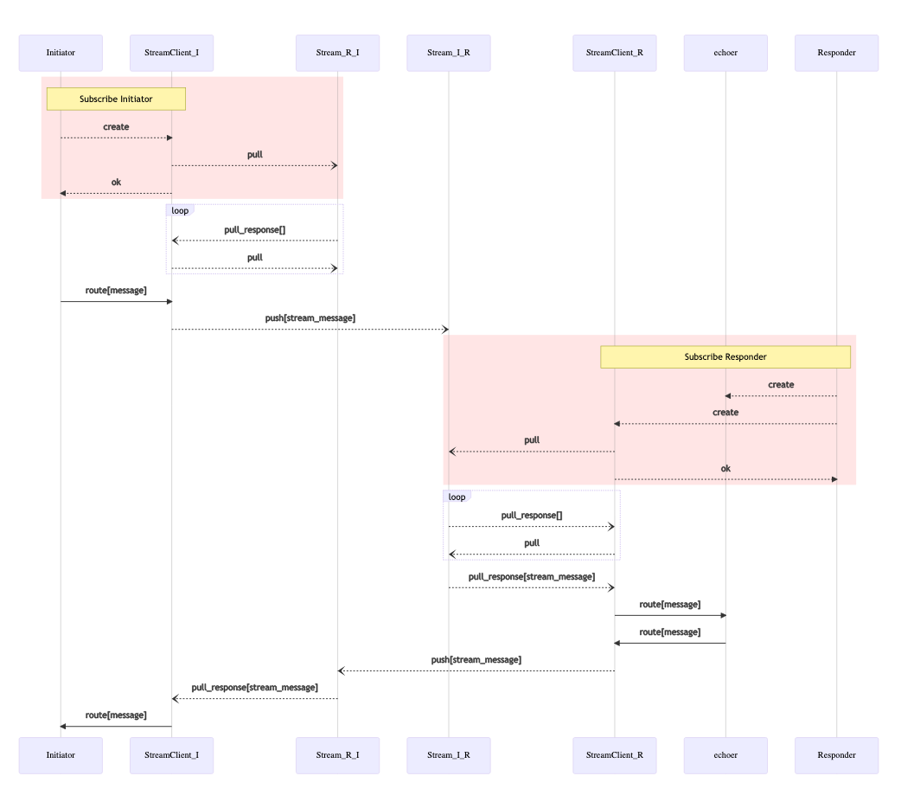

```
title: Reliable message delivery with Streams
```

# Reliable message delivery with Streams

## Introduction

In the previous guides we were sending messages to remote workers without much delivery guarantees.
The workers were sending messages hoping that receiving end would receive them. This messaging mode is
sometimes called "at most once delivery".

In real life distributed systems are constantly experiencing network interruptions while workers and devices
themselves may crash and restart.

To address that message brokers introduce message buffers or logs, which store messages and can re-deliver them after failures. Ockam Hub integrates with message brokers using Ockam Streams. To communicate with Ockam Streams on the Hub, the application can use the Ockam Streams Protocol.

More about the stream protocol can be found here: https://github.com/ockam-network/proposals/tree/main/design/0009-stream-protocol

## Stream client

To hide complexity of stream protocol interaction, Ockam provides a Stream Client API:


**TODO: check this API**

```
Stream::connect(route, outgoing_stream, incoming_stream)
```

Which allows to send messages over one stream and receive over another.

When two stream clients run on different nodes with symmetrical stream names configured,
the nodes can exchange messages the same way as they would using transports or secure channels.

## App worker

For demonstration, we'll set up a stream communication between two nodes.

Like in the previous examples, we will create a responder node and initiator node.
Responder node will have an `"echoer"` worker and initiator will send it a message through
the stream

### Responder node

Create a new file at:

**TODO: do we want to call it over-local-node?**

```
touch examples/13-stream-over-cloud-node-responder.rs
```

Add the following code to this file:

```rust
use ockam::{stream::Stream, Context, Result, route, TcpTransport, TCP};
use ockam_get_started::Echoer;
use std::time::Duration;

#[ockam::node]
async fn main(ctx: Context) -> Result<()> {
    let tcp = TcpTransport::create(&ctx).await?;
    tcp.connect("127.0.0.1:4000").await?;

    // Start a printer
    ctx.start_worker("echoer", Echoer).await?;

    // Create the stream
    Stream::new(&ctx)?
        .stream_service("stream")
        .index_service("stream_index")
        .client_id("stream-over-cloud-node-initiator")
        .with_interval(Duration::from_millis(100))
        .connect(
            route![(TCP, "127.0.0.1:4000")],
            // Stream name from THIS to OTHER
            "test-b-a",
            // Stream name from OTHER to THIS
            "test-a-b",
        )
        .await?;
    Ok(())
}
```

This code creates a stream client on the Hub node at `127.0.0.1:4000` and starts an echoer worker.

### Initiator node

Create a new file at:

**TODO: do we want to call it over-local-node?**

```
touch examples/13-stream-over-cloud-node-initiator.rs
```

Add the following code to this file:

```rust
use ockam::{stream::Stream, Context, Result, Route, TcpTransport, TCP};
use std::time::Duration;

#[ockam::node]
async fn main(mut ctx: Context) -> Result<()> {
    let tcp = TcpTransport::create(&ctx).await?;
    tcp.connect("127.0.0.1:4000").await?;

    let (tx, _rx) = Stream::new(&ctx)?
        .stream_service("stream")
        .index_service("stream_index")
        .client_id("stream-over-cloud-node-initiator")
        .with_interval(Duration::from_millis(100))
        .connect(
            route![(TCP, "127.0.0.1:4000")],
            // Stream name from THIS node to the OTHER node
            "test-a-b",
            // Stream name from OTHER to THIS
            "test-b-a",
        )
        .await?;

    ctx.send(tx.to_route().append("echoer"), "Hello World!".to_string())
        .await?;

    let reply = ctx.receive_block::<String>().await?;
    println!("Reply via stream: {}", reply);

    ctx.stop().await
}
```

This code creates a stream client, sends a message to the echoer through this client and expects a response.


### Run

You can run initiator and responder in any order, because they use stream storage to deliver messages.

To demonstrate that let's run the initiator first:

```
cargo run --example 13-stream-over-cloud-node-initiator
```

```
cargo run --example 13-stream-over-cloud-node-responder
```

On the initiator side you should now see the `Reply via stream: ...` message.

## Message flow



<div style="display: none; visibility: hidden;">
</div>
