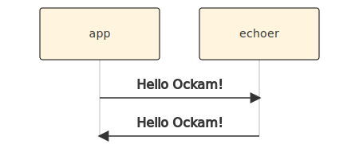

```yaml
title: Worker
```

# Worker



```rust
use ockam::{Context, Result, Routed, Worker};

pub struct Echoer;

#[ockam::async_worker]
impl Worker for Echoer {
    type Context = Context;
    type Message = String;

    async fn handle_message(&mut self, ctx: &mut Context, msg: Routed<String>) -> Result<()> {
        println!("Address: {}, Received: {}", ctx.address(), msg);

        // Echo the message body back on its return_route.
        ctx.send(msg.return_route(), msg.body()).await
    }
}
```

```rust
use ockam::{Context, Result};
use ockam_get_started::Echoer;

#[ockam::node]
async fn main(mut ctx: Context) -> Result<()> {
    // Start an echoer worker.
    ctx.start_worker("echoer", Echoer).await?;

    // Send a message to the echoer worker.
    ctx.send("echoer", "Hello Ockam!".to_string()).await?;

    // Wait to receive a reply and print it.
    let reply = ctx.receive::<String>().await?;
    println!("App Received: {}", reply); // should print "Hello Ockam!"

    ctx.stop().await
}
```

<div style="display: none; visibility: hidden;">
<a href="../03-routing">03. Routing</a>
</div>
