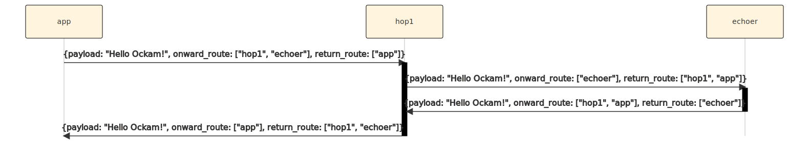

```
title: Routing
```

# Routing




```rust
use ockam::{Any, Context, Result, Routed, Worker};

pub struct Hop;

#[ockam::async_worker]
impl Worker for Hop {
    type Context = Context;
    type Message = Any;

    /// This handle function takes any incoming message and forwards
    /// it to the next hop in it's route
    async fn handle_message(&mut self, ctx: &mut Context, msg: Routed<Any>) -> Result<()> {
        println!("Address: {}, Received: {}", ctx.address(), msg);

        let mut msg = msg.into_transport_message();
        msg.onward_route.step()?;
        msg.return_route.modify().prepend(ctx.address());
        ctx.forward(msg).await
    }
}
```

```rust
use ockam::{Context, Result, Route};
use ockam_get_started::{Echoer, Hop};

#[ockam::node]
async fn main(mut ctx: Context) -> Result<()> {
    // Start an echoer worker.
    ctx.start_worker("echoer", Echoer).await?;

    // Start a hop1 worker.
    ctx.start_worker("hop1", Hop).await?;

    // Send a message to the echoer worker via the hop1 worker
    ctx.send(
        Route::new().append("hop1").append("echoer"),
        "Hello Ockam!".to_string()
    ).await?;

    // Wait to receive a reply and print it.
    let reply = ctx.receive::<String>().await?;
    println!("App Received: {}", reply); // should print "Hello Ockam!"

    ctx.stop().await
}
```


<div style="display: none; visibility: hidden;">
<a href="../04-routing-many-hops">04. Routing over many hops</a>
</div>
