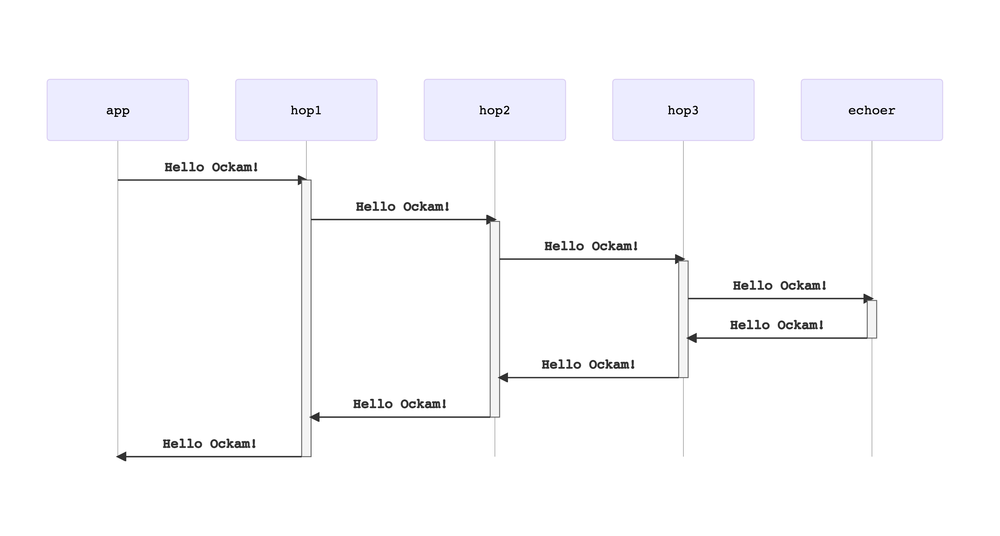

```yaml
title: Routing
```
# Routing

The path that a message takes through an Ockam network is called a route. A
message carries route meta-data that nodes use to determine the next hop toward
the destination. A route is a list of worker addresses. The order of addresses
in a route defines the path the message will take from its source to its
destination.

A message has two routes: the **onward route** and the **return route**. The
onward route specifies the path the message takes to the destination. When
a node receives a message to route, the head of the address list is removed
from the route. This address is used to determine the next destination route,
or destination worker.

The return route of a message represents the path back to the source worker,
and may differ from the onward route. When a message is routed through a node,
the node adds its own address to the return route. This ensures that there is a
valid, known return path for message replies. All messages sent in an Ockam
Network have a route. Many messages between local workers have short routes,
only indicating the address of another local Worker.

Routes are created with the `route` macro, which takes a list of addresses:

```rust
let route = route!["node_a", "node_b", "some_worker"];
```

So far, we've [created an `"echoer"` worker](../02-worker) on our node, sent
it a message, and received a reply.

This worker was a simple one hop away from our `"app"` worker. Ockam's
application layer routing protocols allows us to send messages over multiple
hops, within one node, or across many nodes. To get a sense of how that works,
let's route a message over two hops.

## Hop worker

For demonstration, we'll create a simple middleware worker, called `Hop`, that
takes every incoming message and forwards it to the next address in
the `onward_route` of that message.

Just before forwarding the message, `Hop`'s handle message function will:

1. Print the message
1. Remove its own address (first address) from the `onward_route` by calling `step()`
1. Insert its own address into the `return_route` by calling `prepend()`

Create a new file at:

```
touch src/hop.rs
```

Add the following code to this file:

```rust
// src/hop.rs

use ockam::{Any, Context, Result, Routed, Worker};

pub struct Hop;

#[ockam::worker]
impl Worker for Hop {
    type Context = Context;
    type Message = Any;

    /// This handle function takes any incoming message and forwards
    /// it to the next hop in its onward route
    async fn handle_message(&mut self, ctx: &mut Context, msg: Routed<Any>) -> Result<()> {
        println!("Address: {}, Received: {}", ctx.address(), msg);

        let mut local_msg = msg.into_local_message();
        let msg = local_msg.transport_mut();
        msg.onward_route.step()?;
        msg.return_route.modify().prepend(ctx.address());
        ctx.forward(local_msg).await
    }
}
```

To make this `Hop` type accessible to our main program, export it
from `src/lib.rs` by adding the following to it:

```rust
// src/lib.rs

mod hop;
pub use hop::*;
```

## Echoer worker

We'll also use the `Echoer` worker that we created in the
[previous example](../02-worker#echoer-worker). So make sure that it stays
exported from `src/lib.rs`

## App worker

Next, let's create our main `"app"` worker.

In the code below we start an `Echoer` at address `"echoer"` and a `Hop`
worker at address `"hop1"`. This is familiar from our previous example.

Then, we send a message along the `hop1 => echoer` route by passing
`route!["hop1", "echoer"]` to `send(..)`.

Create a new file at:

```
touch examples/03-routing.rs
```

Add the following code to this file:

```rust
// examples/03-routing.rs

use ockam::{Context, Result, route};
use hello_ockam::{Echoer, Hop};

#[ockam::node]
async fn main(mut ctx: Context) -> Result<()> {
    // Start an Echoer worker at address "echoer"
    ctx.start_worker("echoer", Echoer).await?;

    // Start a Hop worker at address "hop1"
    ctx.start_worker("hop1", Hop).await?;

    // Send a message to the echoer worker via the hop1 worker
    ctx.send(route!["hop1", "echoer"], "Hello Ockam!".to_string()).await?;

    // Wait to receive a reply and print it.
    let reply = ctx.receive::<String>().await?;
    println!("App Received: {}", reply); // should print "Hello Ockam!"

    ctx.stop().await
}
```

To run this new node program:

```
cargo run --example 03-routing
```

Note the message flow and how routing information is manipulated as the message
travels.

## Message Flow


# Routing over many hops

We can easily create routes with many hops. Let's try that in a quick example:

## App worker

This time we'll create multiple hop workers between the `"app"` and
the `"echoer"` and route our message through them.

Create a new file at:

```
touch examples/03-routing-many-hops.rs
```

Add the following code to this file:

```rust
// examples/03-routing-many-hops.rs

use ockam::{Context, Result, route};
use hello_ockam::{Echoer, Hop};

#[ockam::node]
async fn main(mut ctx: Context) -> Result<()> {
    // Start an Echoer worker at address "echoer"
    ctx.start_worker("echoer", Echoer).await?;

    // Start hop workers - hop1, hop2, hop3.
    ctx.start_worker("hop1", Hop).await?;
    ctx.start_worker("hop2", Hop).await?;
    ctx.start_worker("hop3", Hop).await?;

    // Send a message to the echoer worker via the hop1, hop2, and hop3
    ctx.send(route!["hop1","hop2","hop3","echoer"], "Hello Ockam!".to_string()).await?;

    // Wait to receive a reply and print it.
    let reply = ctx.receive::<String>().await?;
    println!("App Received: {}", reply); // should print "Hello Ockam!"

    ctx.stop().await
}
```

To run this new node program:

```
cargo run --example 03-routing-many-hops
```

Note the different message flow.

## Message Flow

