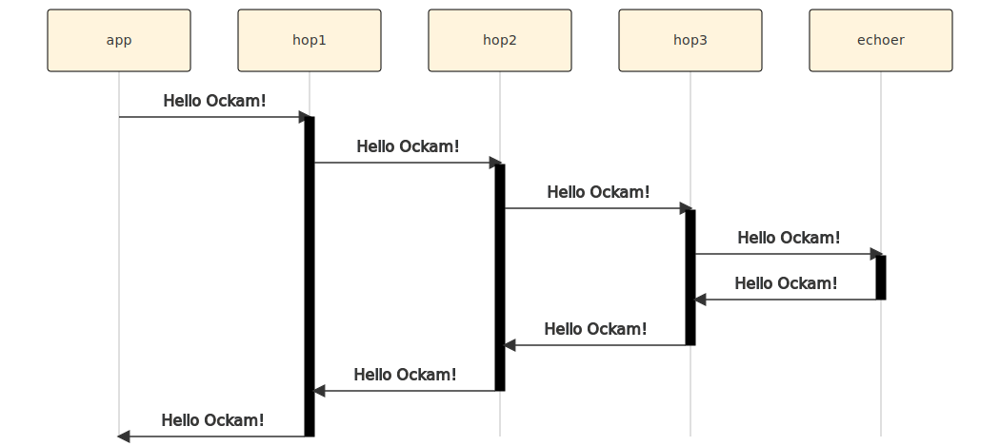

```
title: Routing over many hops
```

# Routing over many hops

Routing is not limited to [one](../02-worker) or [two hops](../03-routing),
we can easily create routes with many hops. Let's try that in a quick example:

## App worker

This time we'll create multiple hop workers between the `"app"` and
the `"echoer"` and route our message through them.

Create a new file at:

```
touch examples/04-routing-many-hops.rs
```

Add the following code to this file:

```rust
// examples/04-routing-many-hops.rs

use ockam::{Context, Result, Route};
use ockam_get_started::{Echoer, Hop};

#[ockam::node]
async fn main(mut ctx: Context) -> Result<()> {
    // Start an Echoer worker at address "echoer"
    ctx.start_worker("echoer", Echoer).await?;

    // Start hop workers - hop1, hop2, hop3.
    ctx.start_worker("hop1", Hop).await?;
    ctx.start_worker("hop2", Hop).await?;
    ctx.start_worker("hop3", Hop).await?;

    // Send a message to the echoer worker via the hop1, hop2, and hop3
    ctx.send(
        Route::new()
            .append("hop1")
            .append("hop2")
            .append("hop3")
            .append("echoer"),
        "Hello Ockam!".to_string()
    ).await?;

    // Wait to receive a reply and print it.
    let reply = ctx.receive::<String>().await?;
    println!("App Received: {}", reply); // should print "Hello Ockam!"

    ctx.stop().await
}
```

To run this new node program:

```
cargo run --example 04-routing-many-hops.rs
```

Note the message flow.

## Message Flow



<div style="display: none; visibility: hidden;">
<hr><b>Next:</b> <a href="../05-secure-channel">05. Secure Channel</a>
</div>
