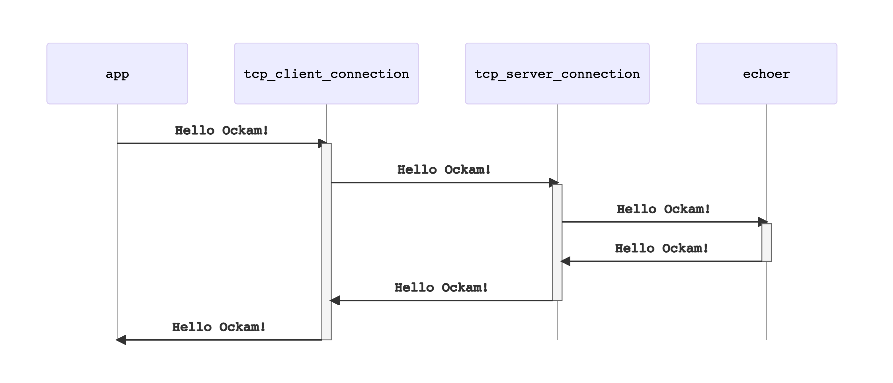

```
title: Transport
```

# Transport

An Ockam Transport is a plugin for Ockam Routing. It moves Ockam Routing messages
using a specific transport protocol like TCP, UDP, WebSockets, Bluetooth etc.

In previous examples, we routed messages locally within one node. Routing messages
over transport layer connections looks very similar.

Let's try the TcpTransport, we'll need to create two nodes:
a [responder](#responder-node) and an [initiator](#initiator-node).

### Responder node

Create a new file at:

```
touch examples/04-routing-over-transport-responder.rs
```

Add the following code to this file:

```rust
// examples/04-routing-over-transport-responder.rs
// This node starts a tcp listener and an echoer worker.
// It then runs forever waiting for messages.

use hello_ockam::Echoer;
use ockam::access_control::AllowAll;
use ockam::{Context, Result, TcpTransport};

#[ockam::node]
async fn main(ctx: Context) -> Result<()> {
    // Initialize the TCP Transport.
    let tcp = TcpTransport::create(&ctx).await?;

    // Create a TCP listener and wait for incoming connections.
    // Use port 4000, unless otherwise specified by command line argument.
    let port = std::env::args().nth(1).unwrap_or_else(|| "4000".to_string());
    tcp.listen(format!("127.0.0.1:{port}")).await?;

    // Create an echoer worker
    ctx.start_worker("echoer", Echoer, AllowAll, AllowAll).await?;

    // Don't call ctx.stop() here so this node runs forever.
    Ok(())
}

```

### Initiator node

Create a new file at:

```
touch examples/04-routing-over-transport-initiator.rs
```

Add the following code to this file:

```rust
// examples/04-routing-over-transport-initiator.rs
// This node routes a message, to a worker on a different node, over the tcp transport.

use ockam::access_control::AllowAll;
use ockam::{route, Context, Result, TcpTransport, TCP};

#[ockam::node]
async fn main(mut ctx: Context) -> Result<()> {
    // Initialize the TCP Transport.
    let _tcp = TcpTransport::create(&ctx).await?;

    let mut child_ctx = ctx.new_detached("main", AllowAll, AllowAll).await?;

    // Send a message to the "echoer" worker, on a different node, over a tcp transport.
    // Use port 4000, unless otherwise specified by command line argument.
    let port = std::env::args().nth(1).unwrap_or_else(|| "4000".to_string());
    let r = route![(TCP, &format!("localhost:{port}")), "echoer"];
    child_ctx.send(r, "Hello Ockam!".to_string()).await?;

    // Wait to receive a reply and print it.
    let reply = child_ctx.receive::<String>().await?;
    println!("App Received: {}", reply); // should print "Hello Ockam!"

    // Stop all workers, stop the node, cleanup and return.
    ctx.stop().await
}

```

### Run

Run the responder:

```
cargo run --example 04-routing-over-transport-responder
```

Run the initiator:

```
cargo run --example 04-routing-over-transport-initiator
```

Note the message flow.




## Routing over two transport hops

### Responder node

Create a new file at:

```
touch examples/04-routing-over-transport-two-hops-responder.rs
```

Add the following code to this file:

```rust
// examples/04-routing-over-transport-two-hops-responder.rs
// This node starts a tcp listener and an echoer worker.
// It then runs forever waiting for messages.

use hello_ockam::Echoer;
use ockam::access_control::AllowAll;
use ockam::{Context, Result, TcpTransport};

#[ockam::node]
async fn main(ctx: Context) -> Result<()> {
    // Initialize the TCP Transport.
    let tcp = TcpTransport::create(&ctx).await?;

    // Create a TCP listener and wait for incoming connections.
    // Use port 4000, unless otherwise specified by command line argument.
    let port = std::env::args().nth(1).unwrap_or_else(|| "4000".to_string());
    tcp.listen(format!("127.0.0.1:{port}")).await?;

    // Create an echoer worker
    ctx.start_worker("echoer", Echoer, AllowAll, AllowAll).await?;

    // Don't call ctx.stop() here so this node runs forever.
    Ok(())
}

```

### Middle node

Create a new file at:

```
touch examples/04-routing-over-transport-two-hops-middle.rs
```

Add the following code to this file:

```rust
// examples/04-routing-over-transport-two-hops-middle.rs
// This node creates a tcp connection to a node at 127.0.0.1:4000
// Starts a tcp listener at 127.0.0.1:3000
// It then runs forever waiting to route messages.

use hello_ockam::Hop;
use ockam::access_control::AllowAll;
use ockam::{Context, Result, TcpTransport};

#[ockam::node]
async fn main(ctx: Context) -> Result<()> {
    // Initialize the TCP Transport.
    let tcp = TcpTransport::create(&ctx).await?;

    // Create a TCP listener and wait for incoming connections.
    // Use port 3000, unless otherwise specified by command line argument.
    let port = std::env::args().nth(1).unwrap_or_else(|| "3000".to_string());
    tcp.listen(format!("127.0.0.1:{port}")).await?;

    // Create a Hop worker
    ctx.start_worker("hop", Hop, AllowAll, AllowAll).await?;

    // Don't call ctx.stop() here so this node runs forever.
    Ok(())
}

```

### Initiator node

Create a new file at:

```
touch examples/04-routing-over-transport-two-hops-initiator.rs
```

Add the following code to this file:

```rust
// examples/04-routing-over-transport-two-hops-initiator.rs
// This node routes a message, to a worker on a different node, over two tcp transport hops.

use ockam::{route, Context, Result, TcpTransport, TCP};

#[ockam::node]
async fn main(mut ctx: Context) -> Result<()> {
    // Initialize the TCP Transport.
    let _tcp = TcpTransport::create(&ctx).await?;

    // Send a message to the "echoer" worker, on a different node, over two tcp hops.
    // Use ports 3000 & 4000, unless otherwise specified by command line arguments.
    let port_middle = std::env::args().nth(1).unwrap_or_else(|| "3000".to_string());
    let port_responder = std::env::args().nth(2).unwrap_or_else(|| "4000".to_string());
    let r = route![
        (TCP, &format!("localhost:{port_middle}")),
        "hop",
        (TCP, &format!("localhost:{port_responder}")),
        "echoer"
    ];
    // Send a message and wait to receive a reply and print it.
    let reply: String = ctx.send_and_receive(r, "Hello Ockam!".to_string()).await?;
    println!("App Received: {}", reply); // should print "Hello Ockam!"

    // Stop all workers, stop the node, cleanup and return.
    ctx.stop().await
}

```

## Run

Run the responder:

```
cargo run --example 04-routing-over-transport-two-hops-responder
```

Run middle:

```
cargo run --example 04-routing-over-transport-two-hops-middle
```

Run the initiator:

```
cargo run --example 04-routing-over-transport-two-hops-initiator
```

Note how the message is routed.

<div style="display: none; visibility: hidden;">
<hr><b>Next:</b> <a href="../05-secure-channel#readme">05. Secure Channel</a>
</div>
