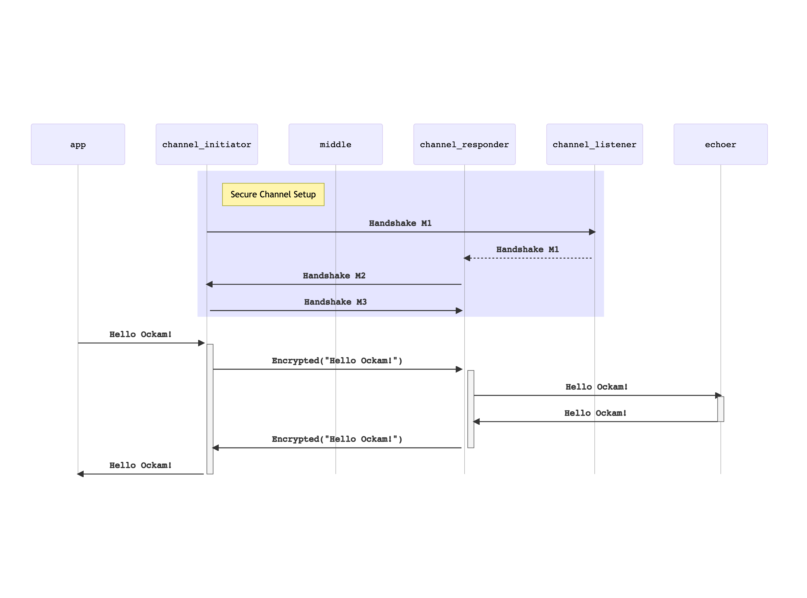

```
title: Secure Channel
```

# Secure Channel

Now that we understand the basics of [Nodes](../01-node#readme),
[Workers](../02-worker#readme), and [Routing](../03-routing#readme) ... let's
create our first encrypted secure channel.

Establishing a secure channel requires establishing a shared secret key between
the two entities that wish to communicate securely. This is usually achieved
using a cryptographic key agreement protocol to safely derive a shared secret
without transporting it over the network. In Ockam, we currently have support for
two different key agreement protocols - one based on the Noise Protocol Framework
and another based on Signal's X3DH design.

Running such protocols requires a stateful exchange of multiple messages and having
a worker and routing system allows Ockam to hide the complexity of creating and
maintaining a secure channel behind two simple functions:

* `create_secure_channel_listener(...)` which waits for requests to create a secure channel.
* `create_secure_channel(...)` which initiates the protocol to create a secure channel with a listener.

## Responder node

Create a new file at:

```
touch examples/05-secure-channel-over-two-transport-hops-responder.rs
```

Add the following code to this file:

```rust
// examples/05-secure-channel-over-two-transport-hops-responder.rs
// This node starts a tcp listener, a secure channel listener, and an echoer worker.
// It then runs forever waiting for messages.

use hello_ockam::Echoer;
use ockam::{Context, Identity, Result, TcpTransport, TrustEveryonePolicy, Vault};

#[ockam::node]
async fn main(ctx: Context) -> Result<()> {
    ctx.start_worker("echoer", Echoer).await?;

    // Initialize the TCP Transport.
    let tcp = TcpTransport::create(&ctx).await?;

    // Create a TCP listener and wait for incoming connections.
    tcp.listen("127.0.0.1:4000").await?;

    // Create a Vault to safely store secret keys for Bob.
    let vault = Vault::create();

    // Create an Identity to represent Bob.
    let bob = Identity::create(&ctx, &vault).await?;

    // Create a secure channel listener for Bob that will wait for requests to
    // initiate an Authenticated Key Exchange.
    bob.create_secure_channel_listener("bob_listener", TrustEveryonePolicy)
        .await?;

    // Don't call ctx.stop() here so this node runs forever.
    Ok(())
}

```

## Middle node

Create a new file at:

```
touch examples/05-secure-channel-over-two-transport-hops-middle.rs
```

Add the following code to this file:

```rust
// examples/05-secure-channel-over-two-transport-hops-middle.rs
// This node creates a tcp connection to a node at 127.0.0.1:4000
// Starts a tcp listener at 127.0.0.1:3000
// It then runs forever waiting to route messages.

use ockam::{Context, Result, TcpTransport};

#[ockam::node]
async fn main(ctx: Context) -> Result<()> {
    // Initialize the TCP Transport.
    let tcp = TcpTransport::create(&ctx).await?;

    // Create a TCP listener and wait for incoming connections.
    tcp.listen("127.0.0.1:3000").await?;

    // Don't call ctx.stop() here so this node runs forever.
    Ok(())
}

```

## Initiator node


Create a new file at:

```
touch examples/05-secure-channel-over-two-transport-hops-initiator.rs
```

Add the following code to this file:

```rust
// examples/05-secure-channel-over-two-transport-hops-initiator.rs
// This node creates an end-to-end encrypted secure channel over two tcp transport hops.
// It then routes a message, to a worker on a different node, through this encrypted channel.

use ockam::{route, Context, Result, TrustEveryonePolicy, Vault};
use ockam::{Identity, TcpTransport, TCP};

#[ockam::node]
async fn main(mut ctx: Context) -> Result<()> {
    // Initialize the TCP Transport.
    TcpTransport::create(&ctx).await?;

    // Create a Vault to safely store secret keys for Alice.
    let vault = Vault::create();

    // Create an Identity to represent Alice.
    let alice = Identity::create(&ctx, &vault).await?;

    // Connect to a secure channel listener and perform a handshake.
    let r = route![(TCP, "localhost:3000"), (TCP, "localhost:4000"), "bob_listener"];
    let channel = alice.create_secure_channel(r, TrustEveryonePolicy).await?;

    // Send a message to the echoer worker via the channel.
    ctx.send(route![channel, "echoer"], "Hello Ockam!".to_string()).await?;

    // Wait to receive a reply and print it.
    let reply = ctx.receive::<String>().await?;
    println!("App Received: {}", reply); // should print "Hello Ockam!"

    // Stop all workers, stop the node, cleanup and return.
    ctx.stop().await
}

```

## Run

Run the responder:

```
cargo run --example 05-secure-channel-over-two-transport-hops-responder
```

Run middle:

```
cargo run --example 05-secure-channel-over-two-transport-hops-middle
```

Run the initiator:

```
cargo run --example 05-secure-channel-over-two-transport-hops-initiator
```

Note the message flow.


