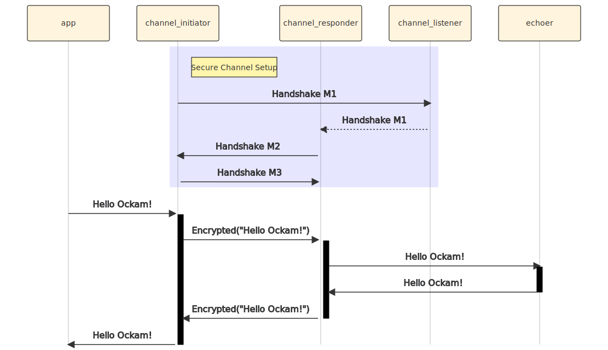

```
title: Secure Channel
```

# Secure Channel

## App worker

Create a new file at:

```
touch examples/05-secure-channel.rs
```

Add the following code to this file:

```rust
// examples/05-secure-channel.rs

use ockam::{Context, Result, Route, SecureChannel};
use ockam_get_started::Echoer;

#[ockam::node]
async fn main(mut ctx: Context) -> Result<()> {
    // Start the echoer worker.
    ctx.start_worker("echoer", Echoer).await?;

    // Create a secure channel listener at address "secure_channel_listener"
    SecureChannel::create_listener(&mut ctx, "secure_channel_listener").await?;

    // Establish a secure channel with the "secure_channel_listener"
    let channel = SecureChannel::create(&mut ctx, "secure_channel_listener").await?;

    // Send a message to the echoer worker via the channel.
    ctx.send(
        Route::new()
            .append(channel.address())
            .append("echoer"),
        "Hello Ockam!".to_string()
    ).await?;

    // Wait to receive a reply and print it.
    let reply = ctx.receive::<String>().await?;
    println!("App Received: {}", reply); // should print "Hello Ockam!"

    ctx.stop().await
}
```

To run this new node program:

```
cargo run --example 05-secure-channel
```

Note the message flow.

## Message Flow



<div style="display: none; visibility: hidden;">
<hr><b>Next:</b> <a href="../06-secure-channel-many-hops">06. Secure Channel over many hops</a>
</div>
