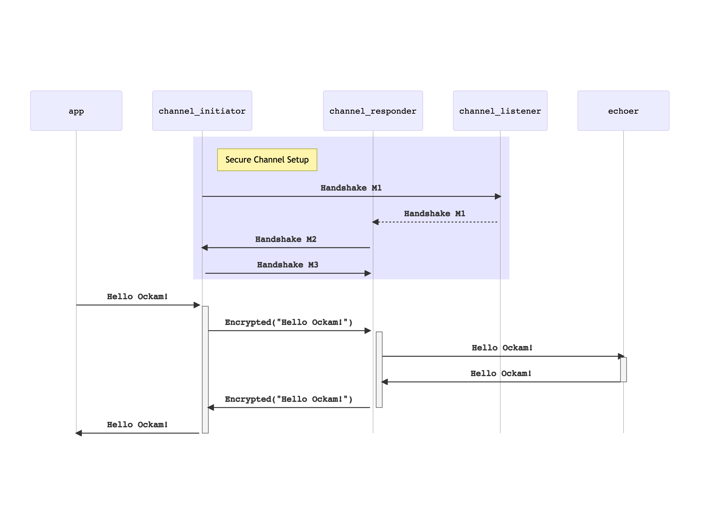

```
title: Secure Channel
```

# Secure Channel

Now that we understand the basics of [Nodes](../01-node),
[Workers](../02-worker), and [Routing](../03-routing) ... let's
create our first encrypted secure channel.

Establishing a secure channel requires establishing a shared secret key between
the two entities that wish to communicate securely. This is usually achieved
using a cryptographic key agreement protocol to safely derive a shared secret
without transporting it over the network. In Ockam, we currently have support for
two different key agreement protocols - one based on the Noise Protocol Framework
and another based on Signal's X3DH design.

Running such protocols requires a stateful exchange of multiple messages and having
a worker and routing system allows Ockam to hide the complexity of creating and
maintaining a secure channel behind two simple functions:

* `Entity::create_secure_channel_listener(...)` which waits for requests to create a secure channel.
* `Entity::create_secure_channel(...)` which initiates the protocol to create a secure channel with a listener.

An `Entity` is an abstraction that provides an API for managing identities.  The `Entity` API requires a Vault to store and manage secrets.
In this example, a Vault is created automatically by the Entity.

Establishing a secure channel requires a **trust policy**. The simplest trust policy is the `IdentifierTrustPolicy` which
determines trust based on a static access control list of authorized parties. In this example, the two parties will
mutually trust one another by constructing `IdentifierTrustPolicy`s which contain each other's identifiers.

## App worker

For demonstration, we'll create a secure channel within a single node. Like our
previous example, [Workers](../02-worker), we'll create an `"echoer"` worker and
send it a message, but we'll route the message through a secure channel:

Create a new file at:

```
touch examples/05a-secure-channel-with-entity.rs
```

Add the following code to this file:

```rust
// This node creates a secure channel and routes a message through it.

use ockam::{Address, Context, Entity, IdentifierTrustPolicy, ProfileIdentity, Result, Route};
use ockam_get_started::Echoer;

#[ockam::node]
async fn main(mut ctx: Context) -> Result<()> {
    // Start an Echoer worker at address "echoer"
    ctx.start_worker("echoer", Echoer).await?;

    let mut bob = Entity::create(&ctx).await?;

    // Connect to a secure channel listener and perform a handshake.
    let mut alice = Entity::create(&ctx).await?;

    // Bob defines a trust policy that only trusts Alice
    let bob_trust_policy = IdentifierTrustPolicy::new(alice.identifier()?);

    // Alice defines a trust policy that only trusts Bob
    let alice_trust_policy = IdentifierTrustPolicy::new(bob.identifier()?);

    // Create a secure channel listener.
    bob.create_secure_channel_listener("bob_secure_channel_listener", bob_trust_policy)
        .await?;

    let channel_to_bob = alice
        .create_secure_channel("bob_secure_channel_listener", alice_trust_policy)
        .await?;

    let echoer: Address = "echoer".into();
    let route: Route = vec![channel_to_bob, echoer].into();

    // Send a message to the echoer worker, via the secure channel.
    ctx.send(route, "Hello Ockam!".to_string()).await?;

    // Wait to receive a reply and print it.
    let reply = ctx.receive::<String>().await?;
    println!("App Received: {}", reply); // should print "Hello Ockam!"

    // Stop all workers, stop the node, cleanup and return.
    ctx.stop().await
}

```

To run this new node program:

```
cargo run --example 05a-secure-channel-with-entity
```

Note how we send the messages on this route
`vec![channel_to_bob, echoer]`.
This encrypts the message when it enters the channel and decrypts it
when it exits.

## Message Flow



<div style="display: none; visibility: hidden;">
<hr><b>Next:</b> <a href="../06-secure-channel-many-hops">06. Secure Channel over many hops</a>
</div>
