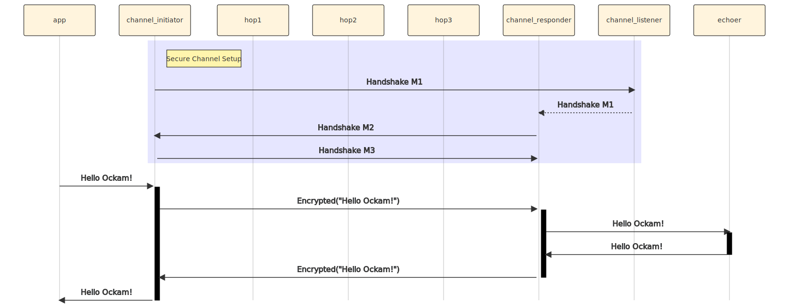

```
title: Secure Channel over many hops
```

# Secure Channel over many hops

The Ockam routing protocol can [route messages over many hops](../04-routing-many-hops)
and establishing a Secure Channel requires exchanging messages. Ockam Secure Channels
are implemented on top of Ockam Routing so you can create a secure channel that is encrypted
and secure, end-to-end, over multiple hops.

## App worker

For illustration, let's create an end-to-end secure channel within a single node.

Create a new file at:

```
touch examples/06-secure-channel-many-hops.rs
```

Add the following code to this file:

```rust
// examples/06-secure-channel-many-hops.rs

use ockam::{Context, Result, Route, SecureChannel};
use ockam_get_started::{Echoer, Hop};

#[ockam::node]
async fn main(mut ctx: Context) -> Result<()> {
    // Start an Echoer worker at address "echoer"
    ctx.start_worker("echoer", Echoer).await?;

    // Start hop workers - hop1, hop2, hop3.
    ctx.start_worker("hop1", Hop).await?;
    ctx.start_worker("hop2", Hop).await?;
    ctx.start_worker("hop3", Hop).await?;

    SecureChannel::create_listener(&mut ctx, "secure_channel_listener").await?;

    let route_to_listener =
        Route::new()
            .append("hop1")
            .append("hop2")
            .append("hop3")
            .append("secure_channel_listener");
    let channel = SecureChannel::create(&mut ctx, route_to_listener).await?;

    // Send a message to the echoer worker via the channel.
    ctx.send(
        Route::new()
            .append(channel.address())
            .append("echoer"),
        "Hello Ockam!".to_string()
    ).await?;

    // Wait to receive a reply and print it.
    let reply = ctx.receive::<String>().await?;
    println!("App Received: {}", reply); // should print "Hello Ockam!"

    ctx.stop().await
}
```

To run this new node program:

```
cargo run --example 06-secure-channel-many-hops
```

In the code above, we create a multi-hop route to the secure channel listener
and provide that route to `SecureChannel::create(...)`. This internally creates
a secure channel `initiator` worker that sends protocol messages over the provide
route to establish the channel.

Once the channel is establish we can send messages along this route: `Route::new().append(channel.address()).append("echoer")`, They are encrypted as
they enter the channel and cannot be tampered as they flows along
`hop1 => hop2 => hop3`.

## Message Flow



The channel that built here was local to one node, and that is of course not very
useful for a real applications. Next we'll see how messages can be routed to other
nodes and we can have end-to-end secure channels over many transport layer hops.

<div style="display: none; visibility: hidden;">
<hr><b>Next:</b> <a href="../07-routing-over-transport">07. Routing over a transport</a>
</div>
