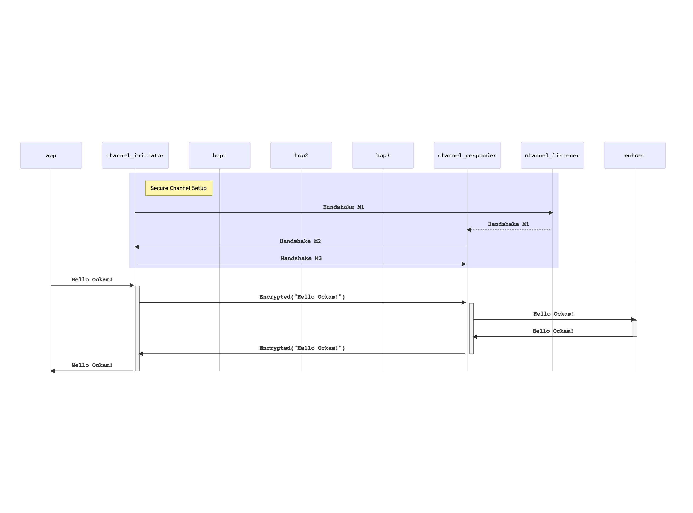

```
title: Secure Channel over many hops
```

# Secure Channel over many hops

The Ockam routing protocol can [route messages over many hops](../04-routing-many-hops)
and establishing a Secure Channel requires exchanging messages. Ockam Secure Channels
are implemented on top of Ockam Routing so you can create a secure channel that is encrypted
and secure, end-to-end, over multiple hops.

## App worker

For illustration, let's create an end-to-end secure channel within a single node.

Create a new file at:

```
touch examples/06-secure-channel-many-hops.rs
```

Add the following code to this file:

```rust
// examples/06-secure-channel-many-hops.rs
// This node creates a secure channel with a listener that is multiple hops away.

use ockam::{Context, Result, Route, SecureChannel, Vault};
use ockam_get_started::{Echoer, Hop};

#[ockam::node]
async fn main(mut ctx: Context) -> Result<()> {
    // Start an Echoer worker at address "echoer"
    ctx.start_worker("echoer", Echoer).await?;

    // Start 3 hop workers at addresses "h1", "h2" and "h3".
    ctx.start_worker("h1", Hop).await?;
    ctx.start_worker("h2", Hop).await?;
    ctx.start_worker("h3", Hop).await?;

    let vault = Vault::create(&ctx)?;

    // Create a secure channel listener at address "secure_channel_listener"
    SecureChannel::create_listener(&mut ctx, "secure_channel_listener", &vault).await?;

    // Connect to a secure channel listener and perform a handshake.
    let channel = SecureChannel::create(
        &mut ctx,
        // route to the secure channel listener, via "h1", "h2" and "h3"
        Route::new()
            .append("h1")
            .append("h2")
            .append("h3")
            .append("secure_channel_listener"),
        &vault,
    )
    .await?;

    // Send a message to the echoer worker, via the secure channel.
    ctx.send(
        // route to the "echoer" worker via the secure channel.
        Route::new().append(channel.address()).append("echoer"),
        // the message you want echo-ed back
        "Hello Ockam!".to_string(),
    )
    .await?;

    // Wait to receive a reply and print it.
    let reply = ctx.receive::<String>().await?;
    println!("App Received: {}", reply); // should print "Hello Ockam!"

    // Stop all workers, stop the node, cleanup and return.
    ctx.stop().await
}

```

To run this new node program:

```
cargo run --example 06-secure-channel-many-hops
```

In the code above, we create a multi-hop route to the secure channel listener
and provide that route to `SecureChannel::create(...)`. This internally creates
a `channel_initiator` worker that sends protocol messages over the given
route to establish the channel.

Once the channel is established, we can send messages via the channel `Route::new().append(channel.address()).append("echoer")`. They are encrypted as
they enter the channel and cannot be tampered or snooped as they flow along
`channel_initiator => hop1 => hop2 => hop3 => channel_responder`.

## Message Flow



The channel that we built above was local to one node, which is not very
useful for a real applications. Next, we'll see how messages can be routed to other
nodes to get end-to-end secure channels over many transport layer hops.

<div style="display: none; visibility: hidden;">
<hr><b>Next:</b> <a href="../07-routing-over-transport">07. Routing over a transport</a>
</div>
