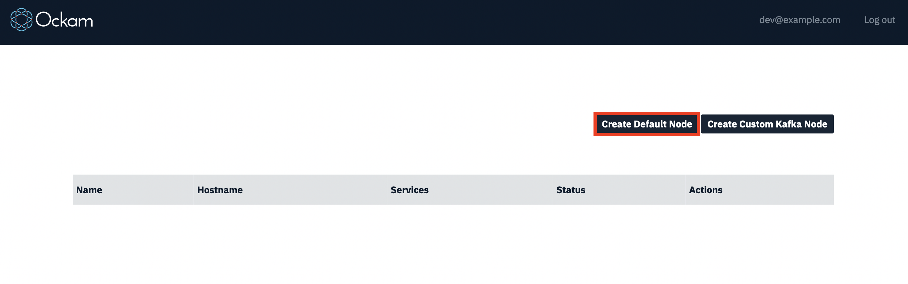
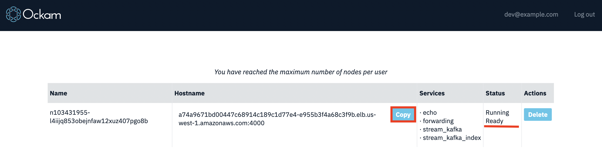

# Using Ockam Hub cloud services

## Ockam Hub

In previous examples we learned how to send messages between nodes using [transports](../07-routing-over-transport).

But to connect two nodes at least one of them must be exposed via hostname or a public IP, which makes connecting devices challenging. To address that we can use special kind of node running on the cloud with a fixed hostname to route messages between device nodes.
We call such nodes Ockam Hub Nodes.

You can host a Hub Node yourself, or use one provided by Ockam service at https://hub.ockam.network

Hub Nodes run a set of predefined workers with static addresses which are called Services.
Ockam Services can be used for discovery, routing and integration with various cloud services used by the application.

This guide shows how to start a new Hub Node, connect an application and use services in there.

## Creating Hub Nodes

1. Navigate to http://hub.ockam.network

1. In order to create a node, you need to log in using your GitHub account:

    

1. After that you can create a node:

    

1. When the node status changes to `Running / Ready`, the node is ready to use.

1. From there you can copy the Hostname of the node to use in the examples.

    

## Example service usage

In this example we're going to use the `echo_service` on the Hub Node we created. This service behaviour is similar to the `echoer` workers we used before - it will reply for a message with the same payload.

### Application code

Create a new file at:

```
touch examples/07-hub.rs
```

Add the following code to this file:

```rust
// This program sends a message to the echo_service worker running on your node in Ockam Hub.

use ockam::{route, Context, Result, TcpTransport, TCP};

#[ockam::node]
async fn main(mut ctx: Context) -> Result<()> {
    // Create a hub node by going to https://hub.ockam.network

    let hub_node_tcp_address = "<Your node Address copied from hub.ockam.network>"; // e.g. "127.0.0.1:4000"

    // Initialize the TCP Transport.
    let _tcp = TcpTransport::create(&ctx).await?;

    // Send a message to the `echo_service` worker on your hub node.
    ctx.send(
        // route to the echo_service worker on your hub node
        route![(TCP, hub_node_tcp_address), "echo_service"],
        // the message you want echo-ed back
        "Hello Ockam!".to_string(),
    )
    .await?;

    // Wait to receive the echo and print it.
    let reply = ctx.receive::<String>().await?;
    println!("App Received: '{}'", reply); // should print "Hello Ockam!"

    // Stop the node.
    ctx.stop().await
}
```

### Run

```
cargo run --example 07-hub
```

<div style="display: none; visibility: hidden;">
<hr><b>Next:</b> <a href="../08-forwarding">08. Forwarding using Hub Nodes</a>
</div>
