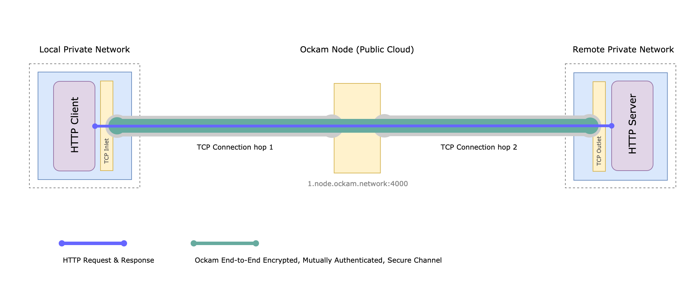
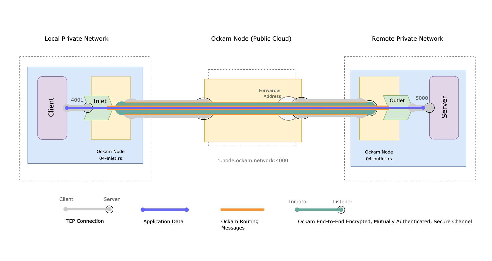
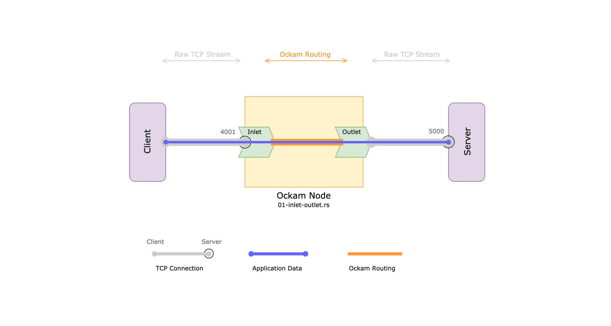
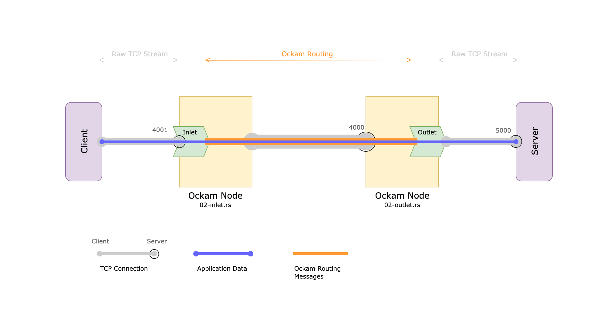
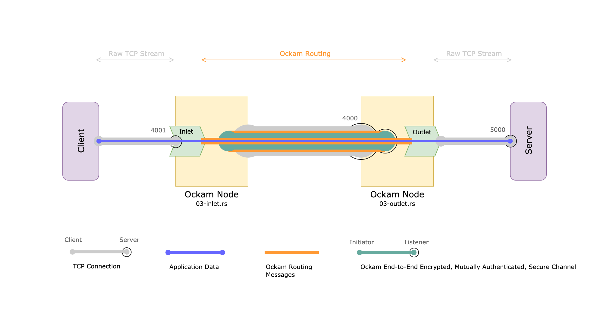

# How to end-to-end encrypt all application layer communication

In this hands-on guide, we'll create two simple [rust programs](#code-walkthrough) to
__transparently tunnel__ arbitrary application layer communication through Ockam's end-to-end encrypted,
mutually authenticated secure channels. These example programs are also available in a docker image so you
can [try them](#end-to-end-encryption-over-two-tcp-connection-hops) without setting up a rust toolchain.

We'll walk through [~30 lines of Rust](#04-end-to-end-encryption-over-two-tcp-connection-hops) that
combine Ockam's Routing, Transports, and Secure Channel building blocks to create an end-to-end guarantee
of _integrity, authenticity, and confidentiality_ for application data
over multi-hop, multi-protocol, transport routes.

Ockam is a collection of
[composable building blocks](#composable-building-blocks-for-securing-any-communication-topology). In a
[previous guide](../end-to-end-encryption-with-rust#readme), we built encrypted communication using the
Ockam Rust library. That approach requires modifying an application to include Ockam.

In this guide, we'll add end-to-end encryption without changing application code. We'll create two
sidecar programs that run next to our primary application within the same security context. These sidecars
use pluggable Transport Inlets and Outlets to transparently tunnel application layer protocols
through Ockam Secure Channels.

## End-to-End Encryption over two TCP connection hops

Let's start with a simple example that tunnels an application's HTTP API calls through an end-to-end
encrypted channel. This channel spans __end-to-end over two TCP transport connection hops__ from one private
network to another private network and no listening port is exposed publicly from either private network.

<p></p>

You can use this approach to create end-to-end secure communication between two mobile applications, or
between two microservices in different VPCs, or from a work tablet to a machine in a factory, or from an app
on a remote worker's home desktop to an internal enterprise service in Kubernetes.

To enable communication between two programs that are behind private NATs or firewalls, we use an Ockam Node
in the cloud `1.node.ockam.network:4000`. This node understands the Ockam application layer Routing Protocol
and provides a forwarding service. We'll use this node to relay end-to-end encrypted messages between our
sidecar programs. This node cannot see or manipulate encrypted application data that is carried as payloads
inside Ockam Routing messages.

If we dig a little bit deeper this is how the communication works under the hood.

<p id="04">

</p>

This picture may seem a little complicated but, after we try our first example, we'll
[assemble it](#code-walkthrough) piece-by-piece using simple composable build blocks. We'll see how
creating this end-to-end encrypted communication only takes ~15 lines of code on each side, most of
which is setup.

The underlying cryptographic, messaging, and routing protocols are hidden behind composable
abstractions and exposed as simple library functions. Before we dive into the code, let's try an end-to-end
encrypted HTTP request and response:

Start a target HTTP server listening on port `5000`:

```
docker run --rm -it --network=host --name=server \
  python:3-alpine python -m http.server --bind 0.0.0.0 5000
```

Next, in a separate terminal window, start the outlet program and give it the address of our target
HTTP server. It will create a forwarder in the cloud node and print the assigned forwarding address, copy it.

```
docker run --rm -it --network=host --name=outlet \
  ghcr.io/ockam-network/examples/tcp_inlet_and_outlet 04-outlet 127.0.0.1:5000
```

Then start the inlet program, in a separate terminal window, and give it the TCP address on which the
Inlet will wait for incoming TCP connections (port `4001`) along with the forwarding address of the outlet
that was printed in the previous step.

```
docker run --rm -it --network=host --name=inlet \
  ghcr.io/ockam-network/examples/tcp_inlet_and_outlet 04-inlet 127.0.0.1:4001 [[FORWARDING_ADDRESS]]
```

Now run an HTTP client, but instead of pointing it directly to our HTTP server, make a request to
the Inlet at port `4001`.

```
docker run --rm -it --network=host curlimages/curl http://localhost:4001
```

When we run this, we see the data flow as shown in the [diagram above](#04).

Our target HTTP server can receive requests from the HTTP client over an end-to-end encrypted channel that
passes through a node in the cloud. The cloud node only sees encrypted data and any tampering is immediately
detected. The outlet and the inlet sidecar programs an both run in private networks without opening any
listening ports that expose them to attacks from the Internet.

The Inlet and Outlet pair that we used in this example are general TCP Inlet and Outlet so that can be used
to tunnel any TCP based protocol through Ockam Secure Channels. Try replacing the HTTP server and client in
above example with some other TCP based client and server.
We'd love to [hear about your experiments](https://github.com/ockam-network/ockam/discussions).

Next let's dig into the [code behind the above example](#code-walkthrough). You can stop the above docker
containers as follows:

```
docker kill server outlet inlet
```

## Code Walkthrough

Each code example below incrementally builds on the examples before it, only a few lines of new code
is introduced in each example.
If you just want to see the final code, jump directly to
[step 4](#04-end-to-end-encryption-over-two-tcp-connection-hops).

* [Step 0](#setup) - Setup
* [Step 1](#01-setup-an-inlet-and-an-outlet) - Create an Inlet and an Outlet
* [Step 2](#02-route-over-a-transport) - Route over a Transport
* [Step 3](#03-tunnel-through-a-secure-channel) - Tunnel through a Secure Channel
* [Step 4](#04-end-to-end-encryption-over-two-tcp-connection-hops) - End-to-End Encrypted Channel over two transport connection hops

### Setup

If you don't have it, please [install](https://www.rust-lang.org/tools/install) the latest version of Rust.

```
curl --proto '=https' --tlsv1.2 -sSf https://sh.rustup.rs | sh
```

Next, create a new cargo project to get started:

```
cargo new --lib ockam_tcp_inlet_outlet && cd ockam_tcp_inlet_outlet && mkdir examples &&
  echo 'ockam = "*"' >> Cargo.toml && cargo build
```

If the above instructions don't work on your machine please
[post a question](https://github.com/ockam-network/ockam/discussions/1642),
we would love to help.

### 01: Setup an Inlet and an Outlet

<p></p>

In our first example, let's create a TCP Inlet and Outlet pair.

A **TCP Outlet** starts up as a **TCP client** to a given target TCP server address. It opens
a TCP connection with the target and then waits to receive Ockam Routing messages from an Inlet.
The payload of an incoming Ockam Routing message is converted into raw TCP and sent over the outlet
connection to the target. Any replies from the TCP target are wrapped as payloads of new Ockam
Routing messages and routed to the Inlet.

A **TCP Inlet** starts up as a **TCP server** and waits for incoming TCP connections. It knows the
route to a corresponding outlet. When new data arrives from a TCP client, the Inlet wraps this data
as payload of a new Ockam Routing message and sends it to the Outlet.

Create a file at `examples/01-inlet-outlet.rs` and copy the below code snippet to it.

```rust
// examples/01-inlet-outlet.rs
use ockam::{route, Context, Result, TcpTransport};

#[ockam::node]
async fn main(ctx: Context) -> Result<()> {
    // Initialize the TCP Transport.
    let tcp = TcpTransport::create(&ctx).await?;

    // Expect second command line argument to be the TCP address of a target TCP server.
    // For example: 127.0.0.1:5000
    //
    // Create a TCP Transport Outlet - at Ockam Worker address "outlet" -
    // that will connect, as a TCP client, to the target TCP server.
    //
    // This Outlet will:
    // 1. Unwrap the payload of any Ockam Routing Message that it receives from an Inlet
    //    and send it as raw TCP data to the target TCP server. First such message from
    //    an Inlet is used to remember the route back the Inlet.
    //
    // 2. Wrap any raw TCP data it receives, from the target TCP server,
    //    as payload of a new Ockam Routing Message. This Ockam Routing Message will have
    //    its onward_route be set to the route to an Inlet, that it knows about, because of
    //    a previous message from the Inlet.

    let outlet_target = std::env::args().nth(2).expect("no outlet target given");
    tcp.create_outlet("outlet", outlet_target).await?;

    // Expect first command line argument to be the TCP address on which to start an Inlet
    // For example: 127.0.0.1:4001
    //
    // Create a TCP Transport Inlet that will listen on the given TCP address as a TCP server.
    //
    // The Inlet will:
    // 1. Wrap any raw TCP data it receives from a TCP client as payload of a new
    //    Ockam Routing Message. This Ockam Routing Message will have its onward_route
    //    be set to the route to a TCP Transport Outlet. This route is provided as the 2nd
    //    argument of the create_inlet() function.
    //
    // 2. Unwrap the payload of any Ockam Routing Message it receives back from the Outlet
    //    and send it as raw TCP data to a connected TCP client.

    let inlet_address = std::env::args().nth(1).expect("no inlet address given");
    tcp.create_inlet(inlet_address, route!["outlet"]).await?;

    // We won't call ctx.stop() here,
    // so this program will keep running until you interrupt it with Ctrl-C.
    Ok(())
}

```

Before running the example program, start a target TCP server listening on port `5000`. As a first
example use a simple HTTP server, later we'll try other TCP-based protocols.

```
pushd $(mktemp -d 2>/dev/null || mktemp -d -t 'tmpdir') &>/dev/null; python3 -m http.server --bind 0.0.0.0 5000; popd
```

The example program takes two arguments. The first argument is the TCP address on which to start an Inlet
(port `4001`) and the second argument is the TCP address of our target TCP server (port `5000`).

```
cargo run --example 01-inlet-outlet 127.0.0.1:4001 127.0.0.1:5000
```

Now run an HTTP client, but instead of pointing it directly to our HTTP server, make a request to
the Inlet at port `4001`.

```
curl http://127.0.0.1:4001
```

When we run this, we see the data flow as shown in the [diagram above](#01-setup-an-inlet-and-an-outlet) -
HTTP requests and responses are wrapped in Ockam Routing messages and tunneled through our simple Rust program.

### 02: Route over a Transport

<p></p>

Next let's separate the Inlet and Outlet from [example 01](#01-setup-an-inlet-and-an-outlet) into
two programs connected using the Ockam TCP Transport. An Ockam Transport carries Ockam Routing messages
from one machine to another machine. An Ockam Node is any program that communicates with other Ockam Nodes
using Ockam Routing and Transports.

The next two code snippets show how we can create such inlet and outlet nodes and tunnel
HTTP, over TCP, through them.

Create a file at `examples/02-outlet.rs` and copy the below code snippet to it.

```rust
// examples/02-outlet.rs
use ockam::{Context, Result, TcpTransport};

#[ockam::node]
async fn main(ctx: Context) -> Result<()> {
    // Initialize the TCP Transport.
    let tcp = TcpTransport::create(&ctx).await?;

    // Expect first command line argument to be the TCP address of a target TCP server.
    // For example: 127.0.0.1:5000
    //
    // Create a TCP Transport Outlet - at Ockam Worker address "outlet" -
    // that will connect, as a TCP client, to the target TCP server.
    //
    // This Outlet will:
    // 1. Unwrap the payload of any Ockam Routing Message that it receives from an Inlet
    //    and send it as raw TCP data to the target TCP server. First such message from
    //    an Inlet is used to remember the route back the Inlet.
    //
    // 2. Wrap any raw TCP data it receives, from the target TCP server,
    //    as payload of a new Ockam Routing Message. This Ockam Routing Message will have
    //    its onward_route be set to the route to an Inlet that is knows about because of
    //    a previous message from the Inlet.

    let outlet_target = std::env::args().nth(1).expect("no outlet target given");
    tcp.create_outlet("outlet", outlet_target).await?;

    // Create a TCP listener to receive Ockam Routing Messages from other ockam nodes.
    tcp.listen("127.0.0.1:4000").await?;

    // We won't call ctx.stop() here,
    // so this program will keep running until you interrupt it with Ctrl-C.
    Ok(())
}

```

Create a file at `examples/02-inlet.rs` and copy the below code snippet to it.

```rust
// examples/02-inlet.rs
use ockam::{route, Context, Result, TcpTransport, TCP};

#[ockam::node]
async fn main(ctx: Context) -> Result<()> {
    // Initialize the TCP Transport.
    let tcp = TcpTransport::create(&ctx).await?;

    // We know the network address of the node with an Outlet, we also know that the Outlet is
    // running at Ockam Worker address "outlet" on that node.

    let route_to_outlet = route![(TCP, "127.0.0.1:4000"), "outlet"];

    // Expect first command line argument to be the TCP address on which to start an Inlet
    // For example: 127.0.0.1:4001
    //
    // Create a TCP Transport Inlet that will listen on the given TCP address as a TCP server.
    //
    // The Inlet will:
    // 1. Wrap any raw TCP data it receives from a TCP client as payload of a new
    //    Ockam Routing Message. This Ockam Routing Message will have its onward_route
    //    be set to the route to a TCP Transport Outlet. This route_to_outlet is provided as
    //    the 2nd argument of the create_inlet() function.
    //
    // 2. Unwrap the payload of any Ockam Routing Message it receives back from the Outlet
    //    and send it as raw TCP data to q connected TCP client.

    let inlet_address = std::env::args().nth(1).expect("no inlet address given");
    tcp.create_inlet(inlet_address, route_to_outlet).await?;

    // We won't call ctx.stop() here,
    // so this program will keep running until you interrupt it with Ctrl-C.
    Ok(())
}

```

Before we can run our example, let's start a target HTTP server listening on port `5000`.

```
pushd $(mktemp -d 2>/dev/null || mktemp -d -t 'tmpdir') &>/dev/null; python3 -m http.server --bind 0.0.0.0 5000; popd
```

Next start the outlet program and give it the address of the target TCP server:

```
cargo run --example 02-outlet 127.0.0.1:5000
```

Then start the inlet program and give it the TCP address on which the Inlet will wait for incoming TCP connections

```
cargo run --example 02-inlet 127.0.0.1:4001
```

Now run an HTTP client, but instead of pointing it directly to our HTTP server, make a request to
the Inlet at port `4001`.

```
curl http://127.0.0.1:4001
```

When we run this, we see the data flow as shown in the [diagram above](#02-route-over-a-transport) -
HTTP requests and responses are wrapped in Ockam Routing messages, carried over TCP, unwrapped and
then delivered to the target HTTP server.

### 03: Tunnel through a Secure Channel

<p></p>

Next let's add an encrypted and mutually authenticated secure channel to [example 02](#02-route-over-a-transport).
The rest of the code will stay the same.

We'll make the outlet program run a Secure Channel Listener and make the Inlet program initiate a secure
handshake (authenticated key exchange) with this listener.

The inlet program will then initiate a secure channel handshake over the route:
```
route![(TCP, "127.0.0.1:4000"), "secure_channel_listener"]
```

Create a file at `examples/03-outlet.rs` and copy the below code snippet to it.

```rust
// examples/03-outlet.rs
use ockam::{Context, Result, TcpTransport};
use ockam::{Identity, TrustEveryonePolicy, Vault};

#[ockam::node]
async fn main(ctx: Context) -> Result<()> {
    // Initialize the TCP Transport.
    let tcp = TcpTransport::create(&ctx).await?;

    // Create:
    //   1. A Vault to store our cryptographic keys
    //   2. An Identity to represent this Node
    //   3. A Secure Channel Listener at Worker address - secure_channel_listener
    //      that will wait for requests to start an Authenticated Key Exchange.

    let vault = Vault::create();
    let mut e = Identity::create(&ctx, &vault).await?;
    e.create_secure_channel_listener("secure_channel_listener", TrustEveryonePolicy).await?;

    // Expect first command line argument to be the TCP address of a target TCP server.
    // For example: 127.0.0.1:5000
    //
    // Create a TCP Transport Outlet - at Ockam Worker address "outlet" -
    // that will connect, as a TCP client, to the target TCP server.
    //
    // This Outlet will:
    // 1. Unwrap the payload of any Ockam Routing Message that it receives from an Inlet
    //    and send it as raw TCP data to the target TCP server. First such message from
    //    an Inlet is used to remember the route back the Inlet.
    //
    // 2. Wrap any raw TCP data it receives, from the target TCP server,
    //    as payload of a new Ockam Routing Message. This Ockam Routing Message will have
    //    its onward_route be set to the route to an Inlet that is knows about because of
    //    a previous message from the Inlet.

    let outlet_target = std::env::args().nth(1).expect("no outlet target given");
    tcp.create_outlet("outlet", outlet_target).await?;

    // Create a TCP listener to receive Ockam Routing Messages from other ockam nodes.
    tcp.listen("127.0.0.1:4000").await?;

    // We won't call ctx.stop() here,
    // so this program will keep running until you interrupt it with Ctrl-C.
    Ok(())
}

```

Create a file at `examples/03-inlet.rs` and copy the below code snippet to it.

```rust
// examples/03-inlet.rs
use ockam::{route, Context, Result, TcpTransport, TCP};
use ockam::{Identity, TrustEveryonePolicy, Vault};

#[ockam::node]
async fn main(ctx: Context) -> Result<()> {
    // Initialize the TCP Transport.
    let tcp = TcpTransport::create(&ctx).await?;

    // Create a Vault to store our cryptographic keys and an Identity to represent this Node.
    // Then initiate a handshake with the secure channel listener on the node that has the
    // TCP Transport Outlet.
    //
    // For this example, we know that the Outlet node is listening for Ockam Routing Messages
    // over TCP at "127.0.0.1:4000" and its secure channel listener is
    // at address: "secure_channel_listener".

    let vault = Vault::create();
    let mut e = Identity::create(&ctx, &vault).await?;
    let r = route![(TCP, "127.0.0.1:4000"), "secure_channel_listener"];
    let channel = e.create_secure_channel(r, TrustEveryonePolicy).await?;

    // We know Secure Channel address that tunnels messages to the node with an Outlet,
    // we also now that Outlet lives at "outlet" address at that node.

    let route_to_outlet = route![channel, "outlet"];

    // Expect first command line argument to be the TCP address on which to start an Inlet
    // For example: 127.0.0.1:4001
    //
    // Create a TCP Transport Inlet that will listen on the given TCP address as a TCP server.
    //
    // The Inlet will:
    // 1. Wrap any raw TCP data it receives from a TCP client as payload of a new
    //    Ockam Routing Message. This Ockam Routing Message will have its onward_route
    //    be set to the route to a TCP Transport Outlet. This route_to_outlet is provided as
    //    the 2nd argument of the create_inlet() function.
    //
    // 2. Unwrap the payload of any Ockam Routing Message it receives back from the Outlet
    //    and send it as raw TCP data to q connected TCP client.

    let inlet_address = std::env::args().nth(1).expect("no inlet address given");
    tcp.create_inlet(inlet_address, route_to_outlet).await?;

    // We won't call ctx.stop() here,
    // so this program will keep running until you interrupt it with Ctrl-C.
    Ok(())
}

```

Before we can run our example, let's start a target HTTP server listening on port `5000`.

```
pushd $(mktemp -d 2>/dev/null || mktemp -d -t 'tmpdir') &>/dev/null; python3 -m http.server --bind 0.0.0.0 5000; popd
```

Next start the outlet program and give it the address of the target TCP server:

```
cargo run --example 03-outlet 127.0.0.1:5000
```

Then start the inlet program and give it the TCP address on which the Inlet will wait for incoming TCP connections

```
cargo run --example 03-inlet 127.0.0.1:4001
```

Now run an HTTP client, but instead of pointing it directly to our HTTP server, make a request to
the Inlet at port `4001`.

```
curl http://127.0.0.1:4001
```

When we run this, we see the data flow as shown in the [diagram above](#03-tunnel-through-a-secure-channel) -

* An HTTP request is wrapped in an Ockam Routing message and routed to the mutually authenticated
  secure channel.
* The channel encrypts this routing message (using an AEAD construction) and makes this encrypted
  message in-turn a payload of a brand new Ockam Routing message.
* This new message is routed over TCP to the other end of the channel where it is decrypted and
  checked for authenticity and integrity.
* This decrypted message is itself an Ockam Routing message destined for the Outlet.
* When it reaches the Outlet, the Outlet unwraps the HTTP request payload and sends it over TCP to our
  target HTTP server.

### 04: End-to-End Encryption over two TCP connection hops

<p></p>

To enable communication between two programs that are behind private NATs or firewalls, our final step
is to route our end-to-end encrypted channel through a public Ockam Node in the cloud `1.node.ockam.network:4000`.
This node understands the Ockam application layer Routing Protocol and provides a forwarding service.

The outlet program will connect with the node at `1.node.ockam.network:4000` as a TCP client and ask the
forwarding service on that node to create a forwarder for it. The forwarding service will create
this forwarder and assign it a new generated forwarding address. The outlet program receives this forwarding
address and prints it.

We give this address to the inlet program, which also connects with the node at `1.node.ockam.network:4000`
as a TCP client and sends messages to the outlet's forwarding address. All messages that arrive at that
forwarding address are sent to the outlet program using the TCP connection it created as a client.
The cloud node only sees end-to-end encrypted data.

You can easily [create your own forwarding nodes](../../guides/rust#step-by-step), for this example we've
created one that lives at `1.node.ockam.network:4000`.

We only need to add a few new lines to our code from [example 03](#03-tunnel-through-a-secure-channel).

Create a file at `examples/04-outlet.rs` and copy the below code snippet to it.

```rust
// examples/04-outlet.rs
use ockam::{Context, RemoteForwarder, Result, TcpTransport, TCP};
use ockam::{Identity, TrustEveryonePolicy, Vault};

#[ockam::node]
async fn main(ctx: Context) -> Result<()> {
    // Initialize the TCP Transport.
    let tcp = TcpTransport::create(&ctx).await?;

    let vault = Vault::create();
    let mut e = Identity::create(&ctx, &vault).await?;
    e.create_secure_channel_listener("secure_channel_listener", TrustEveryonePolicy).await?;

    // Expect first command line argument to be the TCP address of a target TCP server.
    // For example: 127.0.0.1:5000
    //
    // Create a TCP Transport Outlet - at Ockam Worker address "outlet" -
    // that will connect, as a TCP client, to the target TCP server.
    //
    // This Outlet will:
    // 1. Unwrap the payload of any Ockam Routing Message that it receives from an Inlet
    //    and send it as raw TCP data to the target TCP server. First such message from
    //    an Inlet is used to remember the route back the Inlet.
    //
    // 2. Wrap any raw TCP data it receives, from the target TCP server,
    //    as payload of a new Ockam Routing Message. This Ockam Routing Message will have
    //    its onward_route be set to the route to an Inlet that is knows about because of
    //    a previous message from the Inlet.

    let outlet_target = std::env::args().nth(1).expect("no outlet target given");
    tcp.create_outlet("outlet", outlet_target).await?;

    // To allow Inlet Node and others to initiate an end-to-end secure channel with this program
    // we connect with 1.node.ockam.network:4000 as a TCP client and ask the forwarding
    // service on that node to create a forwarder for us.
    //
    // All messages that arrive at that forwarding address will be sent to this program
    // using the TCP connection we created as a client.
    let node_in_hub = (TCP, "1.node.ockam.network:4000");
    let forwarder = RemoteForwarder::create(&ctx, node_in_hub).await?;
    println!("\n[✓] RemoteForwarder was created on the node at: 1.node.ockam.network:4000");
    println!("Forwarding address in Hub is:");
    println!("{}", forwarder.remote_address());

    // We won't call ctx.stop() here,
    // so this program will keep running until you interrupt it with Ctrl-C.
    Ok(())
}

```

Create a file at `examples/04-inlet.rs` and copy the below code snippet to it.

```rust
// examples/04-inlet.rs
use ockam::{route, Context, Result, Route, TcpTransport, TCP};
use ockam::{Identity, TrustEveryonePolicy, Vault};

#[ockam::node]
async fn main(ctx: Context) -> Result<()> {
    // Initialize the TCP Transport.
    let tcp = TcpTransport::create(&ctx).await?;

    // Create a Vault to store our cryptographic keys and an Identity to represent this Node.
    // Then initiate a handshake with the secure channel listener on the node that has the
    // TCP Transport Outlet.
    //
    // For this example, we know that the Outlet node is listening for Ockam Routing Messages
    // through a Remote Forwarder at "1.node.ockam.network:4000" and its forwarder address
    // points to secure channel listener.
    let vault = Vault::create();
    let mut e = Identity::create(&ctx, &vault).await?;

    // Expect second command line argument to be the Outlet node forwarder address
    let forwarding_address = std::env::args().nth(2).expect("no outlet forwarding address given");
    let r = route![(TCP, "1.node.ockam.network:4000"), forwarding_address, "secure_channel_listener"];
    let channel = e.create_secure_channel(r, TrustEveryonePolicy).await?;

    // We know Secure Channel address that tunnels messages to the node with an Outlet,
    // we also now that Outlet lives at "outlet" address at that node.
    let route_to_outlet: Route = route![channel, "outlet"];

    // Expect first command line argument to be the TCP address on which to start an Inlet
    // For example: 127.0.0.1:4001
    //
    // Create a TCP Transport Inlet that will listen on the given TCP address as a TCP server.
    //
    // The Inlet will:
    // 1. Wrap any raw TCP data it receives from a TCP client as payload of a new
    //    Ockam Routing Message. This Ockam Routing Message will have its onward_route
    //    be set to the route to a TCP Transport Outlet. This route_to_outlet is provided as
    //    the 2nd argument of the create_inlet() function.
    //
    // 2. Unwrap the payload of any Ockam Routing Message it receives back from the Outlet
    //    and send it as raw TCP data to q connected TCP client.

    let inlet_address = std::env::args().nth(1).expect("no inlet address given");
    tcp.create_inlet(inlet_address, route_to_outlet).await?;

    // We won't call ctx.stop() here,
    // so this program will keep running until you interrupt it with Ctrl-C.
    Ok(())
}

```

Before we can run our example, let's start a target HTTP server listening on port `5000`.

```
pushd $(mktemp -d 2>/dev/null || mktemp -d -t 'tmpdir') &>/dev/null; python3 -m http.server --bind 0.0.0.0 5000; popd
```

Next, in a separate terminal window, start the outlet program and give it the address of our target
HTTP server. It will create a forwarder in the cloud node and print the assigned forwarding address, copy it.

```
cargo run --example 04-outlet 127.0.0.1:5000
```

Then start the inlet program, in a separate terminal window, and give it the TCP address on which the
Inlet will wait for incoming TCP connections (port `4001`) along with the forwarding address of the outlet
that was printed in the previous step.

```
cargo run --example 04-inlet 127.0.0.1:4001 [[FORWARDING_ADDRESS]]
```

Now run an HTTP client, but instead of pointing it directly to our HTTP server, make a request to the
Inlet at port `4001`.

```
curl http://127.0.0.1:4001
```

When we run this, we see the data flow as shown in the
[diagram above](#04-end-to-end-encryption-over-two-tcp-connection-hops).

Our target HTTP server can receive requests from the HTTP client over an end-to-end encrypted channel that
passes through a node in the cloud. The cloud node only sees encrypted data and any tampering is immediately
detected. The outlet and the inlet sidecar programs an both run in private networks without opening any
listening ports that expose them to attacks from the Internet.

## Composable building blocks for securing any communication topology

In the above examples we stepped through code to create an end-to-end encrypted and mutually authenticated
secure channel over two TCP transport connection hops.

We then used a TCP Inlet and a TCP Outlet to _transparently tunnel_ an application protocol
through our secure channel. Inlets and Outlets wrap incoming application messages an Ockam Routing messages
and unwrap outgoing Ockam Routing messages into application messages. The type of Inlet or Outlet we use
for our application is easily pluggable. For example we could replace TCP Inlet/Outlet with a UDP Inlet/Outlet
and easily tunnel UDP based protocols through Ockam Secure Channels.

The Ockam Routing protocol is designed to decouple Ockam secure channels from transport layer protocols.
This is why an Ockam Secure Channel can span multiple transport layer hops. In the above examples we created
an secure channel over a route that looked like this:

```
route![(TCP, "127.0.0.1:4000"), "secure_channel_listener"]
```

but we can just as easily create an end-to-end secure channel over a route that has many TCP hops:

```
route![(TCP, "22.103.63.130:4000"), (TCP, "215.227.62.96:4000"), (TCP, "79.102.180.116:4000"), "listener"]
```

Ockam Transports are lightweight add-ons that plug into the Ockam Routing layer. So with a bluetooth
transport we can have a route that looks like this.

```
route![(BLUETOOTH, "5b8e2be26fdc"), (TCP, "215.227.62.96:4000"), "listener"]
```

We can then easily establish end-to-end encrypted channels over such a route where the first hop is
bluetooth and the second hop is tcp. The data integrity, authenticity and confidentiality guarantees are
maintained end-to-end and we only need to change the route argument
to the `create_secure_channel` function call.

This type of end-to-end encrypted channels that span multi-hop, multi-protocol routes are simply not possible
with traditional transport layer security protocols because their protection is constrained by the length and
duration of the underlying transport connection.

In the guide on
[end-to-end encryption through kafka](../end-to-end-encryption-through-kafka#readme) we walk through
how this composable design makes it possible to move end-to-end encrypted secure channels through messaging
systems like Kafka using Ockam Streams.

Data, within modern distributed applications, are rarely exchanged over a single point-to-point
transport connection. Application messages routinely flow over complex, multi-hop, multi-protocol
routes — _across data centers, through queues and caches, via gateways and brokers_ — before reaching
their end destination.

Ockam's application layer routing, secure channels and pluggable transports together provide a powerful
collection of composable building blocks that make it simple to create an end-to-end guarantee of
_integrity, authenticity, and confidentiality_ for application data over a wide variety of communication
topologies that are common in modern distributed applications.

To learn more check our [step-by-step](../../guides/rust#readme) deep dive.
