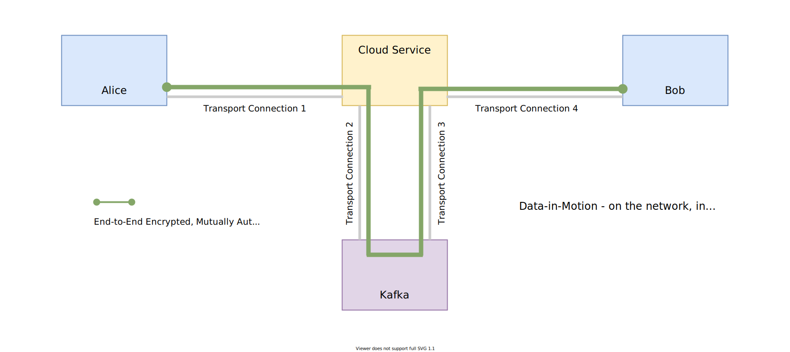

# End-to-End Encryption through Kafka

In this guide, we'll show two programs called Alice and Bob. Alice and Bob will send each other messages,
over the network, via a cloud service, through Kafka. They will mutually authenticate each other and will
have a cryptographic guarantee that the _integrity, authenticity, and confidentiality_ of their messages is
protected _end-to-end_.

The Kafka instance, the intermediary cloud service and attackers on the network will not be able to
see or change the contents of en-route messages. The application data in Kafka would be encrypted.

<p>
<a href="#example">

</a>
</p>

### Remove implicit trust in porous network boundaries

Modern distributed applications operate in highly dynamic environments. Infrastructure automation,
microservices in multiple clouds or data centers, a mobile workforce, the Internet of Things, and Edge
computing mean that machines and applications are continuously leaving and entering network boundaries.
Application architects have learnt that they must lower the amount of trust they place in network boundaries
and infrastructure.

The vulnerability surface of our application cannot include _all code_ that may be running within the same
porous network boundary. That surface is too big, too dynamic and usually outside the control of an application
developer. Applications must instead take control of the security and reliability of their own data. To
do this, all messages that are received over the network must prove who sent them and show that they weren't
tampered with or forged.

### Lower trust in intermediaries

Another aspect of modern applications that can take away Alice's and Bob's ability to rely on the integrity
and authenticity of incoming messages are intermediary services, such as the cloud service in our example below.

Data, within distributed applications, are rarely exchanged over a single point-to-point transport connection.
Application messages routinely flow over complex, multi-hop, multi-protocol routes
— _across data centers, through queues and caches, via gateways and brokers_ —
before reaching their end destination.

Typically, when information or commands are exchanged through an intermediary service, the intermediary
is able to `READ` the messages that are being exchanged, `UPDATE` en-route messages,
`CREATE` messages that were never sent, and `DELETE` (never deliver) messages that were actually sent.
Alice and Bob are entirely dependent on the security of such intermediaries. If the defenses of an intermediary
are compromised, our application is also compromised.

Transport layer security protocols are unable to protect application messages because their protection
is constrained by the length and duration of the underlying transport connection. If there is an intermediary
between Alice and Bob, the transport connection between Alice and the intermediary is completely different
from the transport connection between Bob and the intermediary.

This is why the intermediary has full `CRUD` permissions on the messages in motion.

In environments like _Microservices, Internet-of-Things, and Edge Computing_ there are usually many such
intermediaries. Our application’s vulnerability surface quickly grows and becomes unmanageable.

### Mutually Authenticated, End-to-End Encrypted Secure Channels with Ockam

[Ockam](https://github.com/ockam-network/ockam) is a suite of programming libraries that make it simple
for applications to create any number of lightweight, mutually-authenticated, end-to-end encrypted
secure channels. These channels use cryptography to guarantee end-to-end integrity, authenticity, and
confidentiality of messages.

An application can use Ockam Secure Channels to enforce __least-privileged access__ to commands, data,
configuration, machine-learning models, and software updates that are flowing, as messages, between its
distributed parts. Intermediary services and compromised software (that may be running within the same
network boundary) no longer have implicit CRUD permissions on our application's messages. Instead, we have
granular control over access permissions – tampering or forgery of _data-in-motion_ is immediately detected.

With end-to-end secure channels, we can make the vulnerability surface of our application strikingly small.

## Example

Let's build end-to-end protected communication between Alice and Bob,
via a cloud service, through Kafka, using Ockam.

In order to establish a Secure Channel we need to be able to send messages between two ends bidirectionally.
For that we are going to use two Kafka topics and for simplicity we'll do this with single partition topics.

Our goals are is to make the message exchange secure and guarantee at-least once delivery.

We'll run two programs called Alice and Bob. We want Bob to create a secure channel listener
and ask Alice to initiate a secure handshake (authenticated key exchange) with this listener. We'll imagine
that Bob and Alice are running on two separate computers and this handshake must happen over the Internet.

We'll also imagine that Bob is running within a private network and cannot open a public port exposed to
the Internet. Instead, Bob registers a bi-directional Ockam Stream on an Ockam Node. This Ockam Stream is
configured to store data in Kafka.

The Ockam Node we'll use is running as a cloud service in Ockam Hub. This node's TCP address
`1.node.ockam.network:4000` and it offers two Kafka related services:
`stream_kafka` and `stream_kafka_index`.

### Run (Using Docker)

For convenience, we created a Docker image with both Alice and Bob programs.

1. Run Bob’s program:

    ```
    docker run --interactive --tty ghcr.io/ockam-network/examples/kafka bob
    ```

    The Bob program creates a Secure Channel Listener to accept requests to begin an Authenticated
    Key Exchange. It connects, over TCP, to the cloud node at `1.node.ockam.network:4000` and creates
    a bi-directional, Kafka backed, Ockam stream on that cloud node. All messages that arrive on that
    stream will be relayed to Bob using the TCP connection that Bob created as a client.

    Bob also starts an Echoer worker that prints any message it receives and echoes it back on its
    return route.

2. The Bob program will print two stream names, a sender and receiver, which are the stream addresses
for Bob on the cloud node, copy them.

3. In a separate terminal window, run the Alice program:

    ```
    docker run --interactive --tty ghcr.io/ockam-network/examples/kafka alice
    ```

4. It will stop to ask for Bob's stream names that were printed in step 2. Enter them.

    This will tell Alice that the route to reach Bob is via the stream names registered on `"1.node.ockam.network"`.

    When Alice sends a message along this route, the Ockam routing layer will look at the first address
    in the route and hand the message to the TCP transport. The TCP transport will connect with the cloud
    node over TCP and hand the message to it.

    The routing layer on the cloud node will then take the message via the Kafka stream to Bob. The
    Kafka client will send the message to Bob over the TCP connection Bob had earlier created with the
    cloud node.

    Replies, from Bob, take the same path back and the entire secure channel handshake is completed is this way.

5. End-to-end Secure Channel is established. Send messages to Bob and get their echoes back.

    Once the secure channel is established, the Alice program will stop and ask you to enter a message for
    Bob. Any message that you enter, is delivered to Bob using the secure channel, via the cloud node. The echoer
    on Bob will echo the messages back on the same path and Alice will print it.

### Run (Using Rust)

Now that we understand how it works, let's look at the code for the Alice and Bob programs in Rust.

If you don't have it, please [install](https://www.rust-lang.org/tools/install) the latest version of Rust.

```
curl --proto '=https' --tlsv1.2 -sSf https://sh.rustup.rs | sh
```

Next, create a new cargo project to get started:

```
cargo new --lib ockam_kafka && cd ockam_kafka && mkdir examples &&
  echo 'ockam = "*"' >> Cargo.toml && cargo build
```

If the above instructions don't work on your machine please
[post a question](https://github.com/ockam-network/ockam/discussions/1642),
we would love to help.

#### Bob

Create a file at `examples/bob.rs` and copy the below code snippet to it.

```rust
// examples/bob.rs
use ockam::{route, Context, Entity, Result, SecureChannels, TrustEveryonePolicy, Vault};
use ockam::{stream::Stream, Routed, TcpTransport, Unique, Worker, TCP};

struct Echoer;

// Define an Echoer worker that prints any message it receives and
// echoes it back on its return route.
#[ockam::worker]
impl Worker for Echoer {
    type Context = Context;
    type Message = String;

    async fn handle_message(&mut self, ctx: &mut Context, msg: Routed<String>) -> Result<()> {
        println!("\n[✓] Address: {}, Received: {}", ctx.address(), msg);

        // Echo the message body back on its return_route.
        ctx.send(msg.return_route(), msg.body()).await
    }
}

#[ockam::node]
async fn main(ctx: Context) -> Result<()> {
    // Initialize the TCP Transport.
    TcpTransport::create(&ctx).await?;

    // Create a Vault to safely store secret keys for Bob.
    let vault = Vault::create(&ctx)?;

    // Create an Entity to represent Bob.
    let mut bob = Entity::create(&ctx, &vault)?;

    // Create a secure channel listener for Bob that will wait for requests to
    // initiate an Authenticated Key Exchange.
    bob.create_secure_channel_listener("listener", TrustEveryonePolicy)?;

    // The computer running this program is likely within a private network and not
    // accessible over the internet.
    //
    // To allow Alice and others to initiate an end-to-end secure channel with this program
    // we connect to 1.node.ockam.network:4000 as a TCP client and ask the Kafka Add-on
    // on that node to create a bi-directional stream for us.
    //
    // All messages sent to and arriving at the stream will be relayed
    // using the TCP connection we created as a client.
    let node_in_hub = (TCP, "1.node.ockam.network:4000");
    let sender_name = Unique::with_prefix("bob-to-alice");
    let receiver_name = Unique::with_prefix("alice-to-bob");

    Stream::new(&ctx)?
        .stream_service("stream_kafka")
        .index_service("stream_kafka_index")
        .client_id(Unique::with_prefix("bob"))
        .connect(route![node_in_hub], sender_name.clone(), receiver_name.clone())
        .await?;

    println!("\n[✓] Stream client was created on the node at: 1.node.ockam.network:4000");
    println!("\nStream sender name is: {}", sender_name);
    println!("Stream receiver name is: {}\n", receiver_name);

    // Start a worker, of type Echoer, at address "echoer".
    // This worker will echo back every message it receives, along its return route.
    ctx.start_worker("echoer", Echoer).await?;

    // We won't call ctx.stop() here, this program will run until you stop it with Ctrl-C
    Ok(())
}

```

#### Alice

Create a file at `examples/alice.rs` and copy the below code snippet to it.

```rust
// examples/alice.rs
use ockam::{route, Context, Entity, Result, SecureChannels, TrustEveryonePolicy, Vault};
use ockam::{stream::Stream, TcpTransport, Unique, TCP};
use std::io;

#[ockam::node]
async fn main(mut ctx: Context) -> Result<()> {
    // Initialize the TCP Transport.
    TcpTransport::create(&ctx).await?;

    // Create a Vault to safely store secret keys for Alice.
    let vault = Vault::create(&ctx)?;

    // Create an Entity to represent Alice.
    let mut alice = Entity::create(&ctx, &vault)?;

    // This program expects that Bob has created a bi-directional stream that
    // will relay messages for his secure channel listener, on the Ockam node
    // at 1.node.ockam.network:4000.
    //
    // From standard input, read the bi-directional stream names for
    // Bob's secure channel listener.
    println!("\nEnter the stream sender name for Bob: ");
    let mut sender_name = String::new();
    io::stdin().read_line(&mut sender_name).expect("Error reading stdin.");
    let sender_name = sender_name.trim();

    println!("\nEnter the stream receiver name for Bob: ");
    let mut receiver_name = String::new();
    io::stdin().read_line(&mut receiver_name).expect("Error reading stdin.");
    let receiver_name = receiver_name.trim();

    // Use the tcp address of the node to get a route to Bob's secure
    // channel listener via the Kafka stream client.
    let route_to_bob_listener = route![(TCP, "1.node.ockam.network:4000")];
    let (sender, _receiver) = Stream::new(&ctx)?
        .stream_service("stream_kafka")
        .index_service("stream_kafka_index")
        .client_id(Unique::with_prefix("alice"))
        .connect(route_to_bob_listener, receiver_name, sender_name)
        .await?;

    // As Alice, connect to Bob's secure channel listener, and perform
    // an Authenticated Key Exchange to establish an encrypted secure
    // channel with Bob.
    let r = route![sender.clone(), "listener"];
    let channel = alice.create_secure_channel(r, TrustEveryonePolicy)?;

    println!("\n[✓] End-to-end encrypted secure channel was established.\n");

    loop {
        // Read a message from standard input.
        println!("Type a message for Bob's echoer:");
        let mut message = String::new();
        io::stdin().read_line(&mut message).expect("Error reading from stdin.");
        let message = message.trim();

        // Send the provided message, through the channel, to Bob's echoer.
        ctx.send(route![channel.clone(), "echoer"], message.to_string()).await?;

        // Wait to receive an echo and print it.
        let reply = ctx.receive::<String>().await?;
        println!("Alice received an echo: {}\n", reply); // should print "Hello Ockam!"
    }

    // This program will keep running until you stop it with Ctrl-C
}

```

1. Run Bob’s program:

    ```
    cargo run --example bob
    ```

2. In a separate terminal window, in the same directory path, run the Alice program:

    ```
    cargo run --example alice
    ```

The interaction will be very similar to when we ran the [docker based programs](#run-using-docker).

## Conclusion

Congratulations on running an end-to-end encrypted communication through Kafka!

We [discussed](#remove-implicit-trust-in-porous-network-boundaries) that, in order to have a small and manageable
vulnerability surface, distributed applications must use mutually authenticated, end-to-end encrypted channels.
Implementing an end-to-end secure channel protocol, from scratch, is complex, error prone,
and will take more time than application teams can typically dedicate to this problem.

In the above example, we created a mutually authenticated, end-to-end encrypted channel running through
Kafka topics combining the security of end-to-end encryption with delivery guarantees of Kafka.

Ockam combines proven cryptographic building blocks into a set of reusable protocols for distributed
applications to communicate security and privately. The above example only scratched the surface of what
is possible with the tools that our included in Ockam.

To learn more, please see our [step-by-step guide](../../guides/rust#step-by-step).

<div style="display: none; visibility: hidden;">
<hr><b>Next:</b> <a href="../../guides/rust#step-by-step">A step-by-step introduction</a>
</div>

