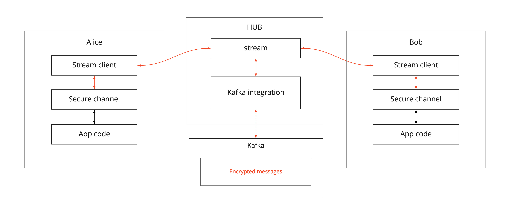

# End-to-end encrypted messaging with Kafka and Ockam Secure Channels

## Background

When using Apache Kafka and other stream processing services a common concern is data access and security.

Many fields, such as finance and personal information handling, have statutory requirements for data to be encrypted when stored or in transit.

Modern networks and data pipelines transfer data through multiple endpoints, often controlled by multiple vendors. It is therefore not sufficient for encryption to only cover the transit between arbitrary pairs of endpoints or once data comes to rest in storage.

This has led to the emergence of End-to-End encryption as the preferred model for messaging.

There were several attempts to define and implement end-to-end encryption for messaging system like Kafka, for example [KIP-317](https://cwiki.apache.org/confluence/display/KAFKA/KIP-317%3A+Add+end-to-end+data+encryption+functionality+to+Apache+Kafka)

Most of these attempts are using some sort of key storage and exchange persistent keys between devices. A fundamental weakness of such a system is its vulnerability to any party able to acquire the key.

Another approach would be to create a transient encryption key when establishing the session between two ends and have only them access it.

This approach is implemented in [Ockam Secure Channels](../../rust/06-secure-channel)


## Example

Let's build end-to-end protected communication between Alice and Bob, via Apache Kafka using Ockam.

In order to establish a Secure Channel we need to be able to send messages between two ends bidirectionally. For that we are going to use two Kafka topics.

For simplicity we're going to use single partition topics.

Our goals are to make the message exchange:

- secure: no one except the endpoints can decrypt the messages
- reliable: messages are delivered eventually as long as the endpoints are alive

We'll run two small Rust programs called Alice and Bob. We want Bob to create a secure channel listener
and ask Alice to initiate a secure handshake (authenticated key exchange) with this listener. We'll imagine
that Bob and Alice are running on two separate computers and this handshake must happen over the Internet.

We'll also imagine that Bob is running within a private network and cannot open a public port exposed to
the Internet. Instead, Bob registers a bi-directional Kafka stream on an Ockam Node, running as a cloud service in Ockam Hub.



This node is at TCP address `1.node.ockam.network:4000` and offers two Kafka services:
`stream_kafka` and `stream_kafka_index`.

### Docker image

For convenience, we created a Docker image with both Alice and Bob programs.

You can get the image by running

```bash
docker pull ghcr.io/ockam-network/examples/kafka:latest
```

### Run the example

1. Run Bob’s program:

    ```
    docker run -ti ghcr.io/ockam-network/examples/kafka:latest bob
    ```

    The Bob program creates a Secure Channel Listener to accept requests to begin an Authenticated
    Key Exchange. It also connects, over TCP, to the cloud node at `1.node.ockam.network:4000` and creates
    a bi-directional Kafka stream on that cloud node. All messages that arrive on that stream will be relayed to
    Bob using the TCP connection that Bob created as a client.

    Bob also starts an Echoer worker that prints any message it receives and echoes it back on its return route.

2. The Bob program will print two stream names, a sender and receiver, which are the stream relay addresses for Bob on the cloud node, copy them.

3. In a separate terminal window, in the same directory path, run the Alice program:

    ```
    docker run -ti ghcr.io/ockam-network/examples/kafka:latest alice
    ```

4. It will stop to ask for Bob's stream names that were printed in step 2. Enter them.

    This will tell Alice that the route to reach Bob is via the stream names registered on `"1.node.ockam.network"`.

    When Alice sends a message along this route, the Ockam routing layer will look at the first address
    in the route and hand the message to the TCP transport. The TCP transport will connect with the cloud
    node over TCP and hand the message to it.

    The routing layer on the cloud node will then take the message via the Kafka stream to Bob. The
    Kafka client will send the message to Bob over the TCP connection Bob had earlier created with the
    cloud node.

    Replies, from Bob, take the same path back and the entire secure channel handshake is completed is this way.

5. End-to-end Secure Channel is established. Send messages to Bob and get their echoes back.

    Once the secure channel is established, the Alice program will stop and ask you to enter a message for
    Bob. Any message that you enter, is delivered to Bob using the secure channel, via the cloud node. The echoer
    on Bob will echo the messages back on the same path and Alice will print it.

### Rust code

The source code for this application is located in [the ockam repo](https://github.com/ockam-network/ockam/tree/hairyhum/stream-guide/examples/rust/ockam_kafka)
Alice and Bob source code can be found in the `examples` folder.

You can check out the code yourself and run the same examples following the project README.


## Conclusion

Congratulations on running an end-to-end encrypted communication through Kafka!

We [discussed](#remove-implicit-trust-in-porous-network-boundaries) that, in order to have a small and manageable
vulnerability surface, distributed applications must use mutually authenticated, end-to-end encrypted channels.
Implementing an end-to-end secure channel protocol, from scratch, is complex, error prone,
and will take more time than application teams can typically dedicate to this problem.

In the above example, we created a mutually authenticated, end-to-end encrypted channel running through Kafka topics combining the security of end-to-end encryption with delivery guarantees of Kafka.

Ockam combines proven cryptographic building blocks into a set of reusable protocols for distributed
applications to communicate security and privately. The above example only scratched the surface of what
is possible with the tools that our included in the `ockam` Rust crate.

To learn more, please see our [step-by-step guide](../../guides/rust#step-by-step).

<div style="display: none; visibility: hidden;">
<hr><b>Next:</b> <a href="../../guides/rust#step-by-step">A step-by-step introduction</a>
</div>

