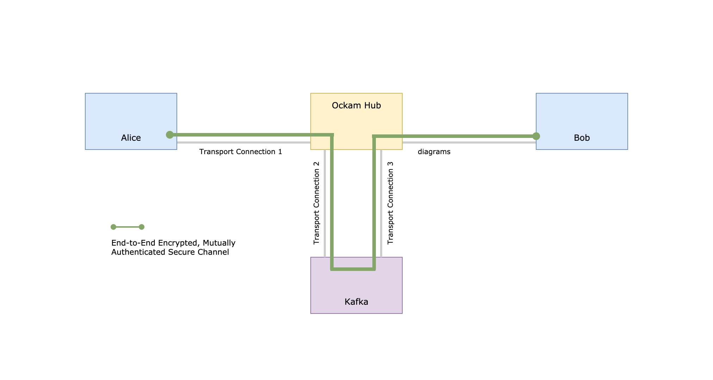

# End-to-End Encryption through Kafka

In this guide, we'll show [two programs](#example) called Alice and Bob. Alice and Bob will send each other
messages, over the network, via a cloud service, through Kafka. They will mutually authenticate each other
and will have a cryptographic guarantee that the _integrity, authenticity, and confidentiality_ of their messages
is protected _end-to-end_.

The Kafka instance, the intermediary cloud service and attackers on the network will not be able to
see or change the contents of en-route messages. The application data in Kafka would be encrypted.

<p>
<a href="#example">

</a>
</p>

[Show me the code](#example)

### Remove implicit trust in porous network boundaries

Modern distributed applications operate in highly dynamic environments. Infrastructure automation,
microservices in multiple clouds or data centers, a mobile workforce, the Internet of Things, and Edge
computing mean that machines and applications are continuously leaving and entering network boundaries.
Application architects have learnt that they must lower the amount of trust they place in network boundaries
and infrastructure.

The vulnerability surface of our application cannot include _all code_ that may be running within the
same porous network boundary. That surface is too big, too dynamic and usually outside the control of an
application developer.

Applications must instead take control of the security and reliability of their own data. To
do this, all messages that are received over the network must prove who sent them and show that they weren't
tampered with or forged.

### Lower trust in intermediaries

Another aspect of modern applications that can take away Alice's and Bob's ability to rely on the integrity
and authenticity of incoming messages are intermediary services, such as the cloud service in our example below.

Data, within distributed applications, are rarely exchanged over a single point-to-point transport connection.
Application messages routinely flow over complex, multi-hop, multi-protocol routes
— _across data centers, through queues and caches, via gateways and brokers_ —
before reaching their end destination.

Typically, when information or commands are exchanged through an intermediary service, the intermediary
is able to `READ` the messages that are being exchanged, `UPDATE` en-route messages,
`CREATE` messages that were never sent, and `DELETE` (never deliver) messages that were actually sent.
Alice and Bob are entirely dependent on the security of such intermediaries. If the defenses of an intermediary
are compromised, our application is also compromised.

Transport layer security protocols are unable to protect application messages because their protection
is constrained by the length and duration of the underlying transport connection. If there is an intermediary
between Alice and Bob, the transport connection between Alice and the intermediary is completely different
from the transport connection between Bob and the intermediary.

This is why the intermediary has full `CRUD` permissions on the messages in motion.

In environments like _Microservices, Internet-of-Things, and Edge Computing_ there are usually many such
intermediaries. Our application’s vulnerability surface quickly grows and becomes unmanageable.

### Mutually Authenticated, End-to-End Encrypted Secure Channels with Ockam

[Ockam](https://github.com/ockam-network/ockam) is a suite of programming libraries that make it simple
for applications to create any number of lightweight, mutually-authenticated, end-to-end encrypted
secure channels. These channels use cryptography to guarantee end-to-end integrity, authenticity, and
confidentiality of messages.

An application can use Ockam Secure Channels to enforce __least-privileged access__ to commands, data,
configuration, machine-learning models, and software updates that are flowing, as messages, between its
distributed parts.

Intermediary services and compromised software (that may be running within the same
network boundary) no longer have _implicit CRUD_ permissions on our application's messages. Instead, we have
granular control over access permissions – tampering or forgery of _data-in-motion_ is immediately detected.

With end-to-end secure channels, we can make the vulnerability surface of our application strikingly small.

## Example

Let's build end-to-end protected communication between Alice and Bob,
via a cloud service, through Kafka, using Ockam.

We'll run two programs called Alice and Bob. We want Bob to create a secure channel listener
and Alice to initiate a secure handshake (authenticated key exchange) with this listener. We'll imagine
that Bob and Alice are running on two separate, far-apart, computers and all communication between
them must happen via a cloud service, through Kafka.

Our goal is to make the message exchange secure and guarantee that every message is delivered __at-least once__.
In order to establish our end-to-end Secure Channel we need a two-way exchange of messages. We'll build this
using two Ockam Streams that are backed by two, single partition, Kafka topics.

An Ockam Stream is a lightweight abstraction over _topics_ or _queues_ in steaming data systems
like Kafka, Pulsar, RabbitMQ etc. In case of Kafka, one Ockam Stream maps to one Kafka topic. In our
example below Bob will create two streams (topics). The first stream `alice_to_bob` is for Alice to leave
messages for Bob and the second stream `bob_to_alice` is for Bob to leave messages for Alice.

The cloud service, in our example, is an Ockam Node running in Ockam Hub. This node has the Kafka Add-on
enabled which offers __two__ services for creating and managing Kafka backed Ockam Streams. The stream service
is available at address `"stream_kafka"` and index service is available at address `"stream_kafka_index"`.

The cloud node also has an Ockam TCP Transport listener on address: `"1.node.ockam.network:4000"`.

### Run (Using Docker)

To make it easy to try, we've created a Docker image that contains both Alice and Bob programs.

[Later in this guide](#run-using-rust) we'll also show the code for these two programs in Rust.

1. Run Bob’s program:

    ```
    docker run --rm --interactive --tty ghcr.io/ockam-network/examples/kafka ockam_kafka_bob
    ```

    The Bob program creates a Secure Channel Listener to accept requests to begin an Authenticated Key
    Exchange. Bob also starts an Echoer worker that prints any message it receives and echoes it back on its
    return route.

    Bob then connects, over TCP, to the cloud node at `1.node.ockam.network:4000` and requests the `stream_kafka`
    service to create two Kafka backed streams - `alice_to_bob` and `bob_to_alice`.

    Bob then, locally, starts a receiver (consumer) for the `alice_to_bob` stream and a sender (producer) for
    the `bob_to_alice` stream.

2. The Bob program prints two stream addresses, that exist on the cloud node, for - the `alice_to_bob` stream and
    the `bob_to_alice` stream. Copy these addresses, Alice will need them to exchange messages with Bob.

3. In a separate terminal window, run the Alice program:

    ```
    docker run --rm --interactive --tty ghcr.io/ockam-network/examples/kafka ockam_kafka_alice
    ```

4. The Alice program will stop to ask for the stream addresses that were printed in step 2. Enter them.

    This will tell Alice that:
    - the route to send messages for Bob is `[(TCP, "1.node.ockam.network:4000"), alice_to_bob_stream_address]`.
    - the route to receive messages from Bob is `[(TCP, "1.node.ockam.network:4000"), bob_to_alice_stream_address]`.

    Alice then, locally, starts a sender (producer) for the `alice_to_bob` stream and a receiver (consumer) for
    the `bob_to_alice` stream. We now have two-way communication between Alice and Bob.

    Alice uses the sender to initiate an authenticated key exchange with Bob.

5. End-to-end Secure Channel is established. Send messages to Bob and get their echoes back.

    Once the secure channel is established, the Alice program will stop and ask you to enter a message for
    Bob. Any message that you enter, is delivered to Bob using the secure channel, via the cloud node, through
    Kafka. The echoer on Bob will echo the messages back and Alice will print it.

### Run (Using Rust)

Now that we understand how it works, let's look at the code for the Alice and Bob programs in Rust.

If you don't have it, please [install](https://www.rust-lang.org/tools/install) the latest version of Rust.

```
curl --proto '=https' --tlsv1.2 -sSf https://sh.rustup.rs | sh
```

Next, create a new cargo project to get started:

```
cargo new --lib ockam_kafka && cd ockam_kafka && mkdir examples &&
  echo 'ockam = "*"' >> Cargo.toml && cargo build
```

If the above instructions don't work on your machine please
[post a question](https://github.com/ockam-network/ockam/discussions/1642),
we would love to help.

#### Bob

Create a file at `examples/ockam_kafka_bob.rs` and copy the below code snippet to it.

```rust
// examples/ockam_kafka_bob.rs
use ockam::{route, Context, Identity, Result, TrustEveryonePolicy, Vault};
use ockam::{stream::Stream, Routed, TcpTransport, Unique, Worker, TCP};

struct Echoer;

// Define an Echoer worker that prints any message it receives and
// echoes it back on its return route.
#[ockam::worker]
impl Worker for Echoer {
    type Context = Context;
    type Message = String;

    async fn handle_message(&mut self, ctx: &mut Context, msg: Routed<String>) -> Result<()> {
        println!("\n[✓] Address: {}, Received: {}", ctx.address(), msg);

        // Echo the message body back on its return_route.
        ctx.send(msg.return_route(), msg.body()).await
    }
}

#[ockam::node]
async fn main(ctx: Context) -> Result<()> {
    // Initialize the TCP Transport.
    TcpTransport::create(&ctx).await?;

    // Create a Vault to safely store secret keys for Bob.
    let vault = Vault::create();

    // Create an Identity to represent Bob.
    let bob = Identity::create(&ctx, &vault).await?;

    // Create a secure channel listener for Bob that will wait for requests to
    // initiate an Authenticated Key Exchange.
    bob.create_secure_channel_listener("listener", TrustEveryonePolicy)
        .await?;

    // Connect, over TCP, to the cloud node at `1.node.ockam.network:4000` and
    // request the `stream_kafka` service to create two Kafka backed streams -
    // `alice_to_bob` and `bob_to_alice`.
    //
    // After the streams are created, create:
    // - a receiver (consumer) for the `alice_to_bob` stream
    // - a sender (producer) for the `bob_to_alice` stream.

    let node_in_hub = (TCP, "1.node.ockam.network:4000");
    let b_to_a_stream_address = Unique::with_prefix("bob_to_alice");
    let a_to_b_stream_address = Unique::with_prefix("alice_to_bob");

    Stream::new(&ctx)
        .await?
        .stream_service("stream_kafka")
        .index_service("stream_kafka_index")
        .client_id(Unique::with_prefix("bob"))
        .connect(
            route![node_in_hub],
            b_to_a_stream_address.clone(),
            a_to_b_stream_address.clone(),
        )
        .await?;

    println!("\n[✓] Streams were created on the node at: 1.node.ockam.network:4000");
    println!("\nbob_to_alice stream address is: {}", b_to_a_stream_address);
    println!("alice_to_bob stream address is: {}\n", a_to_b_stream_address);

    // Start a worker, of type Echoer, at address "echoer".
    // This worker will echo back every message it receives, along its return route.
    ctx.start_worker("echoer", Echoer).await?;

    // We won't call ctx.stop() here, this program will run until you stop it with Ctrl-C
    Ok(())
}

```

#### Alice

Create a file at `examples/ockam_kafka_alice.rs` and copy the below code snippet to it.

```rust
// examples/ockam_kafka_alice.rs
use ockam::{route, Context, Identity, Result, TrustEveryonePolicy, Vault};
use ockam::{stream::Stream, TcpTransport, Unique, TCP};
use std::io;

#[ockam::node]
async fn main(mut ctx: Context) -> Result<()> {
    // Initialize the TCP Transport.
    TcpTransport::create(&ctx).await?;

    // Create a Vault to safely store secret keys for Alice.
    let vault = Vault::create();

    // Create an Identity to represent Alice.
    let alice = Identity::create(&ctx, &vault).await?;

    // This program expects that Bob has created two streams
    // bob_to_alice and alice_to_bob on the cloud node at 1.node.ockam.network:4000
    // We need the user to provide the addresses of these streams.

    // From standard input, read bob_to_alice stream address.
    println!("\nEnter the bob_to_alice stream address: ");
    let mut b_to_a_stream_address = String::new();
    io::stdin().read_line(&mut b_to_a_stream_address).expect("Error stdin.");
    let b_to_a_stream_address = b_to_a_stream_address.trim();

    // From standard input, read alice_to_bob stream address.
    println!("\nEnter the alice_to_bob stream address: ");
    let mut a_to_b_stream_address = String::new();
    io::stdin().read_line(&mut a_to_b_stream_address).expect("Error stdin.");
    let a_to_b_stream_address = a_to_b_stream_address.trim();

    // We now know that the route to:
    // - send messages to bob is [(TCP, "1.node.ockam.network:4000"), a_to_b_stream_address]
    // - receive messages from bob is [(TCP, "1.node.ockam.network:4000"), b_to_a_stream_address]

    // Starts a sender (producer) for the alice_to_bob stream and a receiver (consumer)
    // for the `bob_to_alice` stream to get two-way communication.

    let node_in_hub = (TCP, "1.node.ockam.network:4000");
    let (sender, _receiver) = Stream::new(&ctx)
        .await?
        .stream_service("stream_kafka")
        .index_service("stream_kafka_index")
        .client_id(Unique::with_prefix("alice"))
        .connect(route![node_in_hub], a_to_b_stream_address, b_to_a_stream_address)
        .await?;

    // As Alice, connect to Bob's secure channel listener using the sender, and
    // perform an Authenticated Key Exchange to establish an encrypted secure
    // channel with Bob.
    let r = route![sender.clone(), "listener"];
    let channel = alice.create_secure_channel(r, TrustEveryonePolicy).await?;

    println!("\n[✓] End-to-end encrypted secure channel was established.\n");

    loop {
        // Read a message from standard input.
        println!("Type a message for Bob's echoer:");
        let mut message = String::new();
        io::stdin().read_line(&mut message).expect("Error reading from stdin.");
        let message = message.trim();

        // Send the provided message, through the channel, to Bob's echoer.
        ctx.send(route![channel.clone(), "echoer"], message.to_string()).await?;

        // Wait to receive an echo and print it.
        let reply = ctx.receive::<String>().await?;
        println!("Alice received an echo: {}\n", reply); // should print "Hello Ockam!"
    }

    // This program will keep running until you stop it with Ctrl-C
}

```

1. Run Bob’s program:

    ```
    cargo run --example ockam_kafka_bob
    ```

2. In a separate terminal window, in the same directory path, run the Alice program:

    ```
    cargo run --example ockam_kafka_alice
    ```

The interaction will be very similar to when we ran the [docker based programs](#run-using-docker).

## Conclusion

Congratulations on running an end-to-end encrypted communication through Kafka!

We [discussed](#remove-implicit-trust-in-porous-network-boundaries) that, in order to have a small and manageable
vulnerability surface, distributed applications must use mutually authenticated, end-to-end encrypted channels.
Implementing an end-to-end secure channel protocol, from scratch, is complex, error prone,
and will take more time than application teams can typically dedicate to this problem.

In the above example, we created a mutually authenticated, end-to-end encrypted channel running through
Kafka topics combining the security of end-to-end encryption with delivery guarantees of Kafka.

Ockam combines proven cryptographic building blocks into a set of reusable protocols for distributed
applications to communicate security and privately. The above example only scratched the surface of what
is possible with the tools that our included in Ockam.

To learn more, please see our [rust guide](../end-to-end-encryption-with-rust#readme) and
[step-by-step guide](../../guides/rust#readme).

<div style="display: none; visibility: hidden;">
<hr><b>Next:</b> <a href="../../guides/rust#readme">A step-by-step introduction</a>
</div>
