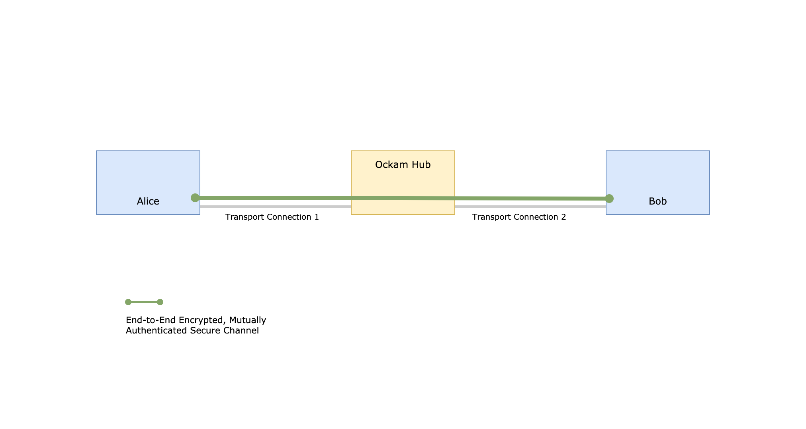

# End-to-End Encryption with Rust

In this hands-on guide, we'll create two small Rust programs called Alice and Bob. Alice and Bob
will send each other messages, over the network, via a cloud service. In our [code example](#rust-example),
Alice and Bob will mutually authenticate each other and will have a cryptographic guarantee that the
_integrity, authenticity, and confidentiality_ of their messages is protected _end-to-end_.

The intermediary cloud service and attackers on the network will not be able to see or change the contents
of en-route messages. In later examples we'll also see how we can have this end-to-end protection even
when the communication path between Alice and Bob is more complex - with multiple transport connections,
a variety of transport protocols and many intermediaries.

<p>
<a href="#rust-example">

</a>
</p>

[Show me the code](#rust-example)

### Remove implicit trust in porous network boundaries

Modern distributed applications operate in highly dynamic environments. Infrastructure automation,
microservices in multiple clouds or data centers, a mobile workforce, the Internet of Things, and Edge
computing mean that machines and applications are continuously leaving and entering network boundaries.
Application architects have learnt that they must lower the amount of trust they place in network boundaries
and infrastructure.

The vulnerability surface of our application cannot include _all code_ that may be running within the same
porous network boundary. That surface is too big, too dynamic and usually outside the control of an application
developer. Applications must instead take control of the security and reliability of their own data. To
do this, all messages that are received over the network must prove who sent them and show that they weren't
tampered with or forged.

### Lower trust in intermediaries

Another aspect of modern applications that can take away Alice's and Bob's ability to rely on the integrity
and authenticity of incoming messages are intermediary services, such as the cloud service in our example below.

Data, within distributed applications, are rarely exchanged over a single point-to-point transport connection.
Application messages routinely flow over complex, multi-hop, multi-protocol routes
— _across data centers, through queues and caches, via gateways and brokers_ —
before reaching their end destination.

Typically, when information or commands are exchanged through an intermediary service, the intermediary
is able to `READ` the messages that are being exchanged, `UPDATE` en-route messages,
`CREATE` messages that were never sent, and `DELETE` (never deliver) messages that were actually sent.
Alice and Bob are entirely dependent on the security of such intermediaries. If the defenses of an intermediary
are compromised, our application is also compromised.

Transport layer security protocols are unable to protect application messages because their protection
is constrained by the length and duration of the underlying transport connection. If there is an intermediary
between Alice and Bob, the transport connection between Alice and the intermediary is completely different
from the transport connection between Bob and the intermediary.

This is why the intermediary has full `CRUD` permissions on the messages in motion.

In environments like _Microservices, Internet-of-Things, and Edge Computing_ there are usually many such
intermediaries. Our application’s vulnerability surface quickly grows and becomes unmanageable.

### Mutually Authenticated, End-to-End Encrypted Secure Channels with Ockam

[Ockam](https://github.com/ockam-network/ockam) is a suite of programming libraries that make it simple
for applications to create any number of lightweight, mutually-authenticated, end-to-end encrypted
secure channels. These channels use cryptography to guarantee end-to-end integrity, authenticity, and
confidentiality of messages.

An application can use Ockam Secure Channels to enforce __least-privileged access__ to commands, data,
configuration, machine-learning models, and software updates that are flowing, as messages, between its
distributed parts. Intermediary services and compromised software (that may be running within the same
network boundary) no longer have implicit CRUD permissions on our application's messages. Instead, we have
granular control over access permissions – tampering or forgery of _data-in-motion_ is immediately detected.

With end-to-end secure channels, we can make the vulnerability surface of our application strikingly small.

## Rust Example

Let's build end-to-end protected communication between Alice and Bob, through a cloud service.

We'll create two small Rust programs called Alice and Bob. We want Bob to create a secure channel listener
and ask Alice to initiate a secure handshake (authenticated key exchange) with this listener. We'll imagine
that Bob and Alice are running on two separate computers and this handshake must happen over the Internet.

We'll also imagine that Bob is running within a private network and cannot open a public port exposed to
the Internet. Instead, Bob registers a forwarding address on an Ockam Node, running as a cloud service in Ockam Hub.

This node is at TCP address `1.node.ockam.network:4000` and offers two general purpose Ockam services:
_routing and forwarding._

### Setup

If you don't have it, please [install](https://www.rust-lang.org/tools/install) the latest version of Rust.

```
curl --proto '=https' --tlsv1.2 -sSf https://sh.rustup.rs | sh
```

Next, create a new cargo project to get started:

```
cargo new --lib hello_ockam && cd hello_ockam && mkdir examples &&
  echo 'ockam = "*"' >> Cargo.toml && cargo build
```

If the above instructions don't work on your machine please
[post a question](https://github.com/ockam-network/ockam/discussions/1642),
we would love to help.

### Bob

Create a file at `examples/bob.rs` and copy the below code snippet to it.

```rust
// examples/bob.rs
use ockam::{Context, Identity, Result, TrustEveryonePolicy, Vault};
use ockam::{RemoteForwarder, Routed, TcpTransport, Worker, TCP};

struct Echoer;

// Define an Echoer worker that prints any message it receives and
// echoes it back on its return route.
#[ockam::worker]
impl Worker for Echoer {
    type Context = Context;
    type Message = String;

    async fn handle_message(&mut self, ctx: &mut Context, msg: Routed<String>) -> Result<()> {
        println!("\n[✓] Address: {}, Received: {}", ctx.address(), msg);

        // Echo the message body back on its return_route.
        ctx.send(msg.return_route(), msg.body()).await
    }
}

#[ockam::node]
async fn main(ctx: Context) -> Result<()> {
    // Initialize the TCP Transport.
    TcpTransport::create(&ctx).await?;

    // Create a Vault to safely store secret keys for Bob.
    let vault = Vault::create();

    // Create an Identity to represent Bob.
    let bob = Identity::create(&ctx, &vault).await?;

    // Create a secure channel listener for Bob that will wait for requests to
    // initiate an Authenticated Key Exchange.
    bob.create_secure_channel_listener("listener", TrustEveryonePolicy)
        .await?;

    // The computer that is running this program is likely within a private network and
    // not accessible over the internet.
    //
    // To allow Alice and others to initiate an end-to-end secure channel with this program
    // we connect with 1.node.ockam.network:4000 as a TCP client and ask the forwarding
    // service on that node to create a forwarder for us.
    //
    // All messages that arrive at that forwarding address will be sent to this program
    // using the TCP connection we created as a client.
    let node_in_hub = (TCP, "1.node.ockam.network:4000");
    let forwarder = RemoteForwarder::create(&ctx, node_in_hub).await?;
    println!("\n[✓] RemoteForwarder was created on the node at: 1.node.ockam.network:4000");
    println!("Forwarding address for Bob is:");
    println!("{}", forwarder.remote_address());

    // Start a worker, of type Echoer, at address "echoer".
    // This worker will echo back every message it receives, along its return route.
    ctx.start_worker("echoer", Echoer).await?;

    // We won't call ctx.stop() here, this program will run until you stop it with Ctrl-C
    Ok(())
}

```

### Alice

Create a file at `examples/alice.rs` and copy the below code snippet to it.

```rust
// examples/alice.rs
use ockam::{route, Context, Identity, Result, TrustEveryonePolicy, Vault};
use ockam::{TcpTransport, TCP};
use std::io;

#[ockam::node]
async fn main(mut ctx: Context) -> Result<()> {
    // Initialize the TCP Transport.
    TcpTransport::create(&ctx).await?;

    // Create a Vault to safely store secret keys for Alice.
    let vault = Vault::create();

    // Create an Identity to represent Alice.
    let alice = Identity::create(&ctx, &vault).await?;

    // This program expects that Bob has setup a forwarding address,
    // for his secure channel listener, on the Ockam node at 1.node.ockam.network:4000.
    //
    // From standard input, read this forwarding address for Bob's secure channel listener.
    println!("\nEnter the forwarding address for Bob: ");
    let mut address = String::new();
    io::stdin().read_line(&mut address).expect("Error reading from stdin.");
    let forwarding_address = address.trim();

    // Combine the tcp address of the node and the forwarding_address to get a route
    // to Bob's secure channel listener.
    let route_to_bob_listener = route![(TCP, "1.node.ockam.network:4000"), forwarding_address, "listener"];

    // As Alice, connect to Bob's secure channel listener, and perform an
    // Authenticated Key Exchange to establish an encrypted secure channel with Bob.
    let channel = alice
        .create_secure_channel(route_to_bob_listener, TrustEveryonePolicy)
        .await?;

    println!("\n[✓] End-to-end encrypted secure channel was established.\n");

    loop {
        // Read a message from standard input.
        println!("Type a message for Bob's echoer:");
        let mut message = String::new();
        io::stdin().read_line(&mut message).expect("Error reading from stdin.");
        let message = message.trim();

        // Send the provided message, through the channel, to Bob's echoer.
        ctx.send(route![channel.clone(), "echoer"], message.to_string()).await?;

        // Wait to receive an echo and print it.
        let reply = ctx.receive::<String>().await?;
        println!("Alice received an echo: {}\n", reply); // should print "Hello Ockam!"
    }

    // This program will keep running until you stop it with Ctrl-C
}

```

### Run the example

1. Run Bob’s program:

    ```
    cargo run --example bob
    ```

    The Bob program creates a Secure Channel Listener to accept requests to begin an Authenticated
    Key Exchange. It also connects, over TCP, to the cloud node at `1.node.ockam.network:4000` and creates
    a Forwarder on that cloud node. All messages that arrive at that forwarding address will be forwarded to
    Bob using the TCP connection that Bob created as a client.

    Bob also starts an Echoer worker that prints any message it receives and echoes it back on its return route.

2. The Bob program will print a hex value which is the forwarding address for Bob on the cloud node, copy it.

3. In a separate terminal window, in the same directory path, run the Alice program:

    ```
    cargo run --example alice
    ```

4. It will stop to ask for Bob's forwarding address that was printed in step 2. Give it that address.

    This will tell Alice that the route to reach Bob is `[(TCP, "1.node.ockam.network:4000"), forwarding_address]`.

    When Alice sends a message along this route, the Ockam routing layer will look at the first address
    in the route and hand the message to the TCP transport. The TCP transport will connect with the cloud
    node over TCP and hand the message to it.

    The routing layer on the cloud node will then take the message to the forwarding address for Bob. The
    forwarder at that address will send the message to Bob over the TCP connection Bob had earlier
    created with the cloud node.

    Replies, from Bob, take the same path back and the entire secure channel handshake is completed is this way.

5. End-to-end Secure Channel is established. Send messages to Bob and get their echoes back.

    Once the secure channel is established, the Alice program will stop and ask you to enter a message for
    Bob. Any message that you enter, is delivered to Bob using the secure channel, via the cloud node. The echoer
    on Bob will echo the messages back on the same path and Alice will print it.

## Conclusion

Congratulations on creating your first end-to-end encrypted application 🥳.

We [discussed](#remove-implicit-trust-in-porous-network-boundaries) that, in order to have a small and manageable
vulnerability surface, distributed applications must use mutually authenticated, end-to-end encrypted channels.
Implementing an end-to-end secure channel protocol, from scratch, is complex, error prone,
and will take more time than application teams can typically dedicate to this problem.

In the above example, we created a mutually authenticated, end-to-end encrypted channel in __51 lines of code__
(excluding comments).

Ockam combines proven cryptographic building blocks into a set of reusable protocols for distributed
applications to communicate security and privately. The above example only scratched the surface of what
is possible with the tools that our included in the `ockam` Rust crate.

To learn more, please see our [step-by-step guide](../../guides/rust#step-by-step).

## Demo

https://user-images.githubusercontent.com/159583/127915377-8777faf5-1b76-4ed4-ac8e-16e2aed2429f.mp4

<div style="display: none; visibility: hidden;">
<hr><b>Next:</b> <a href="../../guides/rust#step-by-step">A step-by-step introduction</a>
</div>
