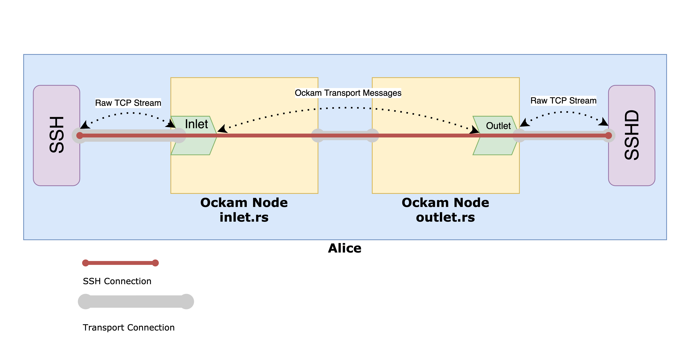
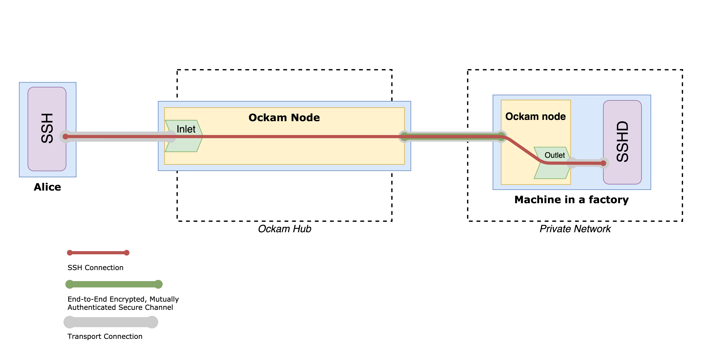

# Secure Remote Access

In this guide, we'll run two examples, showing how arbitrary protocol that runs on top of transport protocol,
can be also run using [Ockam Routing Protocol](https://www.ockam.io/learn/how-to-guides/rust/), gaining its benefits.\
Ockam Routing Protocol is:
  1. Capable of delivering messages through multiple hops.
  1. Agnostic to Transport protocol (TCP, UDP, BLE, etc.).
  1. Angostic to Transport connection direction (it doesn't matter which Ockam Node is listening, and which is starting connection).
  1. May combine multiple Transport protocols in one Route.
  1. Natively integrates with Encrypted and Mutually Authenticated Secure Channels including support of end-to-end encryption, tunneling and trust policies.
  1. Supports transofrming any TCP stream into Ockam Routing Protocol Messages using Inlets, and backwards, using Outlets.

[First example](#rust-local-example) will introduce idea of Transport Portal. We'll create TCP Inlet and TCP Outlet locally,
and run SSH session though them to demostrate how that works.\
[Second example](#rust-ockam-hub-example) will show how Ockam Hub Services can help us to tunnel connection securely.
This will allow us to connect from a user machine (Alice) to a remote machine, that is not able to listen
on publicly-available IP (e.g. is behind NAT), and use that connection to run SSH session. For simplicity, user
and remote machines can be different terminal tabs on the same machine.

## Setup

### SSH

First of all you should make sure you have enabled ssh daemon on a machine you want to connect to. In order to check that, run following command on the remote machine


```bash
ssh localhost
```

If that succeeds, you're good to proceed further, if not, please refer to your OS-specific instruction (e.g. [MacOS](https://support.apple.com/en-gb/guide/mac-help/mchlp1066/mac), [Ubuntu](https://linuxize.com/post/how-to-enable-ssh-on-ubuntu-20-04/)).

### Rust

If you don't have Rust, please install the latest version [here](https://www.rust-lang.org/tools/install).

```
curl --proto '=https' --tlsv1.2 -sSf https://sh.rustup.rs | sh
```

## Rust Local Example

In this example we'll run two executables, one with Inlet and one with Outlet. Inlet is responsible for receiving incoming
TCP traffic (e.g. SSH session), wrapping it inside Ockam Transport Messages, which is type of message used with Ockam
Routing Protocol, and sending it to an Outlet. Outlet is responsible for unwrapping those messages, and sending them into
corresponding TCP stream (e.g. sshd). Combination of Inlet and Outlet is called Portal.

<p>

</p>

Let's start with creating cargo project. We'll have two executable, so let's create lib project and place our snippets
inside examples directory. Navigate to a directory where you want to put your source code and run:
```
cargo new --lib ssh_local && cd ssh_local && mkdir examples &&
  echo 'ockam = "*"' >> Cargo.toml && cargo build
```

If the above instructions don't work on your machine please
[post a question](https://github.com/ockam-network/ockam/discussions/1642),
we would love to help.

### Inlet

Create a file at `examples/inlet.rs` and copy the below code snippet to it.

```rust
use ockam::{Context, Result, Route, TcpTransport};

#[ockam::node]
async fn main(mut ctx: Context) -> Result<()> {
    // Initialize the TCP Transport.
    let tcp = TcpTransport::create(&ctx).await?;

    // Listen for incoming message from the other node with running Outlet
    tcp.listen("127.0.0.1:1234").await?;

    // Receive message from the other node with outlet address in the body
    let msg = ctx.receive::<String>().await?.take();
    // This is return route to a worker that sent us message
    let mut return_route = msg.return_route();
    // This is String with outlet address, that other node sent to us
    let outlet_address = msg.body();
    // This is route to the Outlet on the other node
    let outlet_route: Route = return_route
        .modify()
        .pop_back()
        .append(outlet_address)
        .into();

    // This is inlet listening address
    let inlet_address = "127.0.0.1:5000";
    // Let's create inlet that will listen on 127.0.0.1 port 5000, and stream messages
    // to the Outlet on the other node
    tcp.create_inlet(inlet_address, outlet_route.clone())
        .await?;

    println!(
        "Inlet created on: {} with outlet route: {}",
        inlet_address, outlet_route
    );

    // We won't call ctx.stop() here, this program will run until you stop it with Ctrl-C
    Ok(())
}
```

### Outlet

Create a file at `examples/outlet.rs` and copy the below code snippet to it.

```rust
use ockam::{route, Context, Result, TcpTransport, TCP};

#[ockam::node]
async fn main(ctx: Context) -> Result<()> {
    // Initialize the TCP Transport.
    let tcp = TcpTransport::create(&ctx).await?;

    // This is local address at which we'll start outlet
    let outlet_address = "outlet";

    // Create outlet that will stream messages to localhost port 22 (sshd)
    tcp.create_outlet(outlet_address, "localhost:22").await?;

    // Connect to the other node, and tell what is outlet address
    ctx.send(
        // The other node is listening on localhost port 1234
        // "app" is the address of apps main function Context
        route![(TCP, "localhost:1234"), "app"],
        outlet_address.to_string(),
    )
    .await?;

    // We won't call ctx.stop() here, this program will run until you stop it with Ctrl-C
    Ok(())
}
```

Let's run both executables concurrently in separate terminal tabs. Inlet should be started first.

```
cargo run --example inlet
```
```
cargo run --example outlet
```

Inlet should print (outlet route port may differ)
```
Inlet created on: 127.0.0.1:5000 with outlet route: 1#127.0.0.1:60764 => 0#outlet
```
That means that we now can use localhost port 5000 to tunnel TCP connection to the localhost port 22.
Let's run ssh session using this connection:
```
ssh localhost -port 5000
```
After trusting your public key and entering your user's password, ssh session should be successfully started.
To close the session run
```
exit
```

## Rust Ockam Hub Example

In this code example, we'll be running Outlet on a remote machine inside private network (may be the same machine used
for previous example), while Inlet is deployed for us on Ockam Hub Services.
We'll also use Secure Channel on top of TCP connection to communicate with Ockam Hub node.

<p>

</p>

### Run Ockam on the Remote Machine

Navigate to a directory where you want to put your source code and run:

```
cargo new --bin ssh_remote && cd ssh_remote &&
  echo 'ockam = "*"' >> Cargo.toml && cargo build
```

Go to file `src/main.rs` and copy the below code snippet to it.

```rust
use ockam::{
    route, Context, Entity, Result, SecureChannels, TcpTransport, TrustEveryonePolicy, Vault, TCP,
};

#[ockam::node]
async fn main(mut ctx: Context) -> Result<()> {
    // Create a Vault to safely store secret keys
    let vault = Vault::create(&ctx)?;

    // Create an Entity to represent this machine
    let mut fabric_machine = Entity::create(&ctx, &vault)?;

    // Initialize the TCP Transport
    let tcp = TcpTransport::create(&ctx).await?;

    // Hostname for your personal Ockam Hub Node
    let ockam_hub_hostname = "2.node.ockam.network:4000";

    // Create Secure Channel to your personal Ockam Hub Node
    let channel = fabric_machine.create_secure_channel(
        route![(TCP, ockam_hub_hostname), "secure_channel_listener_service"],
        TrustEveryonePolicy,
    )?;

    // This is local address at which we'll start outlet
    let outlet_address = "outlet";

    // Create outlet that will stream messages to localhost port 22 (sshd)
    tcp.create_outlet(outlet_address, "localhost:22").await?;

    // Ask Ockam Hub Node to create an Inlet for us, that will stream messages to our Outlet
    ctx.send(
        route![channel, "tcp_inlet_service"],
        outlet_address.to_string(),
    )
    .await?;

    // Ockam Hub responds with a port used for Inlet
    let port = ctx.receive::<i32>().await?.take().body();

    println!("Inlet is accessible on port {}", port);

    // We won't call ctx.stop() here, this program will run until you stop it with Ctrl-C
    Ok(())
}
```

### Run the example

1. Run Remote's program:

    ```
    cargo run
    ```

2. After successful connection Remote's program will print message ```Inlet is accessible on port xxxx```, where xxxx is a
port Ockam Hub node is listening for incoming SSH connections, that will be redirected to the Remote machine.

### Alice machine

Open terminal and start SSH connection. Replace xxxx with your porn number.

```bash
ssh 2.node.ockam.network -p xxxx
```

After that, you'll be asked to approve public key fingerprint (which is Remote's SSH public key). Upon successful
conenction you'll be asked to provide password for a Remote user.

## Demo

// TODO: Add video
